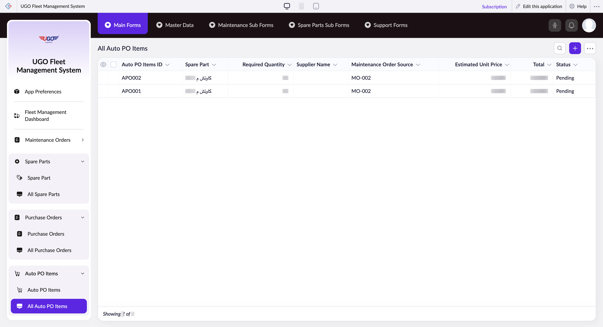

# All Auto PO Items

**URL:** `https://creatorapp.zoho.com/m.fahmy_ugologistics/u-go-garage-maintenance#Report:All_Auto_PO_Items`

## Page Sections

- Upgrade to Creator 5
- Update your subscription plan
- UGO Fleet Management System
- All Auto PO Items
- Export
- Introducing the New zoho Creator ui
- Introducing the New zoho Creator ui
- Introducing the New zoho Creator ui
- Introducing the New zoho Creator ui

## Form Fields

| Field | Type | Required |
|-------|------|----------|
| lang-select-dropdown | dropdown | No |
| Checkbox | checkbox | No |
| 4780709000000819026_checkbox | checkbox | No |
| 4780709000000814062_checkbox | checkbox | No |
| Checkbox | checkbox | No |
| wrapColsInputEl | checkbox | No |
| show-hide-col-all | checkbox | No |
| viewdel | checkbox | No |
| viewdel | checkbox | No |
| viewdel | checkbox | No |
| viewdel | checkbox | No |
| viewdel | checkbox | No |
| viewdel | checkbox | No |
| viewdel | checkbox | No |
| viewdel | checkbox | No |
| volume | range | No |
| checkbox-Auto_PO_Items_ID-ZC_84UG9U | checkbox | No |
| s2id_autogen60 | text | No |
| s2id_autogen60_search | text | No |
| zc_searchSelect | dropdown | No |
| checkbox-Spare_Part-ZC_84UG9U | checkbox | No |
| s2id_autogen62 | text | No |
| s2id_autogen62_search | text | No |
| zc_searchSelect | dropdown | No |
| checkbox-Required_Quantity-ZC_84UG9U | checkbox | No |
| s2id_autogen64 | text | No |
| s2id_autogen64_search | text | No |
| zc_searchSelect | dropdown | No |
| From | text | No |
| To | text | No |
| checkbox-Supplier_Name-ZC_84UG9U | checkbox | No |
| s2id_autogen66 | text | No |
| s2id_autogen66_search | text | No |
| zc_searchSelect | dropdown | No |
| checkbox-Maintenance_Order_Source-ZC_84UG9U | checkbox | No |
| s2id_autogen68 | text | No |
| s2id_autogen68_search | text | No |
| zc_searchSelect | dropdown | No |
| checkbox-Estimated_Unit_Price-ZC_84UG9U | checkbox | No |
| s2id_autogen70 | text | No |
| s2id_autogen70_search | text | No |
| zc_searchSelect | dropdown | No |
| From | text | No |
| To | text | No |
| checkbox-Total-ZC_84UG9U | checkbox | No |
| s2id_autogen72 | text | No |
| s2id_autogen72_search | text | No |
| zc_searchSelect | dropdown | No |
| From | text | No |
| To | text | No |
| checkbox-Status-ZC_84UG9U | checkbox | No |
| s2id_autogen74 | text | No |
| s2id_autogen74_search | text | No |
| zc_searchSelect | dropdown | No |
| checkbox-Brand_Name-ZC_84UG9U | checkbox | No |
| s2id_autogen76 | text | No |
| s2id_autogen76_search | text | No |
| zc_searchSelect | dropdown | No |
| allowlocation | button | No |
| useIconSwitch | checkbox | No |
| toggleIconSwitch | checkbox | No |
| saveIcons | button | No |
| resetIcons | button | No |
| Search... | text | No |
| I have read the above conditions. | checkbox | No |
| reqEmailId | text | No |
| s2id_autogen2 | text | No |
| s2id_autogen2_search | text | No |
| supportType | dropdown | No |
| Please enable edit permission to help with troubleshooting | checkbox | No |
| reachusChatDescription | textarea | No |
| reachUsStartChat | button | No |
| zc-reachus-editaccess-enable-button | button | No |
| zc-reachus-editaccess-revoke-button | button | No |
| zc-reachus-screenrecord-button | button | No |

## Table Columns

- Auto PO Items ID
- Spare Part
- Required Quantity
- Supplier Name
- Maintenance Order Source
- Estimated Unit Price
- Total
- Status

## Actions

- **Done**
- **Main Forms**
- **Master Data**
- **Maintenance Sub Forms**
- **Spare Parts Sub Forms**
- **Support Forms**
- **Remove Changes**
- **Show as**
- **Print**
- **Import**
- **Export**
- **Bulk Edit**
- **Duplicate**
- **Delete**
- **AddAdd (Option + Shift + N)**
- **Submit Request**

## Common Workflows

_Document step-by-step workflows for this page here._
