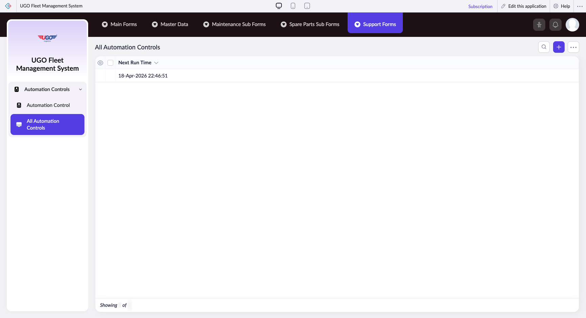

# All Automation Controls

The All Automation Controls page lets you manage scheduled maintenance tasks and automation rules for your garage operations. Use this page to set up, modify, and monitor automated maintenance reminders, notification schedules, and system preferences. Operations staff access this when configuring how and when the system alerts them about upcoming vehicle maintenance.

**URL:** `https://creatorapp.zoho.com/m.fahmy_ugologistics/u-go-garage-maintenance#Report:All_Automation_Controls`

## How to Use

1. Select your preferred language from the lang-select-dropdown if needed for the interface
2. Use the search field to find a specific automation rule or maintenance schedule by name or ID
3. Check the checkbox next to 'Next Run Time' if you want to filter or sort automation tasks by their scheduled dates
4. Set your desired date range using the 'From' and 'To' fields to view automations scheduled within that period
5. Adjust the volume slider to control notification intensity or alert frequency for the selected automation
6. Click Done to save your settings, or use Remove Changes to discard unsaved edits
7. Click Export or Import to back up your automation rules or apply configurations from another system

## Page Sections

- All Automation Controls

## Form Fields

| Field | Description | Type | Required |
|-------|-------------|------|----------|
| lang-select-dropdown | Choose your language preference for the system interface and all automation notifications | dropdown | No |
| Checkbox |  | checkbox | No |
| 4780709000000768049_checkbox |  | checkbox | No |
| Checkbox |  | checkbox | No |
| wrapColsInputEl |  | checkbox | No |
| show-hide-col-all |  | checkbox | No |
| viewdel |  | checkbox | No |
| volume | Control the notification intensity level using this slider—higher settings mean more frequent or prominent alerts | range | No |
| checkbox-Next_Run_Time-ZC_S2TTRE |  | checkbox | No |
| s2id_autogen248 |  | text | No |
| s2id_autogen248_search |  | text | No |
| zc_searchSelect |  | dropdown | No |
| viewSearchEl_Next_Run_Time | Search for automations by their next scheduled run date or time | text | No |
| From | Enter or select the start date to filter automations scheduled on or after this date | text | No |
| To | Enter or select the end date to filter automations scheduled on or before this date | text | No |
| allowlocation |  | button | No |
| useIconSwitch |  | checkbox | No |
| toggleIconSwitch |  | checkbox | No |
| saveIcons |  | button | No |
| resetIcons |  | button | No |
| Search... |  | text | No |
| I have read the above conditions. | Check this box to confirm you understand the automation rules and how they affect your maintenance schedule | checkbox | No |
| reqEmailId | Enter the email address where automation notifications and alerts should be sent | text | No |
| s2id_autogen2 |  | text | No |
| s2id_autogen2_search |  | text | No |
| supportType | Select the category of support or maintenance type this automation applies to (for example, routine service or emergency repairs) | dropdown | No |
| Please enable edit permission to help with troubleshooting | Check this box to allow support staff temporary access to modify your automation settings while diagnosing problems | checkbox | No |
| reachusChatDescription | Describe any issues or questions about your automation setup that you want to discuss with support | textarea | No |
| reachUsStartChat |  | button | No |

## Table Columns

- Next Run Time

## Actions

- **Done**
- **Main Forms**
- **Master Data**
- **Maintenance Sub Forms**
- **Spare Parts Sub Forms**
- **Support Forms**
- **Remove Changes**
- **Show as**
- **Print**
- **Import**
- **Export**
- **Bulk Edit**
- **Duplicate**
- **Delete**
- **AddAdd (Option + Shift + N)**
- **Submit Request**

## Tips

- Always set a clear date range before running bulk operations like Export or Duplicate—this prevents accidentally copying automations you don't need
- If you enable edit permission for support staff, remember to disable it again once troubleshooting is complete for security reasons

## Related Pages

- [Automation Control](automation-control.md)

## Common Workflows

_Add step-by-step workflows specific to your organisation here._
