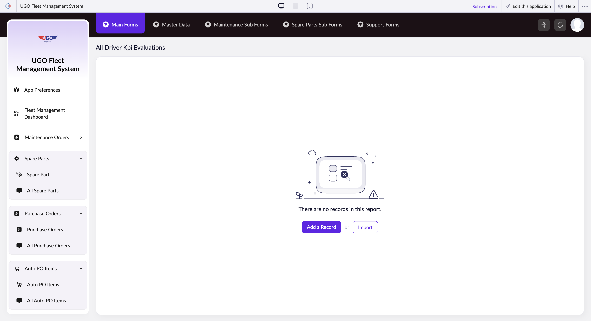

# All Driver Kpi Evaluations

**URL:** `https://creatorapp.zoho.com/m.fahmy_ugologistics/u-go-garage-maintenance#Report:All_Driver_Kpi_Evaluations`

## Page Sections

- All Driver Kpi Evaluations

## Form Fields

| Field | Type | Required |
|-------|------|----------|
| lang-select-dropdown | dropdown | No |
| volume | range | No |
| checkbox-Driver-ZC_IV783X | checkbox | No |
| s2id_autogen152 | text | No |
| s2id_autogen152_search | text | No |
| zc_searchSelect | dropdown | No |
| checkbox-Evaluation_Month-ZC_IV783X | checkbox | No |
| s2id_autogen154 | text | No |
| s2id_autogen154_search | text | No |
| zc_searchSelect | dropdown | No |
| checkbox-Evaluated_by-ZC_IV783X | checkbox | No |
| s2id_autogen156 | text | No |
| s2id_autogen156_search | text | No |
| zc_searchSelect | dropdown | No |
| checkbox-Fuel_Efficiency-ZC_IV783X | checkbox | No |
| s2id_autogen158 | text | No |
| s2id_autogen158_search | text | No |
| zc_searchSelect | dropdown | No |
| checkbox-On_Time_Performance-ZC_IV783X | checkbox | No |
| s2id_autogen160 | text | No |
| s2id_autogen160_search | text | No |
| zc_searchSelect | dropdown | No |
| checkbox-Incidents-ZC_IV783X | checkbox | No |
| s2id_autogen162 | text | No |
| s2id_autogen162_search | text | No |
| zc_searchSelect | dropdown | No |
| checkbox-Documentation-ZC_IV783X | checkbox | No |
| s2id_autogen164 | text | No |
| s2id_autogen164_search | text | No |
| zc_searchSelect | dropdown | No |
| checkbox-Productivity-ZC_IV783X | checkbox | No |
| s2id_autogen166 | text | No |
| s2id_autogen166_search | text | No |
| zc_searchSelect | dropdown | No |
| checkbox-Delay_Time-ZC_IV783X | checkbox | No |
| s2id_autogen168 | text | No |
| s2id_autogen168_search | text | No |
| zc_searchSelect | dropdown | No |
| checkbox-Score-ZC_IV783X | checkbox | No |
| s2id_autogen170 | text | No |
| s2id_autogen170_search | text | No |
| zc_searchSelect | dropdown | No |
| From | text | No |
| To | text | No |
| checkbox-Bonus-ZC_IV783X | checkbox | No |
| s2id_autogen172 | text | No |
| s2id_autogen172_search | text | No |
| zc_searchSelect | dropdown | No |
| From | text | No |
| To | text | No |
| checkbox-Multi_Line1-ZC_IV783X | checkbox | No |
| s2id_autogen174 | text | No |
| s2id_autogen174_search | text | No |
| zc_searchSelect | dropdown | No |
| checkbox-Multi_Line2-ZC_IV783X | checkbox | No |
| s2id_autogen176 | text | No |
| s2id_autogen176_search | text | No |
| zc_searchSelect | dropdown | No |
| checkbox-Multi_Line3-ZC_IV783X | checkbox | No |
| s2id_autogen178 | text | No |
| s2id_autogen178_search | text | No |
| zc_searchSelect | dropdown | No |
| checkbox-Multi_Line4-ZC_IV783X | checkbox | No |
| s2id_autogen180 | text | No |
| s2id_autogen180_search | text | No |
| zc_searchSelect | dropdown | No |
| checkbox-Multi_Line5-ZC_IV783X | checkbox | No |
| s2id_autogen182 | text | No |
| s2id_autogen182_search | text | No |
| zc_searchSelect | dropdown | No |
| checkbox-Multi_Line6-ZC_IV783X | checkbox | No |
| s2id_autogen184 | text | No |
| s2id_autogen184_search | text | No |
| zc_searchSelect | dropdown | No |
| allowlocation | button | No |
| useIconSwitch | checkbox | No |
| toggleIconSwitch | checkbox | No |
| saveIcons | button | No |
| resetIcons | button | No |
| Search... | text | No |
| I have read the above conditions. | checkbox | No |
| reqEmailId | text | No |
| s2id_autogen2 | text | No |
| s2id_autogen2_search | text | No |
| supportType | dropdown | No |
| Please enable edit permission to help with troubleshooting | checkbox | No |
| reachusChatDescription | textarea | No |
| reachUsStartChat | button | No |
| zc-reachus-editaccess-enable-button | button | No |
| zc-reachus-editaccess-revoke-button | button | No |
| zc-reachus-screenrecord-button | button | No |

## Actions

- **Done**
- **Main Forms**
- **Master Data**
- **Maintenance Sub Forms**
- **Spare Parts Sub Forms**
- **Support Forms**
- **Remove Changes**
- **Add a Record**
- **Import**
- **Submit Request**

## Common Workflows

_Document step-by-step workflows for this page here._
