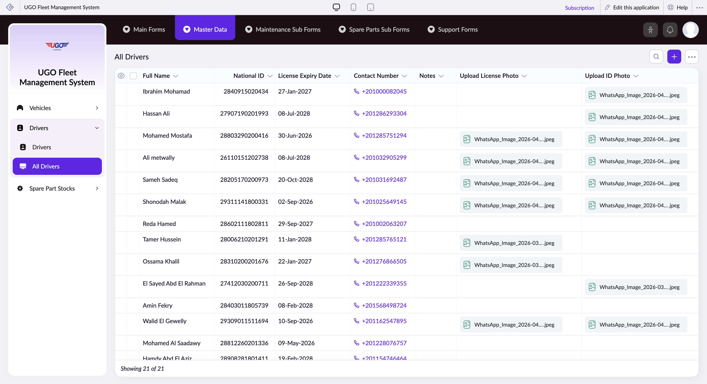

# All Drivers

**URL:** `https://creatorapp.zoho.com/m.fahmy_ugologistics/u-go-garage-maintenance#Report:All_Drivers`

## Page Sections

- All Drivers

## Form Fields

| Field | Type | Required |
|-------|------|----------|
| lang-select-dropdown | dropdown | No |
| Checkbox | checkbox | No |
| 4780709000000838003_checkbox | checkbox | No |
| 4780709000000835019_checkbox | checkbox | No |
| 4780709000000835014_checkbox | checkbox | No |
| 4780709000000805063_checkbox | checkbox | No |
| 4780709000000805057_checkbox | checkbox | No |
| 4780709000000805026_checkbox | checkbox | No |
| 4780709000000517005_checkbox | checkbox | No |
| 4780709000000436017_checkbox | checkbox | No |
| 4780709000000436011_checkbox | checkbox | No |
| 4780709000000436005_checkbox | checkbox | No |
| 4780709000000415065_checkbox | checkbox | No |
| 4780709000000415059_checkbox | checkbox | No |
| 4780709000000415053_checkbox | checkbox | No |
| 4780709000000415047_checkbox | checkbox | No |
| 4780709000000415041_checkbox | checkbox | No |
| 4780709000000415035_checkbox | checkbox | No |
| 4780709000000415029_checkbox | checkbox | No |
| 4780709000000415023_checkbox | checkbox | No |
| 4780709000000415017_checkbox | checkbox | No |
| 4780709000000415011_checkbox | checkbox | No |
| 4780709000000415005_checkbox | checkbox | No |
| Checkbox | checkbox | No |
| wrapColsInputEl | checkbox | No |
| show-hide-col-all | checkbox | No |
| viewdel | checkbox | No |
| viewdel | checkbox | No |
| viewdel | checkbox | No |
| viewdel | checkbox | No |
| viewdel | checkbox | No |
| viewdel | checkbox | No |
| viewdel | checkbox | No |
| volume | range | No |
| checkbox-Full_Name-ZC_8VH8EK | checkbox | No |
| s2id_autogen4 | text | No |
| s2id_autogen4_search | text | No |
| zc_searchSelect | dropdown | No |
| checkbox-Full_Name.prefix-ZC_8VH8EK | checkbox | No |
| s2id_autogen6 | text | No |
| s2id_autogen6_search | text | No |
| zc_searchSelect | dropdown | No |
| checkbox-Full_Name.first_name-ZC_8VH8EK | checkbox | No |
| s2id_autogen8 | text | No |
| s2id_autogen8_search | text | No |
| zc_searchSelect | dropdown | No |
| checkbox-Full_Name.last_name-ZC_8VH8EK | checkbox | No |
| s2id_autogen10 | text | No |
| s2id_autogen10_search | text | No |
| zc_searchSelect | dropdown | No |
| checkbox-Full_Name.suffix-ZC_8VH8EK | checkbox | No |
| s2id_autogen12 | text | No |
| s2id_autogen12_search | text | No |
| zc_searchSelect | dropdown | No |
| checkbox-National_ID-ZC_8VH8EK | checkbox | No |
| s2id_autogen14 | text | No |
| s2id_autogen14_search | text | No |
| zc_searchSelect | dropdown | No |
| From | text | No |
| To | text | No |
| checkbox-License_Expiry_Date-ZC_8VH8EK | checkbox | No |
| s2id_autogen16 | text | No |
| s2id_autogen16_search | text | No |
| zc_searchSelect | dropdown | No |
| viewSearchEl_License_Expiry_Date | text | No |
| From | text | No |
| To | text | No |
| checkbox-Contact_Number-ZC_8VH8EK | checkbox | No |
| s2id_autogen18 | text | No |
| s2id_autogen18_search | text | No |
| zc_searchSelect | dropdown | No |
| checkbox-Notes-ZC_8VH8EK | checkbox | No |
| s2id_autogen20 | text | No |
| s2id_autogen20_search | text | No |
| zc_searchSelect | dropdown | No |
| checkbox-Upload_License_Photo-ZC_8VH8EK | checkbox | No |
| s2id_autogen22 | text | No |
| s2id_autogen22_search | text | No |
| zc_searchSelect | dropdown | No |
| checkbox-Upload_ID_Photo-ZC_8VH8EK | checkbox | No |
| s2id_autogen24 | text | No |
| s2id_autogen24_search | text | No |
| zc_searchSelect | dropdown | No |
| checkbox-Driver_Status-ZC_8VH8EK | checkbox | No |
| s2id_autogen26 | text | No |
| s2id_autogen26_search | text | No |
| zc_searchSelect | dropdown | No |
| allowlocation | button | No |
| useIconSwitch | checkbox | No |
| toggleIconSwitch | checkbox | No |
| saveIcons | button | No |
| resetIcons | button | No |
| Search... | text | No |
| I have read the above conditions. | checkbox | No |
| reqEmailId | text | No |
| s2id_autogen2 | text | No |
| s2id_autogen2_search | text | No |
| supportType | dropdown | No |
| Please enable edit permission to help with troubleshooting | checkbox | No |
| reachusChatDescription | textarea | No |
| reachUsStartChat | button | No |
| zc-reachus-editaccess-enable-button | button | No |
| zc-reachus-editaccess-revoke-button | button | No |
| zc-reachus-screenrecord-button | button | No |

## Table Columns

- Full Name
- National ID
- License Expiry Date
- Contact Number
- Notes
- Upload License Photo
- Upload ID Photo

## Actions

- **Done**
- **Main Forms**
- **Master Data**
- **Maintenance Sub Forms**
- **Spare Parts Sub Forms**
- **Support Forms**
- **Remove Changes**
- **Show as**
- **Print**
- **Import**
- **Export**
- **Bulk Edit**
- **Duplicate**
- **Delete**
- **AddAdd (Option + Shift + N)**
- **Submit Request**

## Common Workflows

_Document step-by-step workflows for this page here._
