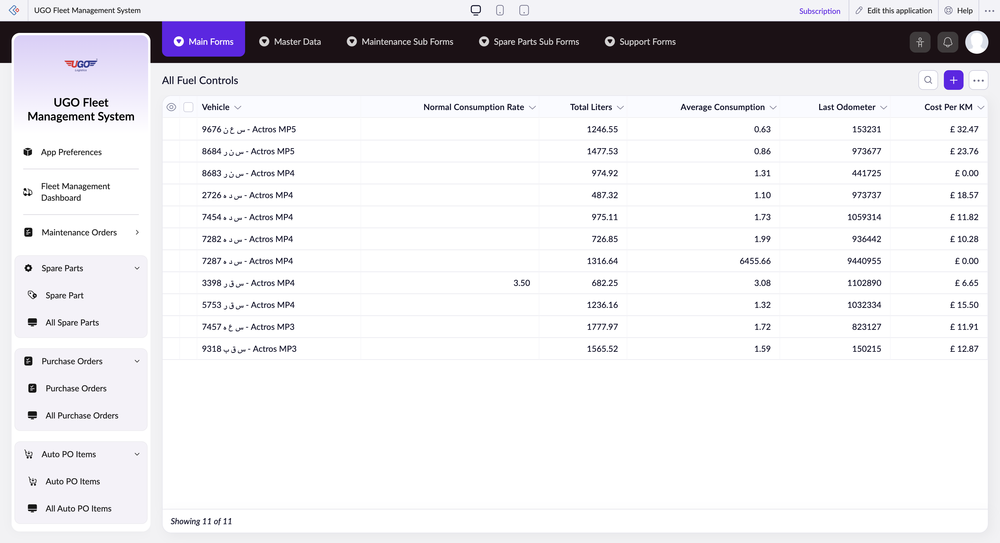

# All Fuel Controls

**URL:** `https://creatorapp.zoho.com/m.fahmy_ugologistics/u-go-garage-maintenance#Report:All_Fuel_Controls`

## Page Sections

- Upgrade to Creator 5
- Update your subscription plan
- UGO Fleet Management System
- All Fuel Controls
- Export
- Introducing the New zoho Creator ui
- Introducing the New zoho Creator ui
- Introducing the New zoho Creator ui
- Introducing the New zoho Creator ui

## Form Fields

| Field | Type | Required |
|-------|------|----------|
| lang-select-dropdown | dropdown | No |
| Checkbox | checkbox | No |
| 4780709000000835067_checkbox | checkbox | No |
| 4780709000000832024_checkbox | checkbox | No |
| 4780709000000832019_checkbox | checkbox | No |
| 4780709000000832006_checkbox | checkbox | No |
| 4780709000000805053_checkbox | checkbox | No |
| 4780709000000805048_checkbox | checkbox | No |
| 4780709000000805043_checkbox | checkbox | No |
| 4780709000000805036_checkbox | checkbox | No |
| 4780709000000805022_checkbox | checkbox | No |
| 4780709000000805012_checkbox | checkbox | No |
| 4780709000000797013_checkbox | checkbox | No |
| Checkbox | checkbox | No |
| wrapColsInputEl | checkbox | No |
| show-hide-col-all | checkbox | No |
| viewdel | checkbox | No |
| viewdel | checkbox | No |
| viewdel | checkbox | No |
| viewdel | checkbox | No |
| viewdel | checkbox | No |
| viewdel | checkbox | No |
| volume | range | No |
| checkbox-Vehicle-ZC_P8JL86 | checkbox | No |
| s2id_autogen80 | text | No |
| s2id_autogen80_search | text | No |
| zc_searchSelect | dropdown | No |
| checkbox-Normal_Consumption_Rate-ZC_P8JL86 | checkbox | No |
| s2id_autogen82 | text | No |
| s2id_autogen82_search | text | No |
| zc_searchSelect | dropdown | No |
| From | text | No |
| To | text | No |
| checkbox-Total_Liters-ZC_P8JL86 | checkbox | No |
| s2id_autogen84 | text | No |
| s2id_autogen84_search | text | No |
| zc_searchSelect | dropdown | No |
| From | text | No |
| To | text | No |
| checkbox-Average_Consumption-ZC_P8JL86 | checkbox | No |
| s2id_autogen86 | text | No |
| s2id_autogen86_search | text | No |
| zc_searchSelect | dropdown | No |
| From | text | No |
| To | text | No |
| checkbox-Last_Odometer-ZC_P8JL86 | checkbox | No |
| s2id_autogen88 | text | No |
| s2id_autogen88_search | text | No |
| zc_searchSelect | dropdown | No |
| From | text | No |
| To | text | No |
| checkbox-Cost_Per_KM-ZC_P8JL86 | checkbox | No |
| s2id_autogen90 | text | No |
| s2id_autogen90_search | text | No |
| zc_searchSelect | dropdown | No |
| From | text | No |
| To | text | No |
| allowlocation | button | No |
| useIconSwitch | checkbox | No |
| toggleIconSwitch | checkbox | No |
| saveIcons | button | No |
| resetIcons | button | No |
| Search... | text | No |
| I have read the above conditions. | checkbox | No |
| reqEmailId | text | No |
| s2id_autogen2 | text | No |
| s2id_autogen2_search | text | No |
| supportType | dropdown | No |
| Please enable edit permission to help with troubleshooting | checkbox | No |
| reachusChatDescription | textarea | No |
| reachUsStartChat | button | No |
| zc-reachus-editaccess-enable-button | button | No |
| zc-reachus-editaccess-revoke-button | button | No |
| zc-reachus-screenrecord-button | button | No |

## Table Columns

- Vehicle
- Normal Consumption Rate
- Total Liters
- Average Consumption
- Last Odometer
- Cost Per KM

## Actions

- **Done**
- **Main Forms**
- **Master Data**
- **Maintenance Sub Forms**
- **Spare Parts Sub Forms**
- **Support Forms**
- **Remove Changes**
- **Show as**
- **Print**
- **Import**
- **Export**
- **Bulk Edit**
- **Duplicate**
- **Delete**
- **AddAdd (Option + Shift + N)**
- **Submit Request**

## Common Workflows

_Document step-by-step workflows for this page here._
