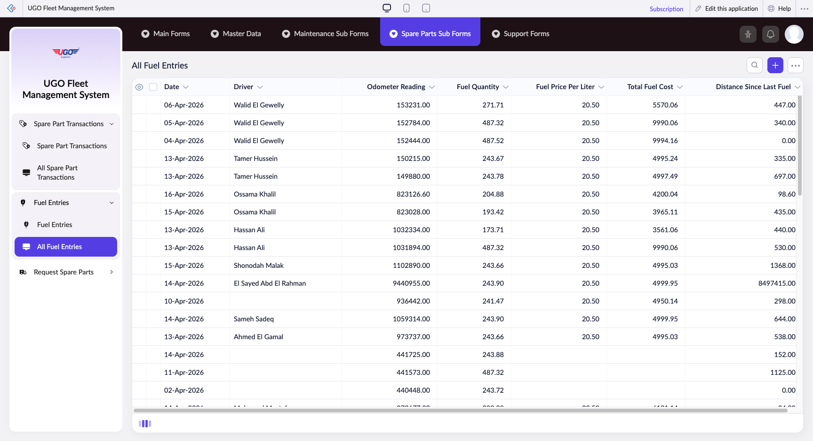

# All Fuel Entries

The All Fuel Entries page displays a complete record of every fuel purchase across your vehicle fleet. Operations staff use this page to track fuel expenses, monitor fuel efficiency trends, and verify that fuel costs match your budget. Access this page regularly to review spending patterns and identify vehicles with unusual consumption.

**URL:** `https://creatorapp.zoho.com/m.fahmy_ugologistics/u-go-garage-maintenance#Report:All_Fuel_Entries`

## How to Use

1. Open the Fuel Management section and select 'All Fuel Entries' to view the complete fuel log
2. Use the table to review fuel records by Date, Driver, Odometer Reading, Fuel Quantity, and Total Fuel Cost
3. To filter or select specific entries, check the checkboxes next to the fuel records you want to work with
4. Use 'Bulk Edit' to update multiple fuel entries at once, or 'Export' to download fuel data for accounting or analysis
5. Click 'Print' to generate a fuel report for your records or to share with management
6. Use 'Delete' to remove incorrect fuel entries (do this only if the entry was entered in error, not to adjust historical data)
7. Click 'Done' when finished reviewing or making changes to return to the main menu

## Page Sections

- All Fuel Entries

## Form Fields

| Field | Description | Type | Required |
|-------|-------------|------|----------|
| lang-select-dropdown | Choose the display language for this page. Select your preferred language from the dropdown menu. | dropdown | No |
| Checkbox |  | checkbox | No |
| 4780709000000835065_checkbox |  | checkbox | No |
| 4780709000000835063_checkbox |  | checkbox | No |
| 4780709000000835061_checkbox |  | checkbox | No |
| 4780709000000835058_checkbox |  | checkbox | No |
| 4780709000000835056_checkbox |  | checkbox | No |
| 4780709000000835053_checkbox |  | checkbox | No |
| 4780709000000835051_checkbox |  | checkbox | No |
| 4780709000000835048_checkbox |  | checkbox | No |
| 4780709000000835046_checkbox |  | checkbox | No |
| 4780709000000835042_checkbox |  | checkbox | No |
| 4780709000000835038_checkbox |  | checkbox | No |
| 4780709000000835035_checkbox |  | checkbox | No |
| 4780709000000835032_checkbox |  | checkbox | No |
| 4780709000000835029_checkbox |  | checkbox | No |
| 4780709000000835027_checkbox |  | checkbox | No |
| 4780709000000835025_checkbox |  | checkbox | No |
| 4780709000000835023_checkbox |  | checkbox | No |
| 4780709000000835010_checkbox |  | checkbox | No |
| 4780709000000835008_checkbox |  | checkbox | No |
| 4780709000000835006_checkbox |  | checkbox | No |
| 4780709000000835004_checkbox |  | checkbox | No |
| 4780709000000835002_checkbox |  | checkbox | No |
| 4780709000000832036_checkbox |  | checkbox | No |
| 4780709000000832034_checkbox |  | checkbox | No |
| 4780709000000832031_checkbox |  | checkbox | No |
| 4780709000000832028_checkbox |  | checkbox | No |
| 4780709000000832026_checkbox |  | checkbox | No |
| 4780709000000832022_checkbox |  | checkbox | No |
| 4780709000000832017_checkbox |  | checkbox | No |
| 4780709000000832014_checkbox |  | checkbox | No |
| 4780709000000832012_checkbox |  | checkbox | No |
| 4780709000000832009_checkbox |  | checkbox | No |
| 4780709000000832004_checkbox |  | checkbox | No |
| 4780709000000832002_checkbox |  | checkbox | No |
| 4780709000000819036_checkbox |  | checkbox | No |
| 4780709000000819033_checkbox |  | checkbox | No |
| 4780709000000819031_checkbox |  | checkbox | No |
| 4780709000000819028_checkbox |  | checkbox | No |
| 4780709000000805051_checkbox |  | checkbox | No |
| 4780709000000805046_checkbox |  | checkbox | No |
| 4780709000000805041_checkbox |  | checkbox | No |
| 4780709000000805039_checkbox |  | checkbox | No |
| 4780709000000805034_checkbox |  | checkbox | No |
| 4780709000000805032_checkbox |  | checkbox | No |
| 4780709000000805030_checkbox |  | checkbox | No |
| 4780709000000805020_checkbox |  | checkbox | No |
| 4780709000000805017_checkbox |  | checkbox | No |
| 4780709000000805015_checkbox |  | checkbox | No |
| 4780709000000805010_checkbox |  | checkbox | No |
| 4780709000000805008_checkbox |  | checkbox | No |
| Checkbox |  | checkbox | No |
| wrapColsInputEl |  | checkbox | No |
| show-hide-col-all |  | checkbox | No |
| viewdel |  | checkbox | No |
| viewdel |  | checkbox | No |
| viewdel |  | checkbox | No |
| viewdel |  | checkbox | No |
| viewdel |  | checkbox | No |
| viewdel |  | checkbox | No |
| viewdel |  | checkbox | No |
| volume |  | range | No |
| checkbox-Date_field1-ZC_HAK4PS |  | checkbox | No |
| s2id_autogen168 |  | text | No |
| s2id_autogen168_search |  | text | No |
| zc_searchSelect |  | dropdown | No |
| viewSearchEl_Date_field1 |  | text | No |
| From |  | text | No |
| To |  | text | No |
| checkbox-Driver-ZC_HAK4PS |  | checkbox | No |
| s2id_autogen170 |  | text | No |
| s2id_autogen170_search |  | text | No |
| zc_searchSelect |  | dropdown | No |
| checkbox-Odometer_Reading-ZC_HAK4PS |  | checkbox | No |
| s2id_autogen172 |  | text | No |
| s2id_autogen172_search |  | text | No |
| zc_searchSelect |  | dropdown | No |
| From |  | text | No |
| To |  | text | No |
| checkbox-Fuel_Quantity-ZC_HAK4PS |  | checkbox | No |
| s2id_autogen174 |  | text | No |
| s2id_autogen174_search |  | text | No |
| zc_searchSelect |  | dropdown | No |
| From |  | text | No |
| To |  | text | No |
| checkbox-Fuel_Price_Per_Liter-ZC_HAK4PS |  | checkbox | No |
| s2id_autogen176 |  | text | No |
| s2id_autogen176_search |  | text | No |
| zc_searchSelect |  | dropdown | No |
| From |  | text | No |
| To |  | text | No |
| checkbox-Total_Fuel_Cost-ZC_HAK4PS |  | checkbox | No |
| s2id_autogen178 |  | text | No |
| s2id_autogen178_search |  | text | No |
| zc_searchSelect |  | dropdown | No |
| From |  | text | No |
| To |  | text | No |
| checkbox-Distance_Since_Last_Fuel-ZC_HAK4PS |  | checkbox | No |
| s2id_autogen180 |  | text | No |
| s2id_autogen180_search |  | text | No |
| zc_searchSelect |  | dropdown | No |
| From |  | text | No |
| To |  | text | No |
| checkbox-Actual_Consumption-ZC_HAK4PS |  | checkbox | No |
| s2id_autogen182 |  | text | No |
| s2id_autogen182_search |  | text | No |
| zc_searchSelect |  | dropdown | No |
| From |  | text | No |
| To |  | text | No |
| checkbox-Status-ZC_HAK4PS |  | checkbox | No |
| s2id_autogen184 |  | text | No |
| s2id_autogen184_search |  | text | No |
| zc_searchSelect |  | dropdown | No |
| checkbox-Consumption_Deviation-ZC_HAK4PS |  | checkbox | No |
| s2id_autogen186 |  | text | No |
| s2id_autogen186_search |  | text | No |
| zc_searchSelect |  | dropdown | No |
| From |  | text | No |
| To |  | text | No |
| checkbox-Vehicle-ZC_HAK4PS |  | checkbox | No |
| s2id_autogen188 |  | text | No |
| s2id_autogen188_search |  | text | No |
| zc_searchSelect |  | dropdown | No |
| allowlocation |  | button | No |
| useIconSwitch |  | checkbox | No |
| toggleIconSwitch |  | checkbox | No |
| saveIcons |  | button | No |
| resetIcons |  | button | No |
| Search... |  | text | No |
| I have read the above conditions. |  | checkbox | No |
| reqEmailId |  | text | No |
| s2id_autogen2 |  | text | No |
| s2id_autogen2_search |  | text | No |
| supportType |  | dropdown | No |
| Please enable edit permission to help with troubleshooting |  | checkbox | No |
| reachusChatDescription |  | textarea | No |
| reachUsStartChat |  | button | No |

## Table Columns

- Date
- Driver
- Odometer Reading
- Fuel Quantity
- Fuel Price Per Liter
- Total Fuel Cost
- Distance Since Last Fuel

## Actions

- **Done**
- **Main Forms**
- **Master Data**
- **Maintenance Sub Forms**
- **Spare Parts Sub Forms**
- **Support Forms**
- **Remove Changes**
- **Show as**
- **Print**
- **Import**
- **Export**
- **Bulk Edit**
- **Duplicate**
- **Delete**
- **AddAdd (Option + Shift + N)**
- **Submit Request**

## Tips

- Always record the odometer reading at the exact moment of fueling—delays in recording can create gaps in your distance calculations and make fuel efficiency reports inaccurate.
- Use 'Export' at the end of each month to create a backup of all fuel entries and share detailed cost reports with accounting or fleet management.

## Related Pages

- [Fuel Control](fuel-control.md)
- [All Fuel Controls](all-fuel-controls.md)
- [Fuel Entries](fuel-entries.md)
- [Fuel – Vehicle Performance Summary](fuel-vehicle-performance-summary.md)
- [Worst Vehicles Report](worst-vehicles-report.md)
- [Cost Per KM](cost-per-km.md)

## Common Workflows

_Add step-by-step workflows specific to your organisation here._
