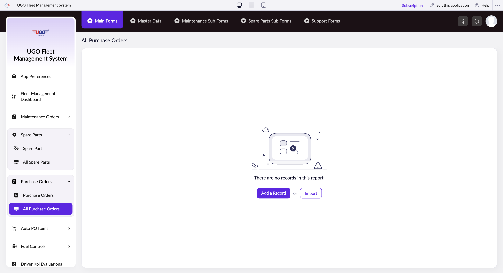

# All Purchase Orders

**URL:** `https://creatorapp.zoho.com/m.fahmy_ugologistics/u-go-garage-maintenance#Report:All_Purchase_Orders`

## Page Sections

- Upgrade to Creator 5
- Update your subscription plan
- UGO Fleet Management System
- All Purchase Orders
- Export
- Introducing the New zoho Creator ui
- Introducing the New zoho Creator ui
- Introducing the New zoho Creator ui
- Introducing the New zoho Creator ui

## Form Fields

| Field | Type | Required |
|-------|------|----------|
| lang-select-dropdown | dropdown | No |
| volume | range | No |
| checkbox-Purchase_Order_ID-ZC_A9PFL5 | checkbox | No |
| s2id_autogen32 | text | No |
| s2id_autogen32_search | text | No |
| zc_searchSelect | dropdown | No |
| checkbox-PO_Date-ZC_A9PFL5 | checkbox | No |
| s2id_autogen34 | text | No |
| s2id_autogen34_search | text | No |
| zc_searchSelect | dropdown | No |
| viewSearchEl_PO_Date | text | No |
| From | text | No |
| To | text | No |
| checkbox-Purchase_Order_Type-ZC_A9PFL5 | checkbox | No |
| s2id_autogen36 | text | No |
| s2id_autogen36_search | text | No |
| zc_searchSelect | dropdown | No |
| checkbox-Status-ZC_A9PFL5 | checkbox | No |
| s2id_autogen38 | text | No |
| s2id_autogen38_search | text | No |
| zc_searchSelect | dropdown | No |
| checkbox-Total_PO_Cost-ZC_A9PFL5 | checkbox | No |
| s2id_autogen40 | text | No |
| s2id_autogen40_search | text | No |
| zc_searchSelect | dropdown | No |
| From | text | No |
| To | text | No |
| checkbox-Purchase_Order_Items.Spare_Part-ZC_A9PFL5 | checkbox | No |
| s2id_autogen42 | text | No |
| s2id_autogen42_search | text | No |
| zc_searchSelect | dropdown | No |
| checkbox-Manual_Purchase_Order_Items.Spare_Part-ZC_A9PFL5 | checkbox | No |
| s2id_autogen44 | text | No |
| s2id_autogen44_search | text | No |
| zc_searchSelect | dropdown | No |
| checkbox-Notes-ZC_A9PFL5 | checkbox | No |
| s2id_autogen46 | text | No |
| s2id_autogen46_search | text | No |
| zc_searchSelect | dropdown | No |
| checkbox-Finance_Approval_Date-ZC_A9PFL5 | checkbox | No |
| s2id_autogen48 | text | No |
| s2id_autogen48_search | text | No |
| zc_searchSelect | dropdown | No |
| viewSearchEl_Finance_Approval_Date | text | No |
| From | text | No |
| To | text | No |
| checkbox-Approved_By-ZC_A9PFL5 | checkbox | No |
| s2id_autogen50 | text | No |
| s2id_autogen50_search | text | No |
| zc_searchSelect | dropdown | No |
| checkbox-Approval-ZC_A9PFL5 | checkbox | No |
| s2id_autogen52 | text | No |
| s2id_autogen52_search | text | No |
| zc_searchSelect | dropdown | No |
| allowlocation | button | No |
| useIconSwitch | checkbox | No |
| toggleIconSwitch | checkbox | No |
| saveIcons | button | No |
| resetIcons | button | No |
| Search... | text | No |
| I have read the above conditions. | checkbox | No |
| reqEmailId | text | No |
| s2id_autogen2 | text | No |
| s2id_autogen2_search | text | No |
| supportType | dropdown | No |
| Please enable edit permission to help with troubleshooting | checkbox | No |
| reachusChatDescription | textarea | No |
| reachUsStartChat | button | No |
| zc-reachus-editaccess-enable-button | button | No |
| zc-reachus-editaccess-revoke-button | button | No |
| zc-reachus-screenrecord-button | button | No |

## Actions

- **Done**
- **Main Forms**
- **Master Data**
- **Maintenance Sub Forms**
- **Spare Parts Sub Forms**
- **Support Forms**
- **Remove Changes**
- **Add a Record**
- **Import**
- **Submit Request**

## Common Workflows

_Document step-by-step workflows for this page here._
