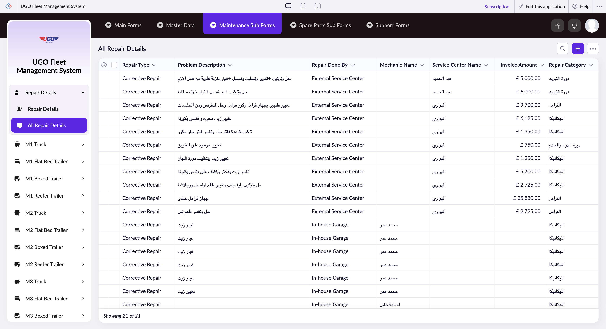

# All Repair Details

**URL:** `https://creatorapp.zoho.com/m.fahmy_ugologistics/u-go-garage-maintenance#Report:All_Repair_Details`

## Page Sections

- Upgrade to Creator 5
- Update your subscription plan
- UGO Fleet Management System
- All Repair Details
- Export
- Introducing the New zoho Creator ui
- Introducing the New zoho Creator ui
- Introducing the New zoho Creator ui
- Introducing the New zoho Creator ui

## Form Fields

| Field | Type | Required |
|-------|------|----------|
| lang-select-dropdown | dropdown | No |
| Checkbox | checkbox | No |
| 4780709000000821052_checkbox | checkbox | No |
| 4780709000000821047_checkbox | checkbox | No |
| 4780709000000821042_checkbox | checkbox | No |
| 4780709000000821037_checkbox | checkbox | No |
| 4780709000000821032_checkbox | checkbox | No |
| 4780709000000821027_checkbox | checkbox | No |
| 4780709000000821022_checkbox | checkbox | No |
| 4780709000000821017_checkbox | checkbox | No |
| 4780709000000821012_checkbox | checkbox | No |
| 4780709000000821007_checkbox | checkbox | No |
| 4780709000000821002_checkbox | checkbox | No |
| 4780709000000819018_checkbox | checkbox | No |
| 4780709000000819010_checkbox | checkbox | No |
| 4780709000000819002_checkbox | checkbox | No |
| 4780709000000814094_checkbox | checkbox | No |
| 4780709000000814080_checkbox | checkbox | No |
| 4780709000000814072_checkbox | checkbox | No |
| 4780709000000814064_checkbox | checkbox | No |
| 4780709000000814054_checkbox | checkbox | No |
| 4780709000000814046_checkbox | checkbox | No |
| 4780709000000767013_checkbox | checkbox | No |
| Checkbox | checkbox | No |
| wrapColsInputEl | checkbox | No |
| show-hide-col-all | checkbox | No |
| viewdel | checkbox | No |
| viewdel | checkbox | No |
| viewdel | checkbox | No |
| viewdel | checkbox | No |
| viewdel | checkbox | No |
| viewdel | checkbox | No |
| viewdel | checkbox | No |
| volume | range | No |
| checkbox-Repair_Type-ZC_S0EBJX | checkbox | No |
| s2id_autogen54 | text | No |
| s2id_autogen54_search | text | No |
| zc_searchSelect | dropdown | No |
| checkbox-Problem_Description-ZC_S0EBJX | checkbox | No |
| s2id_autogen56 | text | No |
| s2id_autogen56_search | text | No |
| zc_searchSelect | dropdown | No |
| checkbox-Repair_Done_By-ZC_S0EBJX | checkbox | No |
| s2id_autogen58 | text | No |
| s2id_autogen58_search | text | No |
| zc_searchSelect | dropdown | No |
| checkbox-Mechanic_Name-ZC_S0EBJX | checkbox | No |
| s2id_autogen60 | text | No |
| s2id_autogen60_search | text | No |
| zc_searchSelect | dropdown | No |
| checkbox-Service_Center_Name-ZC_S0EBJX | checkbox | No |
| s2id_autogen62 | text | No |
| s2id_autogen62_search | text | No |
| zc_searchSelect | dropdown | No |
| checkbox-Invoice_Amount-ZC_S0EBJX | checkbox | No |
| s2id_autogen64 | text | No |
| s2id_autogen64_search | text | No |
| zc_searchSelect | dropdown | No |
| From | text | No |
| To | text | No |
| checkbox-Repair_Category-ZC_S0EBJX | checkbox | No |
| s2id_autogen66 | text | No |
| s2id_autogen66_search | text | No |
| zc_searchSelect | dropdown | No |
| checkbox-File_upload-ZC_S0EBJX | checkbox | No |
| s2id_autogen68 | text | No |
| s2id_autogen68_search | text | No |
| zc_searchSelect | dropdown | No |
| allowlocation | button | No |
| useIconSwitch | checkbox | No |
| toggleIconSwitch | checkbox | No |
| saveIcons | button | No |
| resetIcons | button | No |
| Search... | text | No |
| I have read the above conditions. | checkbox | No |
| reqEmailId | text | No |
| s2id_autogen2 | text | No |
| s2id_autogen2_search | text | No |
| supportType | dropdown | No |
| Please enable edit permission to help with troubleshooting | checkbox | No |
| reachusChatDescription | textarea | No |
| reachUsStartChat | button | No |
| zc-reachus-editaccess-enable-button | button | No |
| zc-reachus-editaccess-revoke-button | button | No |
| zc-reachus-screenrecord-button | button | No |

## Table Columns

- Repair Type
- Problem Description
- Repair Done By
- Mechanic Name
- Service Center Name
- Invoice Amount
- Repair Category

## Actions

- **Done**
- **Main Forms**
- **Master Data**
- **Maintenance Sub Forms**
- **Spare Parts Sub Forms**
- **Support Forms**
- **Remove Changes**
- **Show as**
- **Print**
- **Import**
- **Export**
- **Bulk Edit**
- **Duplicate**
- **Delete**
- **AddAdd (Option + Shift + N)**
- **Submit Request**

## Common Workflows

_Document step-by-step workflows for this page here._
