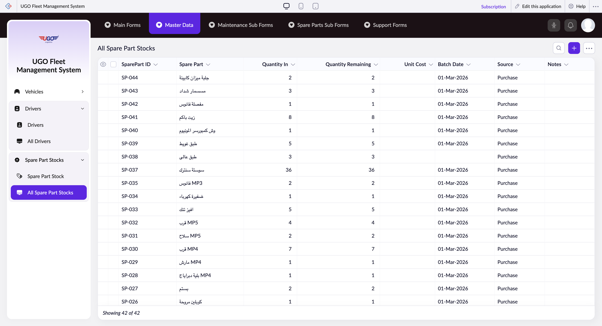

# All Spare Part Stocks

The All Spare Part Stocks page displays your complete inventory of garage maintenance parts, showing current quantities, costs, and sourcing information. Warehouse and maintenance staff use this page to monitor stock levels, track parts availability, and manage bulk operations across all spare parts in the system.

**URL:** `https://creatorapp.zoho.com/m.fahmy_ugologistics/u-go-garage-maintenance#Report:All_Spare_Part_Stocks`

## How to Use

1. Open the Spare Parts section and select 'All Spare Part Stocks' to view the complete inventory table.
2. Review the table columns to check current stock: Quantity In shows incoming stock, Quantity Remaining shows available parts.
3. To select specific parts for action, check the checkbox next to each part ID or use the 'Checkbox' header to select all parts at once.
4. Use the action buttons at the top: Bulk Edit to update multiple parts, Export to download stock data, or Print to generate a report.
5. To add new spare parts, click 'Add' (or press Option + Shift + N) to create a new inventory record.
6. Click 'Done' when finished to save your selections and close the form.

## Page Sections

- All Spare Part Stocks

## Form Fields

| Field | Description | Type | Required |
|-------|-------------|------|----------|
| lang-select-dropdown | Choose the language for the form display; this controls the interface language only, not your data. | dropdown | No |
| Checkbox |  | checkbox | No |
| 4780709000000796054_checkbox |  | checkbox | No |
| 4780709000000796048_checkbox |  | checkbox | No |
| 4780709000000796042_checkbox |  | checkbox | No |
| 4780709000000796036_checkbox |  | checkbox | No |
| 4780709000000796030_checkbox |  | checkbox | No |
| 4780709000000796024_checkbox |  | checkbox | No |
| 4780709000000796018_checkbox |  | checkbox | No |
| 4780709000000796012_checkbox |  | checkbox | No |
| 4780709000000779200_checkbox |  | checkbox | No |
| 4780709000000779190_checkbox |  | checkbox | No |
| 4780709000000779180_checkbox |  | checkbox | No |
| 4780709000000779170_checkbox |  | checkbox | No |
| 4780709000000779160_checkbox |  | checkbox | No |
| 4780709000000779150_checkbox |  | checkbox | No |
| 4780709000000779140_checkbox |  | checkbox | No |
| 4780709000000779130_checkbox |  | checkbox | No |
| 4780709000000779120_checkbox |  | checkbox | No |
| 4780709000000779110_checkbox |  | checkbox | No |
| 4780709000000779100_checkbox |  | checkbox | No |
| 4780709000000779090_checkbox |  | checkbox | No |
| 4780709000000779080_checkbox |  | checkbox | No |
| 4780709000000779070_checkbox |  | checkbox | No |
| 4780709000000779060_checkbox |  | checkbox | No |
| 4780709000000779050_checkbox |  | checkbox | No |
| 4780709000000779040_checkbox |  | checkbox | No |
| 4780709000000779030_checkbox |  | checkbox | No |
| 4780709000000779020_checkbox |  | checkbox | No |
| 4780709000000779010_checkbox |  | checkbox | No |
| 4780709000000772628_checkbox |  | checkbox | No |
| 4780709000000772618_checkbox |  | checkbox | No |
| 4780709000000772608_checkbox |  | checkbox | No |
| 4780709000000772588_checkbox |  | checkbox | No |
| 4780709000000772578_checkbox |  | checkbox | No |
| 4780709000000772568_checkbox |  | checkbox | No |
| 4780709000000772558_checkbox |  | checkbox | No |
| 4780709000000772544_checkbox |  | checkbox | No |
| 4780709000000772534_checkbox |  | checkbox | No |
| 4780709000000772050_checkbox |  | checkbox | No |
| 4780709000000772040_checkbox |  | checkbox | No |
| 4780709000000772030_checkbox |  | checkbox | No |
| 4780709000000772020_checkbox |  | checkbox | No |
| 4780709000000772010_checkbox |  | checkbox | No |
| Checkbox |  | checkbox | No |
| wrapColsInputEl |  | checkbox | No |
| show-hide-col-all |  | checkbox | No |
| viewdel |  | checkbox | No |
| viewdel |  | checkbox | No |
| viewdel |  | checkbox | No |
| viewdel |  | checkbox | No |
| viewdel |  | checkbox | No |
| viewdel |  | checkbox | No |
| viewdel |  | checkbox | No |
| viewdel |  | checkbox | No |
| volume |  | range | No |
| checkbox-Spare_Part.SparePart_ID-ZC_E3FQOV |  | checkbox | No |
| s2id_autogen32 |  | text | No |
| s2id_autogen32_search |  | text | No |
| zc_searchSelect |  | dropdown | No |
| checkbox-Spare_Part-ZC_E3FQOV |  | checkbox | No |
| s2id_autogen34 |  | text | No |
| s2id_autogen34_search |  | text | No |
| zc_searchSelect |  | dropdown | No |
| checkbox-Quantity_In-ZC_E3FQOV |  | checkbox | No |
| s2id_autogen36 |  | text | No |
| s2id_autogen36_search |  | text | No |
| zc_searchSelect |  | dropdown | No |
| From |  | text | No |
| To |  | text | No |
| checkbox-Quantity_Remaining-ZC_E3FQOV |  | checkbox | No |
| s2id_autogen38 |  | text | No |
| s2id_autogen38_search |  | text | No |
| zc_searchSelect |  | dropdown | No |
| From |  | text | No |
| To |  | text | No |
| checkbox-Unit_Cost-ZC_E3FQOV |  | checkbox | No |
| s2id_autogen40 |  | text | No |
| s2id_autogen40_search |  | text | No |
| zc_searchSelect |  | dropdown | No |
| From |  | text | No |
| To |  | text | No |
| checkbox-Batch_Date-ZC_E3FQOV |  | checkbox | No |
| s2id_autogen42 |  | text | No |
| s2id_autogen42_search |  | text | No |
| zc_searchSelect |  | dropdown | No |
| viewSearchEl_Batch_Date |  | text | No |
| From |  | text | No |
| To |  | text | No |
| checkbox-Source-ZC_E3FQOV |  | checkbox | No |
| s2id_autogen44 |  | text | No |
| s2id_autogen44_search |  | text | No |
| zc_searchSelect |  | dropdown | No |
| checkbox-Notes-ZC_E3FQOV |  | checkbox | No |
| s2id_autogen46 |  | text | No |
| s2id_autogen46_search |  | text | No |
| zc_searchSelect |  | dropdown | No |
| allowlocation |  | button | No |
| useIconSwitch |  | checkbox | No |
| toggleIconSwitch |  | checkbox | No |
| saveIcons |  | button | No |
| resetIcons |  | button | No |
| Search... |  | text | No |
| I have read the above conditions. |  | checkbox | No |
| reqEmailId |  | text | No |
| s2id_autogen2 |  | text | No |
| s2id_autogen2_search |  | text | No |
| supportType |  | dropdown | No |
| Please enable edit permission to help with troubleshooting |  | checkbox | No |
| reachusChatDescription |  | textarea | No |
| reachUsStartChat |  | button | No |
| zc-reachus-editaccess-enable-button |  | button | No |
| zc-reachus-editaccess-revoke-button |  | button | No |
| zc-reachus-screenrecord-button |  | button | No |

## Table Columns

- SparePart ID
- Spare Part
- Quantity In
- Quantity Remaining
- Unit Cost
- Batch Date
- Source
- Notes

## Actions

- **Done**
- **Main Forms**
- **Master Data**
- **Maintenance Sub Forms**
- **Spare Parts Sub Forms**
- **Support Forms**
- **Remove Changes**
- **Show as**
- **Print**
- **Import**
- **Export**
- **Bulk Edit**
- **Duplicate**
- **Delete**
- **AddAdd (Option + Shift + N)**
- **Submit Request**

## Tips

- Always verify Quantity Remaining before issuing parts to maintenance jobs; this is your true available stock after accounting for incoming deliveries.
- Use the Batch Date and Source columns to identify old stock or problematic suppliers; older parts may need priority usage or quality review.

## Related Pages

- [All Spare Parts](all-spare-parts.md)
- [Spare Part Stock](spare-part-stock.md)
- [Spare Part Transactions](spare-part-transactions.md)
- [All Spare Part Transactions](all-spare-part-transactions.md)
- [Request Spare Parts](request-spare-parts.md)
- [Request Spare Parts Report](request-spare-parts-report.md)

## Common Workflows

_Add step-by-step workflows specific to your organisation here._
