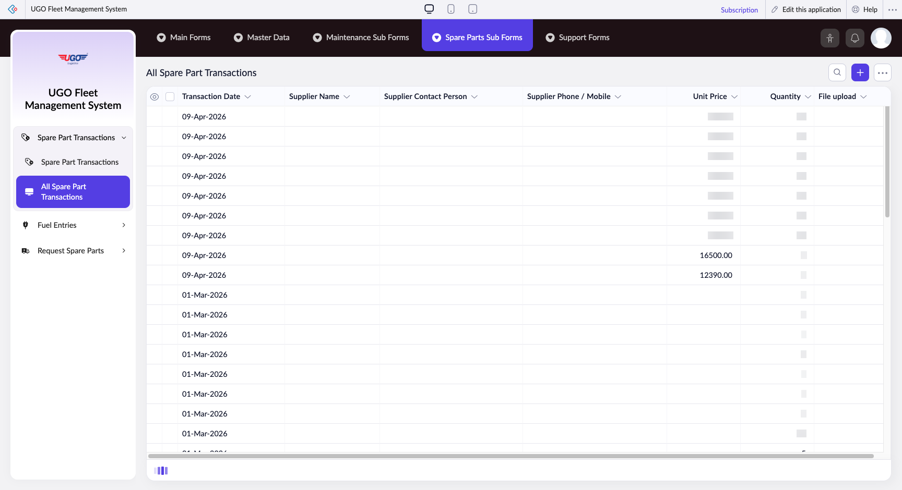

# All Spare Part Transactions

**URL:** `https://creatorapp.zoho.com/m.fahmy_ugologistics/u-go-garage-maintenance#Report:All_Spare_Part_Transactions`

## Page Sections

- All Spare Part Transactions

## Form Fields

| Field | Type | Required |
|-------|------|----------|
| lang-select-dropdown | dropdown | No |
| Checkbox | checkbox | No |
| 4780709000000819024_checkbox | checkbox | No |
| 4780709000000819016_checkbox | checkbox | No |
| 4780709000000819008_checkbox | checkbox | No |
| 4780709000000814100_checkbox | checkbox | No |
| 4780709000000814086_checkbox | checkbox | No |
| 4780709000000814078_checkbox | checkbox | No |
| 4780709000000814070_checkbox | checkbox | No |
| 4780709000000814060_checkbox | checkbox | No |
| 4780709000000814052_checkbox | checkbox | No |
| 4780709000000796050_checkbox | checkbox | No |
| 4780709000000796044_checkbox | checkbox | No |
| 4780709000000796038_checkbox | checkbox | No |
| 4780709000000796032_checkbox | checkbox | No |
| 4780709000000796026_checkbox | checkbox | No |
| 4780709000000796020_checkbox | checkbox | No |
| 4780709000000796014_checkbox | checkbox | No |
| 4780709000000796008_checkbox | checkbox | No |
| 4780709000000796002_checkbox | checkbox | No |
| 4780709000000779193_checkbox | checkbox | No |
| 4780709000000779183_checkbox | checkbox | No |
| 4780709000000779173_checkbox | checkbox | No |
| 4780709000000779163_checkbox | checkbox | No |
| 4780709000000779153_checkbox | checkbox | No |
| 4780709000000779143_checkbox | checkbox | No |
| 4780709000000779133_checkbox | checkbox | No |
| 4780709000000779123_checkbox | checkbox | No |
| 4780709000000779117_checkbox | checkbox | No |
| 4780709000000779103_checkbox | checkbox | No |
| 4780709000000779093_checkbox | checkbox | No |
| 4780709000000779083_checkbox | checkbox | No |
| 4780709000000779073_checkbox | checkbox | No |
| 4780709000000779067_checkbox | checkbox | No |
| 4780709000000779057_checkbox | checkbox | No |
| 4780709000000779047_checkbox | checkbox | No |
| 4780709000000779037_checkbox | checkbox | No |
| 4780709000000779027_checkbox | checkbox | No |
| 4780709000000779017_checkbox | checkbox | No |
| 4780709000000779007_checkbox | checkbox | No |
| 4780709000000772625_checkbox | checkbox | No |
| 4780709000000772615_checkbox | checkbox | No |
| 4780709000000772605_checkbox | checkbox | No |
| 4780709000000772595_checkbox | checkbox | No |
| 4780709000000772585_checkbox | checkbox | No |
| 4780709000000772575_checkbox | checkbox | No |
| 4780709000000772565_checkbox | checkbox | No |
| 4780709000000772555_checkbox | checkbox | No |
| 4780709000000772541_checkbox | checkbox | No |
| 4780709000000772531_checkbox | checkbox | No |
| 4780709000000772521_checkbox | checkbox | No |
| 4780709000000772483_checkbox | checkbox | No |
| Checkbox | checkbox | No |
| wrapColsInputEl | checkbox | No |
| show-hide-col-all | checkbox | No |
| viewdel | checkbox | No |
| viewdel | checkbox | No |
| viewdel | checkbox | No |
| viewdel | checkbox | No |
| viewdel | checkbox | No |
| viewdel | checkbox | No |
| viewdel | checkbox | No |
| volume | range | No |
| checkbox-Transaction_Date-ZC_OGX1KO | checkbox | No |
| s2id_autogen130 | text | No |
| s2id_autogen130_search | text | No |
| zc_searchSelect | dropdown | No |
| viewSearchEl_Transaction_Date | text | No |
| From | text | No |
| To | text | No |
| checkbox-Supplier_Name-ZC_OGX1KO | checkbox | No |
| s2id_autogen132 | text | No |
| s2id_autogen132_search | text | No |
| zc_searchSelect | dropdown | No |
| checkbox-Supplier_Contact_Person-ZC_OGX1KO | checkbox | No |
| s2id_autogen134 | text | No |
| s2id_autogen134_search | text | No |
| zc_searchSelect | dropdown | No |
| checkbox-Supplier_Phone_Mobile-ZC_OGX1KO | checkbox | No |
| s2id_autogen136 | text | No |
| s2id_autogen136_search | text | No |
| zc_searchSelect | dropdown | No |
| checkbox-Unit_Price-ZC_OGX1KO | checkbox | No |
| s2id_autogen138 | text | No |
| s2id_autogen138_search | text | No |
| zc_searchSelect | dropdown | No |
| From | text | No |
| To | text | No |
| checkbox-Quantity-ZC_OGX1KO | checkbox | No |
| s2id_autogen140 | text | No |
| s2id_autogen140_search | text | No |
| zc_searchSelect | dropdown | No |
| From | text | No |
| To | text | No |
| checkbox-File_upload-ZC_OGX1KO | checkbox | No |
| s2id_autogen142 | text | No |
| s2id_autogen142_search | text | No |
| zc_searchSelect | dropdown | No |
| checkbox-Total_Value-ZC_OGX1KO | checkbox | No |
| s2id_autogen144 | text | No |
| s2id_autogen144_search | text | No |
| zc_searchSelect | dropdown | No |
| From | text | No |
| To | text | No |
| checkbox-Brand-ZC_OGX1KO | checkbox | No |
| s2id_autogen146 | text | No |
| s2id_autogen146_search | text | No |
| zc_searchSelect | dropdown | No |
| checkbox-Spare_Part_Condition-ZC_OGX1KO | checkbox | No |
| s2id_autogen148 | text | No |
| s2id_autogen148_search | text | No |
| zc_searchSelect | dropdown | No |
| checkbox-Old_Trans_Quantity-ZC_OGX1KO | checkbox | No |
| s2id_autogen150 | text | No |
| s2id_autogen150_search | text | No |
| zc_searchSelect | dropdown | No |
| From | text | No |
| To | text | No |
| checkbox-Spare_Part-ZC_OGX1KO | checkbox | No |
| s2id_autogen152 | text | No |
| s2id_autogen152_search | text | No |
| zc_searchSelect | dropdown | No |
| checkbox-Maintenance_Order-ZC_OGX1KO | checkbox | No |
| s2id_autogen154 | text | No |
| s2id_autogen154_search | text | No |
| zc_searchSelect | dropdown | No |
| checkbox-Stock_Batch-ZC_OGX1KO | checkbox | No |
| s2id_autogen156 | text | No |
| s2id_autogen156_search | text | No |
| zc_searchSelect | dropdown | No |
| From | text | No |
| To | text | No |
| checkbox-Transaction_Type-ZC_OGX1KO | checkbox | No |
| s2id_autogen158 | text | No |
| s2id_autogen158_search | text | No |
| zc_searchSelect | dropdown | No |
| checkbox-Spare_Part_Number-ZC_OGX1KO | checkbox | No |
| s2id_autogen160 | text | No |
| s2id_autogen160_search | text | No |
| zc_searchSelect | dropdown | No |
| allowlocation | button | No |
| useIconSwitch | checkbox | No |
| toggleIconSwitch | checkbox | No |
| saveIcons | button | No |
| resetIcons | button | No |
| Search... | text | No |
| I have read the above conditions. | checkbox | No |
| reqEmailId | text | No |
| s2id_autogen2 | text | No |
| s2id_autogen2_search | text | No |
| supportType | dropdown | No |
| Please enable edit permission to help with troubleshooting | checkbox | No |
| reachusChatDescription | textarea | No |
| reachUsStartChat | button | No |
| zc-reachus-editaccess-enable-button | button | No |
| zc-reachus-editaccess-revoke-button | button | No |
| zc-reachus-screenrecord-button | button | No |

## Table Columns

- Transaction Date
- Supplier Name
- Supplier Contact Person
- Supplier Phone / Mobile
- Unit Price
- Quantity
- File upload

## Actions

- **Done**
- **Main Forms**
- **Master Data**
- **Maintenance Sub Forms**
- **Spare Parts Sub Forms**
- **Support Forms**
- **Remove Changes**
- **Show as**
- **Print**
- **Import**
- **Export**
- **Bulk Edit**
- **Duplicate**
- **Delete**
- **AddAdd (Option + Shift + N)**
- **Submit Request**

## Common Workflows

_Document step-by-step workflows for this page here._
