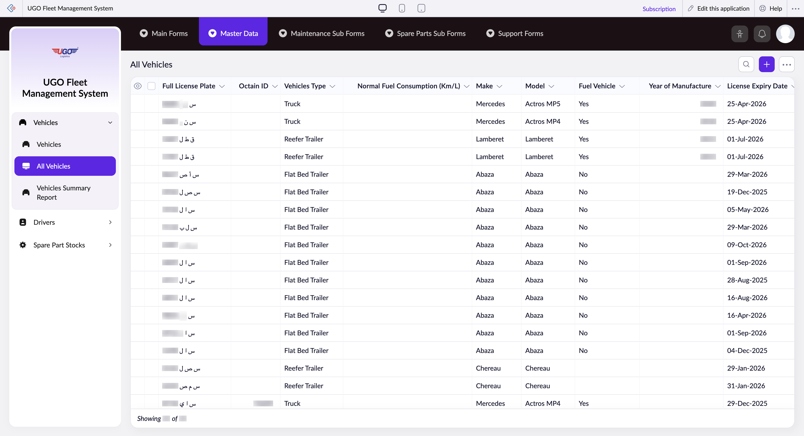

# All Vehicles

The All Vehicles page displays your complete fleet inventory and lets you manage vehicle details, maintenance records, and operational settings. Operations staff use this page to view vehicle specifications, track fuel consumption, monitor license expiries, and perform bulk actions on multiple vehicles at once.

**URL:** `https://creatorapp.zoho.com/m.fahmy_ugologistics/u-go-garage-maintenance#Report:All_Vehicles`

## How to Use

1. Open the All Vehicles page from the Fleet & Drivers section to see your complete vehicle list with key details like license plate, vehicle type, fuel consumption, and license expiry dates.
2. Use the table columns to quickly check vehicle information—scroll right to see all details including make, model, fuel type, and year of manufacture.
3. Select individual vehicles by checking the checkboxes next to each vehicle, or use the main checkbox to select all vehicles at once.
4. For bulk changes across multiple vehicles, check the relevant vehicles and click Bulk Edit to update shared information.
5. To add a new vehicle to the fleet, click the Add button (Option + Shift + N) and fill in the required vehicle details.
6. Use the language dropdown in the top left to change the page language if needed.
7. Click Done when finished making changes, or use the other navigation buttons (Main Forms, Master Data, etc.) to move to different sections.

## Page Sections

- All Vehicles

## Form Fields

| Field | Description | Type | Required |
|-------|-------------|------|----------|
| lang-select-dropdown | Select your preferred language for the page display. This is optional and defaults to your system language. | dropdown | No |
| Checkbox |  | checkbox | No |
| 4780709000000814091_checkbox |  | checkbox | No |
| 4780709000000814088_checkbox |  | checkbox | No |
| 4780709000000805078_checkbox |  | checkbox | No |
| 4780709000000805076_checkbox |  | checkbox | No |
| 4780709000000425107_checkbox |  | checkbox | No |
| 4780709000000425103_checkbox |  | checkbox | No |
| 4780709000000425099_checkbox |  | checkbox | No |
| 4780709000000425095_checkbox |  | checkbox | No |
| 4780709000000425091_checkbox |  | checkbox | No |
| 4780709000000425087_checkbox |  | checkbox | No |
| 4780709000000425083_checkbox |  | checkbox | No |
| 4780709000000425079_checkbox |  | checkbox | No |
| 4780709000000425075_checkbox |  | checkbox | No |
| 4780709000000425071_checkbox |  | checkbox | No |
| 4780709000000425067_checkbox |  | checkbox | No |
| 4780709000000425063_checkbox |  | checkbox | No |
| 4780709000000425059_checkbox |  | checkbox | No |
| 4780709000000425055_checkbox |  | checkbox | No |
| 4780709000000425051_checkbox |  | checkbox | No |
| 4780709000000425047_checkbox |  | checkbox | No |
| 4780709000000425043_checkbox |  | checkbox | No |
| 4780709000000425039_checkbox |  | checkbox | No |
| 4780709000000425035_checkbox |  | checkbox | No |
| 4780709000000425031_checkbox |  | checkbox | No |
| 4780709000000425027_checkbox |  | checkbox | No |
| 4780709000000425023_checkbox |  | checkbox | No |
| 4780709000000425019_checkbox |  | checkbox | No |
| 4780709000000425015_checkbox |  | checkbox | No |
| 4780709000000425011_checkbox |  | checkbox | No |
| 4780709000000425007_checkbox |  | checkbox | No |
| 4780709000000425003_checkbox |  | checkbox | No |
| Checkbox |  | checkbox | No |
| wrapColsInputEl |  | checkbox | No |
| show-hide-col-all |  | checkbox | No |
| viewdel |  | checkbox | No |
| viewdel |  | checkbox | No |
| viewdel |  | checkbox | No |
| viewdel |  | checkbox | No |
| viewdel |  | checkbox | No |
| viewdel |  | checkbox | No |
| viewdel |  | checkbox | No |
| viewdel |  | checkbox | No |
| viewdel |  | checkbox | No |
| volume |  | range | No |
| checkbox-Full_License_Plate-ZC_HSGJ3J |  | checkbox | No |
| s2id_autogen192 |  | text | No |
| s2id_autogen192_search |  | text | No |
| zc_searchSelect |  | dropdown | No |
| checkbox-Octain_ID-ZC_HSGJ3J |  | checkbox | No |
| s2id_autogen194 |  | text | No |
| s2id_autogen194_search |  | text | No |
| zc_searchSelect |  | dropdown | No |
| From |  | text | No |
| To |  | text | No |
| checkbox-Vehicles_Type-ZC_HSGJ3J |  | checkbox | No |
| s2id_autogen196 |  | text | No |
| s2id_autogen196_search |  | text | No |
| zc_searchSelect |  | dropdown | No |
| checkbox-Normal_Fuel_Consumption_Km_L-ZC_HSGJ3J |  | checkbox | No |
| s2id_autogen198 |  | text | No |
| s2id_autogen198_search |  | text | No |
| zc_searchSelect |  | dropdown | No |
| From |  | text | No |
| To |  | text | No |
| checkbox-Make-ZC_HSGJ3J |  | checkbox | No |
| s2id_autogen200 |  | text | No |
| s2id_autogen200_search |  | text | No |
| zc_searchSelect |  | dropdown | No |
| checkbox-Model-ZC_HSGJ3J |  | checkbox | No |
| s2id_autogen202 |  | text | No |
| s2id_autogen202_search |  | text | No |
| zc_searchSelect |  | dropdown | No |
| checkbox-Fuel_Vehicle-ZC_HSGJ3J |  | checkbox | No |
| s2id_autogen204 |  | text | No |
| s2id_autogen204_search |  | text | No |
| zc_searchSelect |  | dropdown | No |
| checkbox-Year_of_Manufacture-ZC_HSGJ3J |  | checkbox | No |
| s2id_autogen206 |  | text | No |
| s2id_autogen206_search |  | text | No |
| zc_searchSelect |  | dropdown | No |
| From |  | text | No |
| To |  | text | No |
| checkbox-License_Expiry_Date-ZC_HSGJ3J |  | checkbox | No |
| s2id_autogen208 |  | text | No |
| s2id_autogen208_search |  | text | No |
| zc_searchSelect |  | dropdown | No |
| viewSearchEl_License_Expiry_Date |  | text | No |
| From |  | text | No |
| To |  | text | No |
| checkbox-License_Plate_Digits-ZC_HSGJ3J |  | checkbox | No |
| s2id_autogen210 |  | text | No |
| s2id_autogen210_search |  | text | No |
| zc_searchSelect |  | dropdown | No |
| From |  | text | No |
| To |  | text | No |
| checkbox-License_plate_Letters-ZC_HSGJ3J |  | checkbox | No |
| s2id_autogen212 |  | text | No |
| s2id_autogen212_search |  | text | No |
| zc_searchSelect |  | dropdown | No |
| checkbox-Notes-ZC_HSGJ3J |  | checkbox | No |
| s2id_autogen214 |  | text | No |
| s2id_autogen214_search |  | text | No |
| zc_searchSelect |  | dropdown | No |
| checkbox-UGO_ID-ZC_HSGJ3J |  | checkbox | No |
| s2id_autogen216 |  | text | No |
| s2id_autogen216_search |  | text | No |
| zc_searchSelect |  | dropdown | No |
| checkbox-Current_Mileage_Km-ZC_HSGJ3J |  | checkbox | No |
| s2id_autogen218 |  | text | No |
| s2id_autogen218_search |  | text | No |
| zc_searchSelect |  | dropdown | No |
| From |  | text | No |
| To |  | text | No |
| checkbox-Date_of_Purchase-ZC_HSGJ3J |  | checkbox | No |
| s2id_autogen220 |  | text | No |
| s2id_autogen220_search |  | text | No |
| zc_searchSelect |  | dropdown | No |
| viewSearchEl_Date_of_Purchase |  | text | No |
| From |  | text | No |
| To |  | text | No |
| checkbox-Chassis_Number-ZC_HSGJ3J |  | checkbox | No |
| s2id_autogen222 |  | text | No |
| s2id_autogen222_search |  | text | No |
| zc_searchSelect |  | dropdown | No |
| checkbox-Engine_Number-ZC_HSGJ3J |  | checkbox | No |
| s2id_autogen224 |  | text | No |
| s2id_autogen224_search |  | text | No |
| zc_searchSelect |  | dropdown | No |
| checkbox-Vehicle_Status-ZC_HSGJ3J |  | checkbox | No |
| s2id_autogen226 |  | text | No |
| s2id_autogen226_search |  | text | No |
| zc_searchSelect |  | dropdown | No |
| checkbox-Fuel_Type-ZC_HSGJ3J |  | checkbox | No |
| s2id_autogen228 |  | text | No |
| s2id_autogen228_search |  | text | No |
| zc_searchSelect |  | dropdown | No |
| checkbox-Upload_License_Photo-ZC_HSGJ3J |  | checkbox | No |
| s2id_autogen230 |  | text | No |
| s2id_autogen230_search |  | text | No |
| zc_searchSelect |  | dropdown | No |
| checkbox-Latest_Fuel_Price-ZC_HSGJ3J |  | checkbox | No |
| s2id_autogen232 |  | text | No |
| s2id_autogen232_search |  | text | No |
| zc_searchSelect |  | dropdown | No |
| From |  | text | No |
| To |  | text | No |
| checkbox-GPS_Tracker-ZC_HSGJ3J |  | checkbox | No |
| s2id_autogen234 |  | text | No |
| s2id_autogen234_search |  | text | No |
| zc_searchSelect |  | dropdown | No |
| checkbox-Upload_Vehicle_Photo-ZC_HSGJ3J |  | checkbox | No |
| s2id_autogen236 |  | text | No |
| s2id_autogen236_search |  | text | No |
| zc_searchSelect |  | dropdown | No |
| allowlocation |  | button | No |
| useIconSwitch |  | checkbox | No |
| toggleIconSwitch |  | checkbox | No |
| saveIcons |  | button | No |
| resetIcons |  | button | No |
| Search... |  | text | No |
| I have read the above conditions. |  | checkbox | No |
| reqEmailId |  | text | No |
| s2id_autogen2 |  | text | No |
| s2id_autogen2_search |  | text | No |
| supportType |  | dropdown | No |
| Please enable edit permission to help with troubleshooting |  | checkbox | No |
| reachusChatDescription |  | textarea | No |
| reachUsStartChat |  | button | No |
| zc-reachus-editaccess-enable-button |  | button | No |
| zc-reachus-editaccess-revoke-button |  | button | No |
| zc-reachus-screenrecord-button |  | button | No |

## Table Columns

- Full License Plate
- Octain ID
- Vehicles Type
- Normal Fuel Consumption (Km/L)
- Make
- Model
- Fuel Vehicle
- Year of Manufacture
- License Expiry Date

## Actions

- **Done**
- **Main Forms**
- **Master Data**
- **Maintenance Sub Forms**
- **Spare Parts Sub Forms**
- **Support Forms**
- **Remove Changes**
- **Show as**
- **Print**
- **Import**
- **Export**
- **Bulk Edit**
- **Duplicate**
- **Delete**
- **AddAdd (Option + Shift + N)**
- **Submit Request**

## Tips

- Always check the License Expiry Date column regularly to avoid running unlicensed vehicles. Set reminders for renewals at least 30 days before expiry.
- Use the fuel consumption field as a baseline for detecting mechanical issues—if actual consumption rises significantly, schedule a maintenance inspection promptly.

## Related Pages

- [Vehicles](vehicles.md)
- [Vehicles Summary Report](vehicles-summary-report.md)
- [All Drivers](all-drivers.md)
- [Driver KPI Evaluation](driver-kpi-evaluation.md)
- [All Driver Kpi Evaluations](all-driver-kpi-evaluations.md)

## Common Workflows

_Add step-by-step workflows specific to your organisation here._
