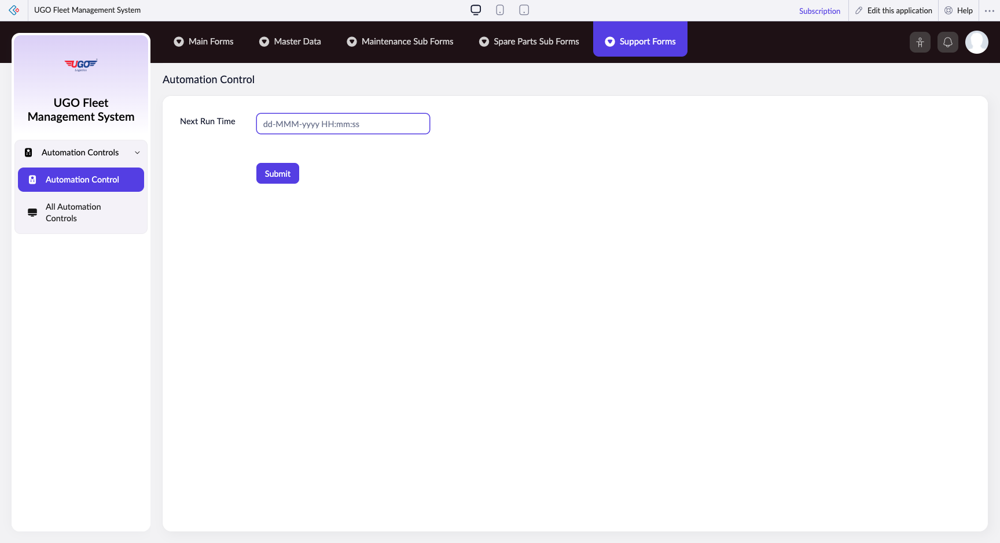

# Automation Control

The Automation Control page lets garage maintenance staff set up and manage automated maintenance schedules and support requests. Use this page to configure when maintenance tasks run automatically and to connect with support staff when you need help troubleshooting issues.

**URL:** `https://creatorapp.zoho.com/m.fahmy_ugologistics/u-go-garage-maintenance#Form:Automation_Control`

## How to Use

1. Select your preferred language from the lang-select-dropdown if you need to change the interface language.
2. Enter the time you want automated maintenance to run in the Next_Run_Time field (for example, 02:00 for 2 AM).
3. Check the 'useIconSwitch' checkbox if you want to use custom icons for your automation displays.
4. Click 'saveIcons' to save your icon settings, or 'resetIcons' if you need to restore the default icons.
5. If you need support, enter your email address in the reqEmailId field and select a support type from the supportType dropdown.
6. Check the box 'I have read the above conditions' to confirm you understand the support terms.
7. Click 'Submit Request' or 'reachUsStartChat' to send your support request or open a chat with the support team.

## Form Fields

| Field | Description | Type | Required |
|-------|-------------|------|----------|
| lang-select-dropdown | Choose your preferred language for the entire system interface. | dropdown | No |
| Next_Run_Time | Enter the specific time (in 24-hour format, like 14:30) when you want the automated maintenance tasks to start running. | text | No |
| submit |  | submit | No |
| searchmap |  | text | No |
| useIconSwitch | Turn this on if you want to display custom icons instead of the standard system icons in automation dashboards. | checkbox | No |
| toggleIconSwitch | Use this to quickly switch between your saved custom icons and the default icons without losing your settings. | checkbox | No |
| saveIcons |  | button | No |
| resetIcons |  | button | No |
| Search... |  | text | No |
| I have read the above conditions. |  | checkbox | No |
| reqEmailId | Enter the email address where support staff should contact you with responses. | text | No |
| s2id_autogen2 |  | text | No |
| s2id_autogen2_search |  | text | No |
| supportType | Select the category of support you need — for example, technical troubleshooting, system access, or general questions. | dropdown | No |
| Please enable edit permission to help with troubleshooting | Check this box only if you give support staff temporary access to view and edit settings in your account to diagnose problems. | checkbox | No |
| reachusChatDescription | Briefly describe your issue or what you need help with — include specific error messages or what you were doing when the problem occurred. | textarea | No |
| reachUsStartChat |  | button | No |

## Actions

- **Done**
- **Main Forms**
- **Master Data**
- **Maintenance Sub Forms**
- **Spare Parts Sub Forms**
- **Support Forms**
- **Submit**
- **Submit Request**

## Tips

- Always check the 'I have read the above conditions' box before submitting a support request — the system will not process your request without this confirmation.
- When describing your support issue, include the exact time the problem happened and what maintenance task was running — this helps support staff respond faster and more accurately.

## Related Pages

- [All Automation Controls](all-automation-controls.md)

## Common Workflows

_Add step-by-step workflows specific to your organisation here._
