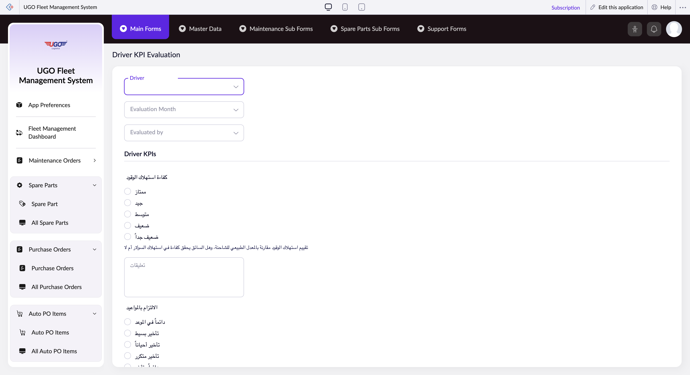

# Driver KPI Evaluation

**URL:** `https://creatorapp.zoho.com/m.fahmy_ugologistics/u-go-garage-maintenance#Form:Driver_KPI_Evaluation`

## Page Sections

- Driver KPIs
- Score & Bonus Calculations

## Form Fields

| Field | Type | Required |
|-------|------|----------|
| lang-select-dropdown | dropdown | No |
| zc-sel2-foc-Driver | text | No |
| zc-sel2-inp-Driver | text | No |
| Driver | text | No |
| zc-sel2-foc-Evaluation_Month | text | No |
| zc-sel2-inp-Evaluation_Month | text | No |
| Evaluation_Month | text | No |
| zc-sel2-foc-Evaluated_by | text | No |
| zc-sel2-inp-Evaluated_by | text | No |
| Evaluated_by | text | No |
| Fuel_Efficiency | radio | No |
| Fuel_Efficiency | radio | No |
| Fuel_Efficiency | radio | No |
| Fuel_Efficiency | radio | No |
| Fuel_Efficiency | radio | No |
| تعليقات | textarea | No |
| On_Time_Performance | radio | No |
| On_Time_Performance | radio | No |
| On_Time_Performance | radio | No |
| On_Time_Performance | radio | No |
| On_Time_Performance | radio | No |
| تعليقات | textarea | No |
| Incidents | radio | No |
| Incidents | radio | No |
| Incidents | radio | No |
| Incidents | radio | No |
| Incidents | radio | No |
| تعليقات | textarea | No |
| Documentation | radio | No |
| Documentation | radio | No |
| Documentation | radio | No |
| Documentation | radio | No |
| Documentation | radio | No |
| تعليقات | textarea | No |
| Productivity | radio | No |
| Productivity | radio | No |
| Productivity | radio | No |
| Productivity | radio | No |
| Productivity | radio | No |
| تعليقات | textarea | No |
| Delay_Time | radio | No |
| Delay_Time | radio | No |
| Delay_Time | radio | No |
| Delay_Time | radio | No |
| Delay_Time | radio | No |
| تعليقات | textarea | No |
| Score % | text | No |
| Bonus ( EGP ) | text | No |
| submit | submit | No |
| searchmap | text | No |
| useIconSwitch | checkbox | No |
| toggleIconSwitch | checkbox | No |
| saveIcons | button | No |
| resetIcons | button | No |
| Search... | text | No |
| I have read the above conditions. | checkbox | No |
| reqEmailId | text | No |
| s2id_autogen2 | text | No |
| s2id_autogen2_search | text | No |
| supportType | dropdown | No |
| Please enable edit permission to help with troubleshooting | checkbox | No |
| reachusChatDescription | textarea | No |
| reachUsStartChat | button | No |
| zc-reachus-editaccess-enable-button | button | No |
| zc-reachus-editaccess-revoke-button | button | No |
| zc-reachus-screenrecord-button | button | No |

## Actions

- **Done**
- **Main Forms**
- **Master Data**
- **Maintenance Sub Forms**
- **Spare Parts Sub Forms**
- **Support Forms**
- **Submit**
- **Submit Request**

## Common Workflows

_Document step-by-step workflows for this page here._
