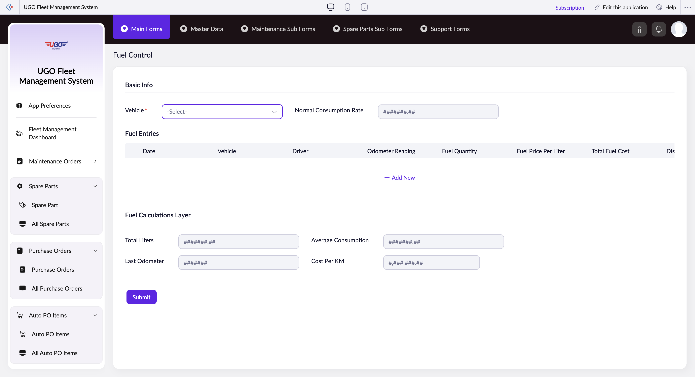

# Fuel Control

**URL:** `https://creatorapp.zoho.com/m.fahmy_ugologistics/u-go-garage-maintenance#Form:Fuel_Control`

## Page Sections

- Upgrade to Creator 5
- Update your subscription plan
- UGO Fleet Management System
- Basic Info
- Fuel Calculations Layer
- Introducing the New zoho Creator ui
- Introducing the New zoho Creator ui
- Introducing the New zoho Creator ui
- Introducing the New zoho Creator ui

## Form Fields

| Field | Type | Required |
|-------|------|----------|
| lang-select-dropdown | dropdown | No |
| zc-sel2-foc-Vehicle | text | No |
| zc-sel2-inp-Vehicle | text | No |
| Vehicle | text | No |
| Normal Consumption Rate | text | No |
| SF(Fuel_Entries).FD(t::row_0_0).SV(record::status) | hidden | No |
| SF(Fuel_Entries).FD(t::row_0_0).SV(ID) | hidden | No |
| Fuel_Entries.t::row_0.Date_field1 | text | No |
| Fuel_Entries.t::row_0.Vehicle | text | No |
| Fuel_Entries.t::row_0.Driver | text | No |
| #######.## | text | No |
| #######.## | text | No |
| #######.## | text | No |
| #######.## | text | No |
| #######.## | text | No |
| #######.## | text | No |
| Fuel_Entries.t::row_0.Status | text | No |
| #######.## | text | No |
| Total Liters | text | No |
| Last Odometer | text | No |
| Average Consumption | text | No |
| Cost Per KM | text | No |
| submit | submit | No |
| searchmap | text | No |
| useIconSwitch | checkbox | No |
| toggleIconSwitch | checkbox | No |
| saveIcons | button | No |
| resetIcons | button | No |
| Search... | text | No |
| I have read the above conditions. | checkbox | No |
| reqEmailId | text | No |
| s2id_autogen2 | text | No |
| s2id_autogen2_search | text | No |
| supportType | dropdown | No |
| Please enable edit permission to help with troubleshooting | checkbox | No |
| reachusChatDescription | textarea | No |
| reachUsStartChat | button | No |
| zc-reachus-editaccess-enable-button | button | No |
| zc-reachus-editaccess-revoke-button | button | No |
| zc-reachus-screenrecord-button | button | No |

## Actions

- **Done**
- **Main Forms**
- **Master Data**
- **Maintenance Sub Forms**
- **Spare Parts Sub Forms**
- **Support Forms**
- **Expand**
- **Add New**
- **Submit**
- **Submit Request**

## Common Workflows

_Document step-by-step workflows for this page here._
