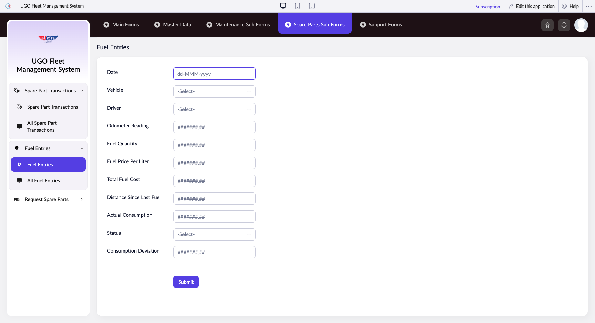

# Fuel Entries

This page manages fuel entries records.

**URL:** `https://creatorapp.zoho.com/m.fahmy_ugologistics/u-go-garage-maintenance#Form:Fuel_Entries`

## How to Use

1. Open this page from the sidebar.
2. Review or enter the required information.
3. Save your changes.

## Form Fields

| Field | Description | Type | Required |
|-------|-------------|------|----------|
| lang-select-dropdown |  | dropdown | No |
| Date_field1 |  | text | No |
| Vehicle |  | text | No |
| Driver |  | text | No |
| Odometer Reading |  | text | No |
| Fuel Quantity |  | text | No |
| Fuel Price Per Liter |  | text | No |
| Total Fuel Cost |  | text | No |
| Distance Since Last Fuel |  | text | No |
| Actual Consumption |  | text | No |
| Status |  | text | No |
| Consumption Deviation |  | text | No |
| submit |  | submit | No |
| searchmap |  | text | No |
| useIconSwitch |  | checkbox | No |
| toggleIconSwitch |  | checkbox | No |
| saveIcons |  | button | No |
| resetIcons |  | button | No |
| Search... |  | text | No |
| I have read the above conditions. |  | checkbox | No |
| reqEmailId |  | text | No |
| s2id_autogen2 |  | text | No |
| s2id_autogen2_search |  | text | No |
| supportType |  | dropdown | No |
| Please enable edit permission to help with troubleshooting |  | checkbox | No |
| reachusChatDescription |  | textarea | No |
| reachUsStartChat |  | button | No |

## Actions

- **Done**
- **Main Forms**
- **Master Data**
- **Maintenance Sub Forms**
- **Spare Parts Sub Forms**
- **Support Forms**
- **Submit**
- **Submit Request**

## Related Pages

- [Fuel Control](fuel-control.md)
- [All Fuel Controls](all-fuel-controls.md)
- [All Fuel Entries](all-fuel-entries.md)
- [Fuel – Vehicle Performance Summary](fuel-vehicle-performance-summary.md)
- [Worst Vehicles Report](worst-vehicles-report.md)
- [Cost Per KM](cost-per-km.md)

## Common Workflows

_Add step-by-step workflows specific to your organisation here._
