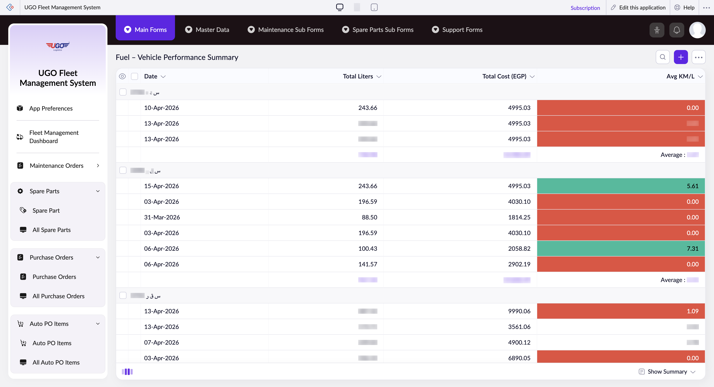

# Fuel – Vehicle Performance Summary

**URL:** `https://creatorapp.zoho.com/m.fahmy_ugologistics/u-go-garage-maintenance#Report:Fuel_Vehicle_Performance_Summary1`

## Page Sections

- Upgrade to Creator 5
- Update your subscription plan
- UGO Fleet Management System
- Fuel – Vehicle Performance Summary
- Export
- Introducing the New zoho Creator ui
- Introducing the New zoho Creator ui
- Introducing the New zoho Creator ui
- Introducing the New zoho Creator ui

## Form Fields

| Field | Type | Required |
|-------|------|----------|
| lang-select-dropdown | dropdown | No |
| Checkbox | checkbox | No |
| groupid0_ZC_CSBZEQ | checkbox | No |
| 4780709000000832002_checkbox | checkbox | No |
| 4780709000000832004_checkbox | checkbox | No |
| 4780709000000835029_checkbox | checkbox | No |
| groupid1_ZC_CSBZEQ | checkbox | No |
| 4780709000000835042_checkbox | checkbox | No |
| 4780709000000797002_checkbox | checkbox | No |
| 4780709000000797004_checkbox | checkbox | No |
| 4780709000000805030_checkbox | checkbox | No |
| 4780709000000805032_checkbox | checkbox | No |
| 4780709000000805034_checkbox | checkbox | No |
| groupid2_ZC_CSBZEQ | checkbox | No |
| 4780709000000835046_checkbox | checkbox | No |
| 4780709000000835048_checkbox | checkbox | No |
| 4780709000000819028_checkbox | checkbox | No |
| 4780709000000805020_checkbox | checkbox | No |
| groupid3_ZC_CSBZEQ | checkbox | No |
| 4780709000000805046_checkbox | checkbox | No |
| 4780709000000832009_checkbox | checkbox | No |
| 4780709000000835035_checkbox | checkbox | No |
| groupid4_ZC_CSBZEQ | checkbox | No |
| 4780709000000805039_checkbox | checkbox | No |
| 4780709000000805041_checkbox | checkbox | No |
| 4780709000000832031_checkbox | checkbox | No |
| 4780709000000832034_checkbox | checkbox | No |
| 4780709000000832036_checkbox | checkbox | No |
| 4780709000000835038_checkbox | checkbox | No |
| groupid5_ZC_CSBZEQ | checkbox | No |
| 4780709000000805051_checkbox | checkbox | No |
| 4780709000000819036_checkbox | checkbox | No |
| 4780709000000832012_checkbox | checkbox | No |
| 4780709000000835032_checkbox | checkbox | No |
| groupid6_ZC_CSBZEQ | checkbox | No |
| 4780709000000832028_checkbox | checkbox | No |
| 4780709000000835051_checkbox | checkbox | No |
| 4780709000000835053_checkbox | checkbox | No |
| 4780709000000819031_checkbox | checkbox | No |
| 4780709000000805004_checkbox | checkbox | No |
| 4780709000000819033_checkbox | checkbox | No |
| 4780709000000805006_checkbox | checkbox | No |
| 4780709000000805008_checkbox | checkbox | No |
| 4780709000000805010_checkbox | checkbox | No |
| 4780709000000832026_checkbox | checkbox | No |
| groupid7_ZC_CSBZEQ | checkbox | No |
| 4780709000000835023_checkbox | checkbox | No |
| 4780709000000835025_checkbox | checkbox | No |
| 4780709000000835027_checkbox | checkbox | No |
| 4780709000000832017_checkbox | checkbox | No |
| groupid8_ZC_CSBZEQ | checkbox | No |
| 4780709000000835002_checkbox | checkbox | No |
| 4780709000000835004_checkbox | checkbox | No |
| 4780709000000835006_checkbox | checkbox | No |
| 4780709000000835008_checkbox | checkbox | No |
| 4780709000000835010_checkbox | checkbox | No |
| 4780709000000832022_checkbox | checkbox | No |
| groupid9_ZC_CSBZEQ | checkbox | No |
| 4780709000000797009_checkbox | checkbox | No |
| 4780709000000797011_checkbox | checkbox | No |
| 4780709000000835056_checkbox | checkbox | No |
| 4780709000000835058_checkbox | checkbox | No |
| Checkbox | checkbox | No |
| wrapColsInputEl | checkbox | No |
| show-hide-col-all | checkbox | No |
| viewdel | checkbox | No |
| viewdel | checkbox | No |
| viewdel | checkbox | No |
| viewdel | checkbox | No |
| volume | range | No |
| checkbox-Date_field1-ZC_CSBZEQ | checkbox | No |
| s2id_autogen92 | text | No |
| s2id_autogen92_search | text | No |
| zc_searchSelect | dropdown | No |
| viewSearchEl_Date_field1 | text | No |
| From | text | No |
| To | text | No |
| checkbox-Fuel_Quantity-ZC_CSBZEQ | checkbox | No |
| s2id_autogen94 | text | No |
| s2id_autogen94_search | text | No |
| zc_searchSelect | dropdown | No |
| From | text | No |
| To | text | No |
| checkbox-Total_Fuel_Cost-ZC_CSBZEQ | checkbox | No |
| s2id_autogen96 | text | No |
| s2id_autogen96_search | text | No |
| zc_searchSelect | dropdown | No |
| From | text | No |
| To | text | No |
| checkbox-Actual_Consumption-ZC_CSBZEQ | checkbox | No |
| s2id_autogen98 | text | No |
| s2id_autogen98_search | text | No |
| zc_searchSelect | dropdown | No |
| From | text | No |
| To | text | No |
| checkbox-Driver-ZC_CSBZEQ | checkbox | No |
| s2id_autogen100 | text | No |
| s2id_autogen100_search | text | No |
| zc_searchSelect | dropdown | No |
| checkbox-Odometer_Reading-ZC_CSBZEQ | checkbox | No |
| s2id_autogen102 | text | No |
| s2id_autogen102_search | text | No |
| zc_searchSelect | dropdown | No |
| From | text | No |
| To | text | No |
| checkbox-Fuel_Price_Per_Liter-ZC_CSBZEQ | checkbox | No |
| s2id_autogen104 | text | No |
| s2id_autogen104_search | text | No |
| zc_searchSelect | dropdown | No |
| From | text | No |
| To | text | No |
| checkbox-Distance_Since_Last_Fuel-ZC_CSBZEQ | checkbox | No |
| s2id_autogen106 | text | No |
| s2id_autogen106_search | text | No |
| zc_searchSelect | dropdown | No |
| From | text | No |
| To | text | No |
| checkbox-Status-ZC_CSBZEQ | checkbox | No |
| s2id_autogen108 | text | No |
| s2id_autogen108_search | text | No |
| zc_searchSelect | dropdown | No |
| checkbox-Consumption_Deviation-ZC_CSBZEQ | checkbox | No |
| s2id_autogen110 | text | No |
| s2id_autogen110_search | text | No |
| zc_searchSelect | dropdown | No |
| From | text | No |
| To | text | No |
| allowlocation | button | No |
| useIconSwitch | checkbox | No |
| toggleIconSwitch | checkbox | No |
| saveIcons | button | No |
| resetIcons | button | No |
| Search... | text | No |
| I have read the above conditions. | checkbox | No |
| reqEmailId | text | No |
| s2id_autogen2 | text | No |
| s2id_autogen2_search | text | No |
| supportType | dropdown | No |
| Please enable edit permission to help with troubleshooting | checkbox | No |
| reachusChatDescription | textarea | No |
| reachUsStartChat | button | No |
| zc-reachus-editaccess-enable-button | button | No |
| zc-reachus-editaccess-revoke-button | button | No |
| zc-reachus-screenrecord-button | button | No |

## Table Columns

- Date
- Total Liters
- Total Cost (EGP)
- Avg KM/L

## Actions

- **Done**
- **Main Forms**
- **Master Data**
- **Maintenance Sub Forms**
- **Spare Parts Sub Forms**
- **Support Forms**
- **Remove Changes**
- **Show as**
- **Print**
- **Import**
- **Export**
- **Bulk Edit**
- **Duplicate**
- **Delete**
- **AddAdd (Option + Shift + N)**
- **Submit Request**

## Common Workflows

_Document step-by-step workflows for this page here._
