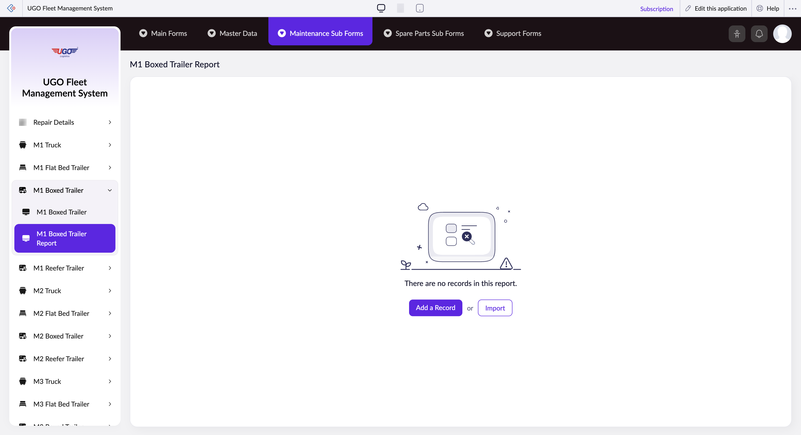

# M1 Boxed Trailer Report

The M1 Boxed Trailer Report page lets you record and manage maintenance details for M1 boxed trailers in your fleet. Maintenance staff and fleet managers use this page to log service records, track repairs, and generate reports on trailer conditions. Use this when performing scheduled maintenance, documenting repairs, or reviewing trailer service history.

**URL:** `https://creatorapp.zoho.com/m.fahmy_ugologistics/u-go-garage-maintenance#Report:M1_Boxed_Trailer_Report`

## How to Use

1. Select your preferred language from the lang-select-dropdown at the top if needed.
2. Use the volume range field to specify the trailer capacity or storage size being serviced.
3. Work through each maintenance section by checking the relevant checkbox to flag that area for inspection or repair (checkboxes like Radio40, Radio44, Notes10, etc. represent different maintenance categories).
4. For each checked section, use the corresponding text and search fields to enter specific details, part numbers, or select from the dropdown menu if you need to link to existing records.
5. Click 'Add a Record' to include additional maintenance items or repeat inspections.
6. Review all entries, then click 'Submit Request' to save your report and route it for approval.
7. Use 'Done' to exit the form, or navigate to other sections using the sub-form buttons if you need to add spare parts or additional maintenance details.

## Page Sections

- M1 Boxed Trailer Report

## Form Fields

| Field | Description | Type | Required |
|-------|-------------|------|----------|
| lang-select-dropdown | Choose your working language for the form and any generated reports. | dropdown | No |
| volume | Enter the cargo capacity or cubic volume of the M1 boxed trailer being serviced. Use this to match trailer specifications during maintenance verification. | range | No |
| checkbox-Radio40-ZC_O34I14 |  | checkbox | No |
| s2id_autogen4 |  | text | No |
| s2id_autogen4_search |  | text | No |
| zc_searchSelect |  | dropdown | No |
| checkbox-Radio44-ZC_O34I14 |  | checkbox | No |
| s2id_autogen6 |  | text | No |
| s2id_autogen6_search |  | text | No |
| zc_searchSelect |  | dropdown | No |
| checkbox-Notes10-ZC_O34I14 |  | checkbox | No |
| s2id_autogen8 |  | text | No |
| s2id_autogen8_search |  | text | No |
| zc_searchSelect |  | dropdown | No |
| checkbox-Radio45-ZC_O34I14 |  | checkbox | No |
| s2id_autogen10 |  | text | No |
| s2id_autogen10_search |  | text | No |
| zc_searchSelect |  | dropdown | No |
| checkbox-Radio46-ZC_O34I14 |  | checkbox | No |
| s2id_autogen12 |  | text | No |
| s2id_autogen12_search |  | text | No |
| zc_searchSelect |  | dropdown | No |
| checkbox-Radio47-ZC_O34I14 |  | checkbox | No |
| s2id_autogen14 |  | text | No |
| s2id_autogen14_search |  | text | No |
| zc_searchSelect |  | dropdown | No |
| checkbox-Radio48-ZC_O34I14 |  | checkbox | No |
| s2id_autogen16 |  | text | No |
| s2id_autogen16_search |  | text | No |
| zc_searchSelect |  | dropdown | No |
| checkbox-Radio49-ZC_O34I14 |  | checkbox | No |
| s2id_autogen18 |  | text | No |
| s2id_autogen18_search |  | text | No |
| zc_searchSelect |  | dropdown | No |
| checkbox-Radio50-ZC_O34I14 |  | checkbox | No |
| s2id_autogen20 |  | text | No |
| s2id_autogen20_search |  | text | No |
| zc_searchSelect |  | dropdown | No |
| checkbox-Radio51-ZC_O34I14 |  | checkbox | No |
| s2id_autogen22 |  | text | No |
| s2id_autogen22_search |  | text | No |
| zc_searchSelect |  | dropdown | No |
| checkbox-Notes11-ZC_O34I14 |  | checkbox | No |
| s2id_autogen24 |  | text | No |
| s2id_autogen24_search |  | text | No |
| zc_searchSelect |  | dropdown | No |
| checkbox-Radio52-ZC_O34I14 |  | checkbox | No |
| s2id_autogen26 |  | text | No |
| s2id_autogen26_search |  | text | No |
| zc_searchSelect |  | dropdown | No |
| checkbox-Radio53-ZC_O34I14 |  | checkbox | No |
| s2id_autogen28 |  | text | No |
| s2id_autogen28_search |  | text | No |
| zc_searchSelect |  | dropdown | No |
| checkbox-Notes12-ZC_O34I14 |  | checkbox | No |
| s2id_autogen30 |  | text | No |
| s2id_autogen30_search |  | text | No |
| zc_searchSelect |  | dropdown | No |
| checkbox-Radio54-ZC_O34I14 |  | checkbox | No |
| s2id_autogen32 |  | text | No |
| s2id_autogen32_search |  | text | No |
| zc_searchSelect |  | dropdown | No |
| checkbox-Radio55-ZC_O34I14 |  | checkbox | No |
| s2id_autogen34 |  | text | No |
| s2id_autogen34_search |  | text | No |
| zc_searchSelect |  | dropdown | No |
| checkbox-Notes13-ZC_O34I14 |  | checkbox | No |
| s2id_autogen36 |  | text | No |
| s2id_autogen36_search |  | text | No |
| zc_searchSelect |  | dropdown | No |
| checkbox-Radio56-ZC_O34I14 |  | checkbox | No |
| s2id_autogen38 |  | text | No |
| s2id_autogen38_search |  | text | No |
| zc_searchSelect |  | dropdown | No |
| checkbox-Radio57-ZC_O34I14 |  | checkbox | No |
| s2id_autogen40 |  | text | No |
| s2id_autogen40_search |  | text | No |
| zc_searchSelect |  | dropdown | No |
| checkbox-Notes14-ZC_O34I14 |  | checkbox | No |
| s2id_autogen42 |  | text | No |
| s2id_autogen42_search |  | text | No |
| zc_searchSelect |  | dropdown | No |
| checkbox-Radio58-ZC_O34I14 |  | checkbox | No |
| s2id_autogen44 |  | text | No |
| s2id_autogen44_search |  | text | No |
| zc_searchSelect |  | dropdown | No |
| checkbox-Radio59-ZC_O34I14 |  | checkbox | No |
| s2id_autogen46 |  | text | No |
| s2id_autogen46_search |  | text | No |
| zc_searchSelect |  | dropdown | No |
| checkbox-Radio60-ZC_O34I14 |  | checkbox | No |
| s2id_autogen48 |  | text | No |
| s2id_autogen48_search |  | text | No |
| zc_searchSelect |  | dropdown | No |
| checkbox-Radio61-ZC_O34I14 |  | checkbox | No |
| s2id_autogen50 |  | text | No |
| s2id_autogen50_search |  | text | No |
| zc_searchSelect |  | dropdown | No |
| checkbox-Radio62-ZC_O34I14 |  | checkbox | No |
| s2id_autogen52 |  | text | No |
| s2id_autogen52_search |  | text | No |
| zc_searchSelect |  | dropdown | No |
| checkbox-Radio63-ZC_O34I14 |  | checkbox | No |
| s2id_autogen54 |  | text | No |
| s2id_autogen54_search |  | text | No |
| zc_searchSelect |  | dropdown | No |
| checkbox-Radio64-ZC_O34I14 |  | checkbox | No |
| s2id_autogen56 |  | text | No |
| s2id_autogen56_search |  | text | No |
| zc_searchSelect |  | dropdown | No |
| checkbox-Notes15-ZC_O34I14 |  | checkbox | No |
| s2id_autogen58 |  | text | No |
| s2id_autogen58_search |  | text | No |
| zc_searchSelect |  | dropdown | No |
| checkbox-Technician_Name-ZC_O34I14 |  | checkbox | No |
| s2id_autogen60 |  | text | No |
| s2id_autogen60_search |  | text | No |
| zc_searchSelect |  | dropdown | No |
| allowlocation |  | button | No |
| useIconSwitch |  | checkbox | No |
| toggleIconSwitch |  | checkbox | No |
| saveIcons |  | button | No |
| resetIcons |  | button | No |
| Search... |  | text | No |
| I have read the above conditions. |  | checkbox | No |
| reqEmailId |  | text | No |
| s2id_autogen2 |  | text | No |
| s2id_autogen2_search |  | text | No |
| supportType |  | dropdown | No |
| Please enable edit permission to help with troubleshooting |  | checkbox | No |
| reachusChatDescription |  | textarea | No |
| reachUsStartChat |  | button | No |
| zc-reachus-editaccess-enable-button |  | button | No |
| zc-reachus-editaccess-revoke-button |  | button | No |
| zc-reachus-screenrecord-button |  | button | No |

## Actions

- **Done**
- **Main Forms**
- **Master Data**
- **Maintenance Sub Forms**
- **Spare Parts Sub Forms**
- **Support Forms**
- **Remove Changes**
- **Add a Record**
- **Import**
- **Submit Request**

## Tips

- Always check the relevant maintenance checkbox before entering details in the text fields below it—unchecked items with data may not be saved or included in reports.
- Use the search fields to avoid duplicate entries; if the part or service already exists in the system, link to it rather than creating a new record.

## Related Pages

- [M1 Truck Report](m1-truck-report.md)
- [M1 Flat Bed Trailer Report](m1-flat-bed-trailer-report.md)
- [M1 Reefer Trailer Report](m1-reefer-trailer-report.md)
- [M2 Truck Report](m2-truck-report.md)
- [M2 Flat Bed Trailer Report](m2-flat-bed-trailer-report.md)
- [M2 Boxed Trailer Report](m2-boxed-trailer-report.md)
- [M2 Reefer Trailer Report](m2-reefer-trailer-report.md)
- [M3 Truck Report](m3-truck-report.md)
- [M3 Flat Bed Trailer Report](m3-flat-bed-trailer-report.md)
- [M3 Boxed Trailer Report](m3-boxed-trailer-report.md)
- [M3 Reefer Trailer Report](m3-reefer-trailer-report.md)
- [M4 Truck Report](m4-truck-report.md)
- [M4 Flat Bed Trailer Report](m4-flat-bed-trailer-report.md)
- [M4 Boxed Trailer Report](m4-boxed-trailer-report.md)
- [M4 Reefer Trailer Report](m4-reefer-trailer-report.md)

## Common Workflows

_Add step-by-step workflows specific to your organisation here._
