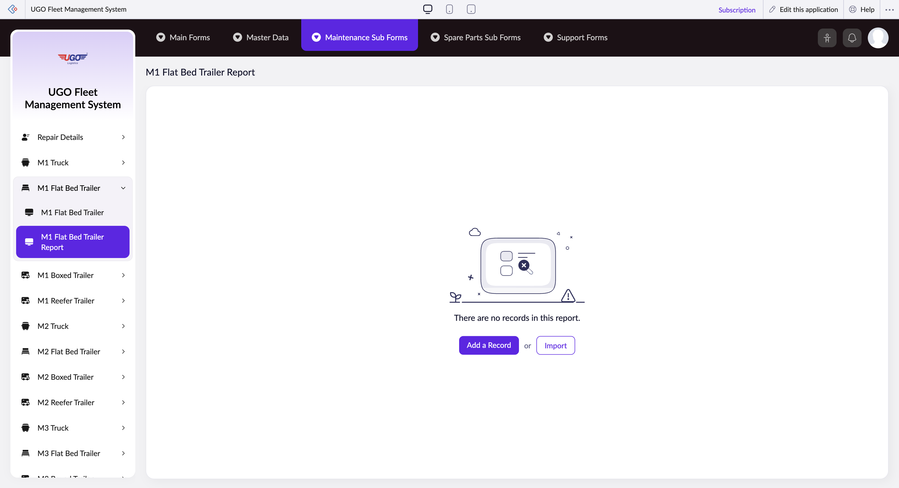

# M1 Flat Bed Trailer Report

**URL:** `https://creatorapp.zoho.com/m.fahmy_ugologistics/u-go-garage-maintenance#Report:M1_Flat_Bed_Trailer_Report`

## Page Sections

- M1 Flat Bed Trailer Report

## Form Fields

| Field | Type | Required |
|-------|------|----------|
| lang-select-dropdown | dropdown | No |
| volume | range | No |
| checkbox-Radio40-ZC_6V9KRF | checkbox | No |
| s2id_autogen4 | text | No |
| s2id_autogen4_search | text | No |
| zc_searchSelect | dropdown | No |
| checkbox-Radio44-ZC_6V9KRF | checkbox | No |
| s2id_autogen6 | text | No |
| s2id_autogen6_search | text | No |
| zc_searchSelect | dropdown | No |
| checkbox-Notes10-ZC_6V9KRF | checkbox | No |
| s2id_autogen8 | text | No |
| s2id_autogen8_search | text | No |
| zc_searchSelect | dropdown | No |
| checkbox-Radio45-ZC_6V9KRF | checkbox | No |
| s2id_autogen10 | text | No |
| s2id_autogen10_search | text | No |
| zc_searchSelect | dropdown | No |
| checkbox-Radio46-ZC_6V9KRF | checkbox | No |
| s2id_autogen12 | text | No |
| s2id_autogen12_search | text | No |
| zc_searchSelect | dropdown | No |
| checkbox-Radio47-ZC_6V9KRF | checkbox | No |
| s2id_autogen14 | text | No |
| s2id_autogen14_search | text | No |
| zc_searchSelect | dropdown | No |
| checkbox-Radio48-ZC_6V9KRF | checkbox | No |
| s2id_autogen16 | text | No |
| s2id_autogen16_search | text | No |
| zc_searchSelect | dropdown | No |
| checkbox-Radio49-ZC_6V9KRF | checkbox | No |
| s2id_autogen18 | text | No |
| s2id_autogen18_search | text | No |
| zc_searchSelect | dropdown | No |
| checkbox-Radio50-ZC_6V9KRF | checkbox | No |
| s2id_autogen20 | text | No |
| s2id_autogen20_search | text | No |
| zc_searchSelect | dropdown | No |
| checkbox-Radio51-ZC_6V9KRF | checkbox | No |
| s2id_autogen22 | text | No |
| s2id_autogen22_search | text | No |
| zc_searchSelect | dropdown | No |
| checkbox-Notes11-ZC_6V9KRF | checkbox | No |
| s2id_autogen24 | text | No |
| s2id_autogen24_search | text | No |
| zc_searchSelect | dropdown | No |
| checkbox-Radio52-ZC_6V9KRF | checkbox | No |
| s2id_autogen26 | text | No |
| s2id_autogen26_search | text | No |
| zc_searchSelect | dropdown | No |
| checkbox-Radio53-ZC_6V9KRF | checkbox | No |
| s2id_autogen28 | text | No |
| s2id_autogen28_search | text | No |
| zc_searchSelect | dropdown | No |
| checkbox-Notes12-ZC_6V9KRF | checkbox | No |
| s2id_autogen30 | text | No |
| s2id_autogen30_search | text | No |
| zc_searchSelect | dropdown | No |
| checkbox-Radio54-ZC_6V9KRF | checkbox | No |
| s2id_autogen32 | text | No |
| s2id_autogen32_search | text | No |
| zc_searchSelect | dropdown | No |
| checkbox-Radio55-ZC_6V9KRF | checkbox | No |
| s2id_autogen34 | text | No |
| s2id_autogen34_search | text | No |
| zc_searchSelect | dropdown | No |
| checkbox-Notes13-ZC_6V9KRF | checkbox | No |
| s2id_autogen36 | text | No |
| s2id_autogen36_search | text | No |
| zc_searchSelect | dropdown | No |
| checkbox-Radio56-ZC_6V9KRF | checkbox | No |
| s2id_autogen38 | text | No |
| s2id_autogen38_search | text | No |
| zc_searchSelect | dropdown | No |
| checkbox-Radio57-ZC_6V9KRF | checkbox | No |
| s2id_autogen40 | text | No |
| s2id_autogen40_search | text | No |
| zc_searchSelect | dropdown | No |
| checkbox-Notes14-ZC_6V9KRF | checkbox | No |
| s2id_autogen42 | text | No |
| s2id_autogen42_search | text | No |
| zc_searchSelect | dropdown | No |
| checkbox-Technician_Name-ZC_6V9KRF | checkbox | No |
| s2id_autogen44 | text | No |
| s2id_autogen44_search | text | No |
| zc_searchSelect | dropdown | No |
| allowlocation | button | No |
| useIconSwitch | checkbox | No |
| toggleIconSwitch | checkbox | No |
| saveIcons | button | No |
| resetIcons | button | No |
| Search... | text | No |
| I have read the above conditions. | checkbox | No |
| reqEmailId | text | No |
| s2id_autogen2 | text | No |
| s2id_autogen2_search | text | No |
| supportType | dropdown | No |
| Please enable edit permission to help with troubleshooting | checkbox | No |
| reachusChatDescription | textarea | No |
| reachUsStartChat | button | No |
| zc-reachus-editaccess-enable-button | button | No |
| zc-reachus-editaccess-revoke-button | button | No |
| zc-reachus-screenrecord-button | button | No |

## Actions

- **Done**
- **Main Forms**
- **Master Data**
- **Maintenance Sub Forms**
- **Spare Parts Sub Forms**
- **Support Forms**
- **Remove Changes**
- **Add a Record**
- **Import**
- **Submit Request**

## Common Workflows

_Document step-by-step workflows for this page here._
