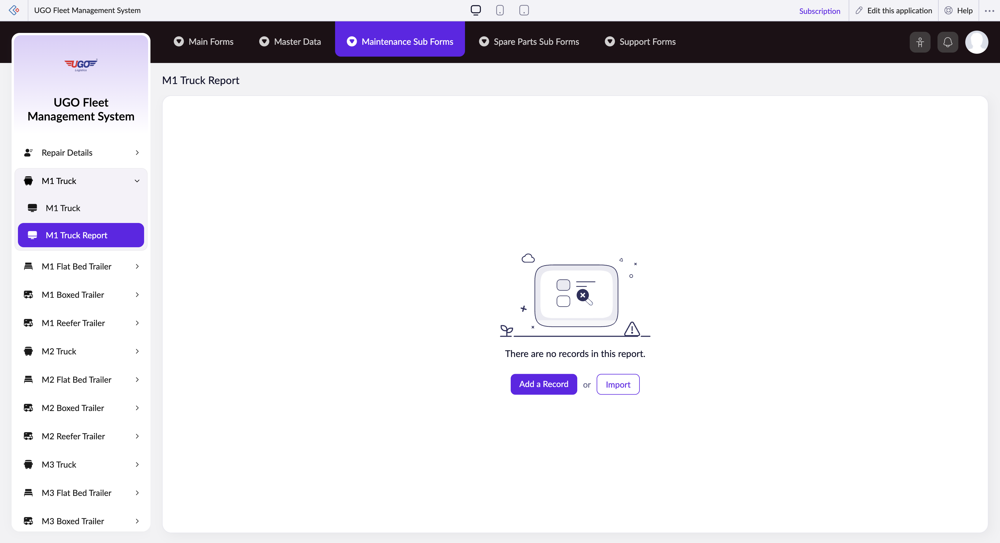

# M1 Truck Report

The M1 Truck Report page lets you view, filter, and manage maintenance records for your M1 truck fleet. Operations staff use this page to track maintenance history, add new maintenance records, and generate reports for compliance and planning purposes. Access this page when you need to review truck service status or document maintenance work completed.

**URL:** `https://creatorapp.zoho.com/m.fahmy_ugologistics/u-go-garage-maintenance#Report:M1_Truck_Report`

## How to Use

1. Select your preferred language using the Language dropdown at the top if needed.
2. Use the Volume range slider to filter records by maintenance volume or capacity if required.
3. Check the boxes next to maintenance categories (Radio 1-6) to display those specific maintenance types in your report.
4. For each checked category, use the search dropdown to select the specific truck or maintenance item you want to review.
5. Click Add a Record to enter a new maintenance entry, or Import to load maintenance data from another source.
6. Review your filtered results and click Submit Request when ready to finalize the report.
7. Click Done to save and exit, or choose Main Forms to return to the main menu.

## Page Sections

- M1 Truck Report

## Form Fields

| Field | Description | Type | Required |
|-------|-------------|------|----------|
| lang-select-dropdown | Choose your working language for the report interface. | dropdown | No |
| volume | Adjust the range to filter maintenance records by volume capacity or maintenance scope. | range | No |
| checkbox-Radio1-ZC_CWYBPE |  | checkbox | No |
| s2id_autogen4 |  | text | No |
| s2id_autogen4_search |  | text | No |
| zc_searchSelect |  | dropdown | No |
| checkbox-Radio2-ZC_CWYBPE |  | checkbox | No |
| s2id_autogen6 |  | text | No |
| s2id_autogen6_search |  | text | No |
| zc_searchSelect |  | dropdown | No |
| checkbox-Radio3-ZC_CWYBPE |  | checkbox | No |
| s2id_autogen8 |  | text | No |
| s2id_autogen8_search |  | text | No |
| zc_searchSelect |  | dropdown | No |
| checkbox-Notes-ZC_CWYBPE |  | checkbox | No |
| s2id_autogen10 |  | text | No |
| s2id_autogen10_search |  | text | No |
| zc_searchSelect |  | dropdown | No |
| checkbox-Radio4-ZC_CWYBPE |  | checkbox | No |
| s2id_autogen12 |  | text | No |
| s2id_autogen12_search |  | text | No |
| zc_searchSelect |  | dropdown | No |
| checkbox-Radio5-ZC_CWYBPE |  | checkbox | No |
| s2id_autogen14 |  | text | No |
| s2id_autogen14_search |  | text | No |
| zc_searchSelect |  | dropdown | No |
| checkbox-Radio6-ZC_CWYBPE |  | checkbox | No |
| s2id_autogen16 |  | text | No |
| s2id_autogen16_search |  | text | No |
| zc_searchSelect |  | dropdown | No |
| checkbox-Radio7-ZC_CWYBPE |  | checkbox | No |
| s2id_autogen18 |  | text | No |
| s2id_autogen18_search |  | text | No |
| zc_searchSelect |  | dropdown | No |
| checkbox-Radio8-ZC_CWYBPE |  | checkbox | No |
| s2id_autogen20 |  | text | No |
| s2id_autogen20_search |  | text | No |
| zc_searchSelect |  | dropdown | No |
| checkbox-Notes1-ZC_CWYBPE |  | checkbox | No |
| s2id_autogen22 |  | text | No |
| s2id_autogen22_search |  | text | No |
| zc_searchSelect |  | dropdown | No |
| checkbox-Radio9-ZC_CWYBPE |  | checkbox | No |
| s2id_autogen24 |  | text | No |
| s2id_autogen24_search |  | text | No |
| zc_searchSelect |  | dropdown | No |
| checkbox-Radio10-ZC_CWYBPE |  | checkbox | No |
| s2id_autogen26 |  | text | No |
| s2id_autogen26_search |  | text | No |
| zc_searchSelect |  | dropdown | No |
| checkbox-Radio11-ZC_CWYBPE |  | checkbox | No |
| s2id_autogen28 |  | text | No |
| s2id_autogen28_search |  | text | No |
| zc_searchSelect |  | dropdown | No |
| checkbox-Radio12-ZC_CWYBPE |  | checkbox | No |
| s2id_autogen30 |  | text | No |
| s2id_autogen30_search |  | text | No |
| zc_searchSelect |  | dropdown | No |
| checkbox-Radio13-ZC_CWYBPE |  | checkbox | No |
| s2id_autogen32 |  | text | No |
| s2id_autogen32_search |  | text | No |
| zc_searchSelect |  | dropdown | No |
| checkbox-Notes2-ZC_CWYBPE |  | checkbox | No |
| s2id_autogen34 |  | text | No |
| s2id_autogen34_search |  | text | No |
| zc_searchSelect |  | dropdown | No |
| checkbox-Radio14-ZC_CWYBPE |  | checkbox | No |
| s2id_autogen36 |  | text | No |
| s2id_autogen36_search |  | text | No |
| zc_searchSelect |  | dropdown | No |
| checkbox-Radio15-ZC_CWYBPE |  | checkbox | No |
| s2id_autogen38 |  | text | No |
| s2id_autogen38_search |  | text | No |
| zc_searchSelect |  | dropdown | No |
| checkbox-Notes3-ZC_CWYBPE |  | checkbox | No |
| s2id_autogen40 |  | text | No |
| s2id_autogen40_search |  | text | No |
| zc_searchSelect |  | dropdown | No |
| checkbox-Radio16-ZC_CWYBPE |  | checkbox | No |
| s2id_autogen42 |  | text | No |
| s2id_autogen42_search |  | text | No |
| zc_searchSelect |  | dropdown | No |
| checkbox-Radio17-ZC_CWYBPE |  | checkbox | No |
| s2id_autogen44 |  | text | No |
| s2id_autogen44_search |  | text | No |
| zc_searchSelect |  | dropdown | No |
| checkbox-Notes4-ZC_CWYBPE |  | checkbox | No |
| s2id_autogen46 |  | text | No |
| s2id_autogen46_search |  | text | No |
| zc_searchSelect |  | dropdown | No |
| checkbox-Radio18-ZC_CWYBPE |  | checkbox | No |
| s2id_autogen48 |  | text | No |
| s2id_autogen48_search |  | text | No |
| zc_searchSelect |  | dropdown | No |
| checkbox-Notes5-ZC_CWYBPE |  | checkbox | No |
| s2id_autogen50 |  | text | No |
| s2id_autogen50_search |  | text | No |
| zc_searchSelect |  | dropdown | No |
| checkbox-Radio19-ZC_CWYBPE |  | checkbox | No |
| s2id_autogen52 |  | text | No |
| s2id_autogen52_search |  | text | No |
| zc_searchSelect |  | dropdown | No |
| checkbox-Radio20-ZC_CWYBPE |  | checkbox | No |
| s2id_autogen54 |  | text | No |
| s2id_autogen54_search |  | text | No |
| zc_searchSelect |  | dropdown | No |
| checkbox-Notes6-ZC_CWYBPE |  | checkbox | No |
| s2id_autogen56 |  | text | No |
| s2id_autogen56_search |  | text | No |
| zc_searchSelect |  | dropdown | No |
| checkbox-Radio21-ZC_CWYBPE |  | checkbox | No |
| s2id_autogen58 |  | text | No |
| s2id_autogen58_search |  | text | No |
| zc_searchSelect |  | dropdown | No |
| checkbox-Radio22-ZC_CWYBPE |  | checkbox | No |
| s2id_autogen60 |  | text | No |
| s2id_autogen60_search |  | text | No |
| zc_searchSelect |  | dropdown | No |
| checkbox-Notes7-ZC_CWYBPE |  | checkbox | No |
| s2id_autogen62 |  | text | No |
| s2id_autogen62_search |  | text | No |
| zc_searchSelect |  | dropdown | No |
| checkbox-Radio23-ZC_CWYBPE |  | checkbox | No |
| s2id_autogen64 |  | text | No |
| s2id_autogen64_search |  | text | No |
| zc_searchSelect |  | dropdown | No |
| checkbox-Radio24-ZC_CWYBPE |  | checkbox | No |
| s2id_autogen66 |  | text | No |
| s2id_autogen66_search |  | text | No |
| zc_searchSelect |  | dropdown | No |
| checkbox-Radio25-ZC_CWYBPE |  | checkbox | No |
| s2id_autogen68 |  | text | No |
| s2id_autogen68_search |  | text | No |
| zc_searchSelect |  | dropdown | No |
| checkbox-Radio26-ZC_CWYBPE |  | checkbox | No |
| s2id_autogen70 |  | text | No |
| s2id_autogen70_search |  | text | No |
| zc_searchSelect |  | dropdown | No |
| checkbox-Radio27-ZC_CWYBPE |  | checkbox | No |
| s2id_autogen72 |  | text | No |
| s2id_autogen72_search |  | text | No |
| zc_searchSelect |  | dropdown | No |
| checkbox-Radio28-ZC_CWYBPE |  | checkbox | No |
| s2id_autogen74 |  | text | No |
| s2id_autogen74_search |  | text | No |
| zc_searchSelect |  | dropdown | No |
| checkbox-Radio29-ZC_CWYBPE |  | checkbox | No |
| s2id_autogen76 |  | text | No |
| s2id_autogen76_search |  | text | No |
| zc_searchSelect |  | dropdown | No |
| checkbox-Notes8-ZC_CWYBPE |  | checkbox | No |
| s2id_autogen78 |  | text | No |
| s2id_autogen78_search |  | text | No |
| zc_searchSelect |  | dropdown | No |
| checkbox-Radio30-ZC_CWYBPE |  | checkbox | No |
| s2id_autogen80 |  | text | No |
| s2id_autogen80_search |  | text | No |
| zc_searchSelect |  | dropdown | No |
| checkbox-Radio31-ZC_CWYBPE |  | checkbox | No |
| s2id_autogen82 |  | text | No |
| s2id_autogen82_search |  | text | No |
| zc_searchSelect |  | dropdown | No |
| checkbox-Radio32-ZC_CWYBPE |  | checkbox | No |
| s2id_autogen84 |  | text | No |
| s2id_autogen84_search |  | text | No |
| zc_searchSelect |  | dropdown | No |
| checkbox-Radio33-ZC_CWYBPE |  | checkbox | No |
| s2id_autogen86 |  | text | No |
| s2id_autogen86_search |  | text | No |
| zc_searchSelect |  | dropdown | No |
| checkbox-Radio34-ZC_CWYBPE |  | checkbox | No |
| s2id_autogen88 |  | text | No |
| s2id_autogen88_search |  | text | No |
| zc_searchSelect |  | dropdown | No |
| checkbox-Radio35-ZC_CWYBPE |  | checkbox | No |
| s2id_autogen90 |  | text | No |
| s2id_autogen90_search |  | text | No |
| zc_searchSelect |  | dropdown | No |
| checkbox-Radio36-ZC_CWYBPE |  | checkbox | No |
| s2id_autogen92 |  | text | No |
| s2id_autogen92_search |  | text | No |
| zc_searchSelect |  | dropdown | No |
| checkbox-Radio37-ZC_CWYBPE |  | checkbox | No |
| s2id_autogen94 |  | text | No |
| s2id_autogen94_search |  | text | No |
| zc_searchSelect |  | dropdown | No |
| checkbox-Radio38-ZC_CWYBPE |  | checkbox | No |
| s2id_autogen96 |  | text | No |
| s2id_autogen96_search |  | text | No |
| zc_searchSelect |  | dropdown | No |
| checkbox-Radio39-ZC_CWYBPE |  | checkbox | No |
| s2id_autogen98 |  | text | No |
| s2id_autogen98_search |  | text | No |
| zc_searchSelect |  | dropdown | No |
| checkbox-Radio41-ZC_CWYBPE |  | checkbox | No |
| s2id_autogen100 |  | text | No |
| s2id_autogen100_search |  | text | No |
| zc_searchSelect |  | dropdown | No |
| checkbox-Radio42-ZC_CWYBPE |  | checkbox | No |
| s2id_autogen102 |  | text | No |
| s2id_autogen102_search |  | text | No |
| zc_searchSelect |  | dropdown | No |
| checkbox-Radio43-ZC_CWYBPE |  | checkbox | No |
| s2id_autogen104 |  | text | No |
| s2id_autogen104_search |  | text | No |
| zc_searchSelect |  | dropdown | No |
| checkbox-Notes9-ZC_CWYBPE |  | checkbox | No |
| s2id_autogen106 |  | text | No |
| s2id_autogen106_search |  | text | No |
| zc_searchSelect |  | dropdown | No |
| checkbox-Technician_Name-ZC_CWYBPE |  | checkbox | No |
| s2id_autogen108 |  | text | No |
| s2id_autogen108_search |  | text | No |
| zc_searchSelect |  | dropdown | No |
| allowlocation |  | button | No |
| useIconSwitch |  | checkbox | No |
| toggleIconSwitch |  | checkbox | No |
| saveIcons |  | button | No |
| resetIcons |  | button | No |
| Search... |  | text | No |
| I have read the above conditions. |  | checkbox | No |
| reqEmailId |  | text | No |
| s2id_autogen2 |  | text | No |
| s2id_autogen2_search |  | text | No |
| supportType |  | dropdown | No |
| Please enable edit permission to help with troubleshooting |  | checkbox | No |
| reachusChatDescription |  | textarea | No |
| reachUsStartChat |  | button | No |
| zc-reachus-editaccess-enable-button |  | button | No |
| zc-reachus-editaccess-revoke-button |  | button | No |
| zc-reachus-screenrecord-button |  | button | No |

## Actions

- **Done**
- **Main Forms**
- **Master Data**
- **Maintenance Sub Forms**
- **Spare Parts Sub Forms**
- **Support Forms**
- **Remove Changes**
- **Add a Record**
- **Import**
- **Submit Request**

## Tips

- Always check the appropriate maintenance category boxes before searching—if no boxes are checked, you will see an empty report.
- Use the Import button to quickly load multiple maintenance records at once instead of entering them manually, which saves time for large fleet updates.

## Related Pages

- [M1 Flat Bed Trailer Report](m1-flat-bed-trailer-report.md)
- [M1 Boxed Trailer Report](m1-boxed-trailer-report.md)
- [M1 Reefer Trailer Report](m1-reefer-trailer-report.md)
- [M2 Truck Report](m2-truck-report.md)
- [M2 Flat Bed Trailer Report](m2-flat-bed-trailer-report.md)
- [M2 Boxed Trailer Report](m2-boxed-trailer-report.md)
- [M2 Reefer Trailer Report](m2-reefer-trailer-report.md)
- [M3 Truck Report](m3-truck-report.md)
- [M3 Flat Bed Trailer Report](m3-flat-bed-trailer-report.md)
- [M3 Boxed Trailer Report](m3-boxed-trailer-report.md)
- [M3 Reefer Trailer Report](m3-reefer-trailer-report.md)
- [M4 Truck Report](m4-truck-report.md)
- [M4 Flat Bed Trailer Report](m4-flat-bed-trailer-report.md)
- [M4 Boxed Trailer Report](m4-boxed-trailer-report.md)
- [M4 Reefer Trailer Report](m4-reefer-trailer-report.md)

## Common Workflows

_Add step-by-step workflows specific to your organisation here._
