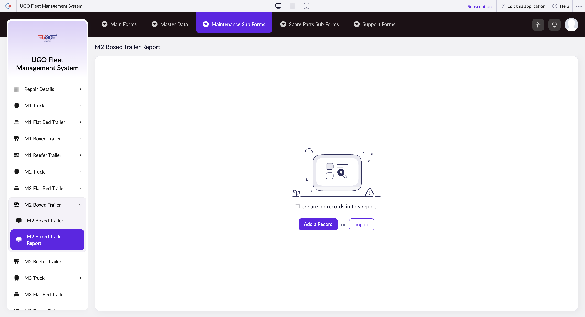

# M2 Boxed Trailer Report

The M2 Boxed Trailer Report page lets you create and manage maintenance records for M2-type boxed trailers in your fleet. Maintenance staff use this page to document inspections, repairs, and service work performed on these trailers. You'll typically access this page when you need to log completed maintenance or generate reports for specific trailers.

**URL:** `https://creatorapp.zoho.com/m.fahmy_ugologistics/u-go-garage-maintenance#Report:M2_Boxed_Trailer_Report`

## How to Use

1. Select your preferred language using the lang-select-dropdown at the top if needed
2. Use the volume range field to specify the trailer capacity or volume being serviced
3. For each maintenance item or inspection area, check the corresponding checkbox (Radio136 through Radio141) to mark it as applicable
4. In the text fields next to each checked item, enter the trailer identification number or search for the specific trailer using the search function
5. Use the dropdown menus (zc_searchSelect) to select the maintenance category or status for each item
6. If you need to add notes about the maintenance work, check the Notes checkbox and enter your comments in the corresponding text field
7. Click Submit Request to save your report, or click Add a Record to log additional trailers

## Page Sections

- M2 Boxed Trailer Report

## Form Fields

| Field | Description | Type | Required |
|-------|-------------|------|----------|
| lang-select-dropdown | Choose the language for the report interface if you need to work in a language other than the default | dropdown | No |
| volume | Enter the cubic capacity or volume measurement of the M2 boxed trailer being serviced (measured in cubic feet or meters) | range | No |
| checkbox-Radio136-ZC_IO294Z |  | checkbox | No |
| s2id_autogen4 |  | text | No |
| s2id_autogen4_search |  | text | No |
| zc_searchSelect |  | dropdown | No |
| checkbox-Radio137-ZC_IO294Z |  | checkbox | No |
| s2id_autogen6 |  | text | No |
| s2id_autogen6_search |  | text | No |
| zc_searchSelect |  | dropdown | No |
| checkbox-Radio138-ZC_IO294Z |  | checkbox | No |
| s2id_autogen8 |  | text | No |
| s2id_autogen8_search |  | text | No |
| zc_searchSelect |  | dropdown | No |
| checkbox-Radio139-ZC_IO294Z |  | checkbox | No |
| s2id_autogen10 |  | text | No |
| s2id_autogen10_search |  | text | No |
| zc_searchSelect |  | dropdown | No |
| checkbox-Radio140-ZC_IO294Z |  | checkbox | No |
| s2id_autogen12 |  | text | No |
| s2id_autogen12_search |  | text | No |
| zc_searchSelect |  | dropdown | No |
| checkbox-Radio141-ZC_IO294Z |  | checkbox | No |
| s2id_autogen14 |  | text | No |
| s2id_autogen14_search |  | text | No |
| zc_searchSelect |  | dropdown | No |
| checkbox-Notes-ZC_IO294Z | Check this box if you need to add additional comments or observations about the maintenance work performed | checkbox | No |
| s2id_autogen16 |  | text | No |
| s2id_autogen16_search |  | text | No |
| zc_searchSelect |  | dropdown | No |
| checkbox-Radio142-ZC_IO294Z |  | checkbox | No |
| s2id_autogen18 |  | text | No |
| s2id_autogen18_search |  | text | No |
| zc_searchSelect |  | dropdown | No |
| checkbox-Radio143-ZC_IO294Z |  | checkbox | No |
| s2id_autogen20 |  | text | No |
| s2id_autogen20_search |  | text | No |
| zc_searchSelect |  | dropdown | No |
| checkbox-Radio144-ZC_IO294Z |  | checkbox | No |
| s2id_autogen22 |  | text | No |
| s2id_autogen22_search |  | text | No |
| zc_searchSelect |  | dropdown | No |
| checkbox-Radio145-ZC_IO294Z |  | checkbox | No |
| s2id_autogen24 |  | text | No |
| s2id_autogen24_search |  | text | No |
| zc_searchSelect |  | dropdown | No |
| checkbox-Radio146-ZC_IO294Z |  | checkbox | No |
| s2id_autogen26 |  | text | No |
| s2id_autogen26_search |  | text | No |
| zc_searchSelect |  | dropdown | No |
| checkbox-Radio147-ZC_IO294Z |  | checkbox | No |
| s2id_autogen28 |  | text | No |
| s2id_autogen28_search |  | text | No |
| zc_searchSelect |  | dropdown | No |
| checkbox-Radio148-ZC_IO294Z |  | checkbox | No |
| s2id_autogen30 |  | text | No |
| s2id_autogen30_search |  | text | No |
| zc_searchSelect |  | dropdown | No |
| checkbox-Notes1-ZC_IO294Z |  | checkbox | No |
| s2id_autogen32 |  | text | No |
| s2id_autogen32_search |  | text | No |
| zc_searchSelect |  | dropdown | No |
| checkbox-Radio149-ZC_IO294Z |  | checkbox | No |
| s2id_autogen34 |  | text | No |
| s2id_autogen34_search |  | text | No |
| zc_searchSelect |  | dropdown | No |
| checkbox-Radio150-ZC_IO294Z |  | checkbox | No |
| s2id_autogen36 |  | text | No |
| s2id_autogen36_search |  | text | No |
| zc_searchSelect |  | dropdown | No |
| checkbox-Radio151-ZC_IO294Z |  | checkbox | No |
| s2id_autogen38 |  | text | No |
| s2id_autogen38_search |  | text | No |
| zc_searchSelect |  | dropdown | No |
| checkbox-Radio152-ZC_IO294Z |  | checkbox | No |
| s2id_autogen40 |  | text | No |
| s2id_autogen40_search |  | text | No |
| zc_searchSelect |  | dropdown | No |
| checkbox-Notes2-ZC_IO294Z |  | checkbox | No |
| s2id_autogen42 |  | text | No |
| s2id_autogen42_search |  | text | No |
| zc_searchSelect |  | dropdown | No |
| checkbox-Radio153-ZC_IO294Z |  | checkbox | No |
| s2id_autogen44 |  | text | No |
| s2id_autogen44_search |  | text | No |
| zc_searchSelect |  | dropdown | No |
| checkbox-Radio154-ZC_IO294Z |  | checkbox | No |
| s2id_autogen46 |  | text | No |
| s2id_autogen46_search |  | text | No |
| zc_searchSelect |  | dropdown | No |
| checkbox-Notes3-ZC_IO294Z |  | checkbox | No |
| s2id_autogen48 |  | text | No |
| s2id_autogen48_search |  | text | No |
| zc_searchSelect |  | dropdown | No |
| checkbox-Radio155-ZC_IO294Z |  | checkbox | No |
| s2id_autogen50 |  | text | No |
| s2id_autogen50_search |  | text | No |
| zc_searchSelect |  | dropdown | No |
| checkbox-Radio156-ZC_IO294Z |  | checkbox | No |
| s2id_autogen52 |  | text | No |
| s2id_autogen52_search |  | text | No |
| zc_searchSelect |  | dropdown | No |
| checkbox-Radio157-ZC_IO294Z |  | checkbox | No |
| s2id_autogen54 |  | text | No |
| s2id_autogen54_search |  | text | No |
| zc_searchSelect |  | dropdown | No |
| checkbox-Notes4-ZC_IO294Z |  | checkbox | No |
| s2id_autogen56 |  | text | No |
| s2id_autogen56_search |  | text | No |
| zc_searchSelect |  | dropdown | No |
| checkbox-Radio158-ZC_IO294Z |  | checkbox | No |
| s2id_autogen58 |  | text | No |
| s2id_autogen58_search |  | text | No |
| zc_searchSelect |  | dropdown | No |
| checkbox-Radio159-ZC_IO294Z |  | checkbox | No |
| s2id_autogen60 |  | text | No |
| s2id_autogen60_search |  | text | No |
| zc_searchSelect |  | dropdown | No |
| checkbox-Radio160-ZC_IO294Z |  | checkbox | No |
| s2id_autogen62 |  | text | No |
| s2id_autogen62_search |  | text | No |
| zc_searchSelect |  | dropdown | No |
| checkbox-Radio1-ZC_IO294Z |  | checkbox | No |
| s2id_autogen64 |  | text | No |
| s2id_autogen64_search |  | text | No |
| zc_searchSelect |  | dropdown | No |
| checkbox-Radio2-ZC_IO294Z |  | checkbox | No |
| s2id_autogen66 |  | text | No |
| s2id_autogen66_search |  | text | No |
| zc_searchSelect |  | dropdown | No |
| checkbox-Radio3-ZC_IO294Z |  | checkbox | No |
| s2id_autogen68 |  | text | No |
| s2id_autogen68_search |  | text | No |
| zc_searchSelect |  | dropdown | No |
| checkbox-Radio4-ZC_IO294Z |  | checkbox | No |
| s2id_autogen70 |  | text | No |
| s2id_autogen70_search |  | text | No |
| zc_searchSelect |  | dropdown | No |
| checkbox-Radio6-ZC_IO294Z |  | checkbox | No |
| s2id_autogen72 |  | text | No |
| s2id_autogen72_search |  | text | No |
| zc_searchSelect |  | dropdown | No |
| checkbox-Notes5-ZC_IO294Z |  | checkbox | No |
| s2id_autogen74 |  | text | No |
| s2id_autogen74_search |  | text | No |
| zc_searchSelect |  | dropdown | No |
| checkbox-Technician_Name-ZC_IO294Z |  | checkbox | No |
| s2id_autogen76 |  | text | No |
| s2id_autogen76_search |  | text | No |
| zc_searchSelect |  | dropdown | No |
| allowlocation |  | button | No |
| useIconSwitch |  | checkbox | No |
| toggleIconSwitch |  | checkbox | No |
| saveIcons |  | button | No |
| resetIcons |  | button | No |
| Search... |  | text | No |
| I have read the above conditions. |  | checkbox | No |
| reqEmailId |  | text | No |
| s2id_autogen2 |  | text | No |
| s2id_autogen2_search |  | text | No |
| supportType |  | dropdown | No |
| Please enable edit permission to help with troubleshooting |  | checkbox | No |
| reachusChatDescription |  | textarea | No |
| reachUsStartChat |  | button | No |

## Actions

- **Done**
- **Main Forms**
- **Master Data**
- **Maintenance Sub Forms**
- **Spare Parts Sub Forms**
- **Support Forms**
- **Remove Changes**
- **Add a Record**
- **Import**
- **Submit Request**

## Tips

- Always search for existing trailers first before entering a new unit number—this prevents duplicate records and keeps your fleet data clean
- The checkboxes and associated fields work together as groups; only fill in the search and dropdown fields for items you've actually checked, otherwise you may create incomplete or confusing records

## Related Pages

- [M1 Truck Report](m1-truck-report.md)
- [M1 Flat Bed Trailer Report](m1-flat-bed-trailer-report.md)
- [M1 Boxed Trailer Report](m1-boxed-trailer-report.md)
- [M1 Reefer Trailer Report](m1-reefer-trailer-report.md)
- [M2 Truck Report](m2-truck-report.md)
- [M2 Flat Bed Trailer Report](m2-flat-bed-trailer-report.md)
- [M2 Reefer Trailer Report](m2-reefer-trailer-report.md)
- [M3 Truck Report](m3-truck-report.md)
- [M3 Flat Bed Trailer Report](m3-flat-bed-trailer-report.md)
- [M3 Boxed Trailer Report](m3-boxed-trailer-report.md)
- [M3 Reefer Trailer Report](m3-reefer-trailer-report.md)
- [M4 Truck Report](m4-truck-report.md)
- [M4 Flat Bed Trailer Report](m4-flat-bed-trailer-report.md)
- [M4 Boxed Trailer Report](m4-boxed-trailer-report.md)
- [M4 Reefer Trailer Report](m4-reefer-trailer-report.md)

## Common Workflows

_Add step-by-step workflows specific to your organisation here._
