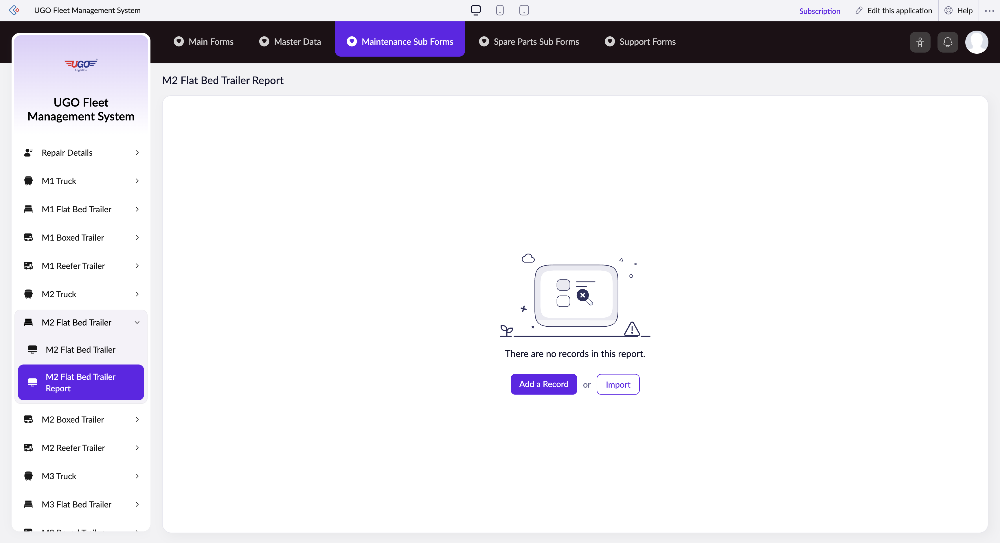

# M2 Flat Bed Trailer Report

This page lets you create and manage maintenance records for M2 flat bed trailers in your fleet. Maintenance staff and fleet managers use this form to log service work, track repairs, and maintain compliance records for each trailer.

**URL:** `https://creatorapp.zoho.com/m.fahmy_ugologistics/u-go-garage-maintenance#Report:M2_Flat_Bed_Trailer_Report`

## How to Use

1. Select your preferred language from the language dropdown at the top if needed.
2. Use the volume range slider to specify the cargo capacity or load details relevant to the maintenance work.
3. For each maintenance item, check the checkbox to activate that record line.
4. In the text field below the checkbox, enter the maintenance task description or item name.
5. Use the search dropdown to select the maintenance type category or responsible technician.
6. Repeat steps 3-5 for each additional maintenance item you need to record (up to 7 items per form).
7. Click 'Submit Request' to save your maintenance record, or 'Add a Record' to include additional trailers.

## Page Sections

- M2 Flat Bed Trailer Report

## Form Fields

| Field | Description | Type | Required |
|-------|-------------|------|----------|
| lang-select-dropdown | Choose your working language for the form display. | dropdown | No |
| volume | Adjust the slider to enter cargo volume, weight capacity, or other load measurements relevant to this maintenance work. | range | No |
| checkbox-Radio136-ZC_XZ5RRL |  | checkbox | No |
| s2id_autogen4 |  | text | No |
| s2id_autogen4_search |  | text | No |
| zc_searchSelect |  | dropdown | No |
| checkbox-Radio137-ZC_XZ5RRL |  | checkbox | No |
| s2id_autogen6 |  | text | No |
| s2id_autogen6_search |  | text | No |
| zc_searchSelect |  | dropdown | No |
| checkbox-Radio138-ZC_XZ5RRL |  | checkbox | No |
| s2id_autogen8 |  | text | No |
| s2id_autogen8_search |  | text | No |
| zc_searchSelect |  | dropdown | No |
| checkbox-Radio139-ZC_XZ5RRL |  | checkbox | No |
| s2id_autogen10 |  | text | No |
| s2id_autogen10_search |  | text | No |
| zc_searchSelect |  | dropdown | No |
| checkbox-Radio140-ZC_XZ5RRL |  | checkbox | No |
| s2id_autogen12 |  | text | No |
| s2id_autogen12_search |  | text | No |
| zc_searchSelect |  | dropdown | No |
| checkbox-Radio141-ZC_XZ5RRL |  | checkbox | No |
| s2id_autogen14 |  | text | No |
| s2id_autogen14_search |  | text | No |
| zc_searchSelect |  | dropdown | No |
| checkbox-Radio142-ZC_XZ5RRL |  | checkbox | No |
| s2id_autogen16 |  | text | No |
| s2id_autogen16_search |  | text | No |
| zc_searchSelect |  | dropdown | No |
| checkbox-Radio143-ZC_XZ5RRL |  | checkbox | No |
| s2id_autogen18 |  | text | No |
| s2id_autogen18_search |  | text | No |
| zc_searchSelect |  | dropdown | No |
| checkbox-Radio144-ZC_XZ5RRL |  | checkbox | No |
| s2id_autogen20 |  | text | No |
| s2id_autogen20_search |  | text | No |
| zc_searchSelect |  | dropdown | No |
| checkbox-Radio145-ZC_XZ5RRL |  | checkbox | No |
| s2id_autogen22 |  | text | No |
| s2id_autogen22_search |  | text | No |
| zc_searchSelect |  | dropdown | No |
| checkbox-Radio146-ZC_XZ5RRL |  | checkbox | No |
| s2id_autogen24 |  | text | No |
| s2id_autogen24_search |  | text | No |
| zc_searchSelect |  | dropdown | No |
| checkbox-Radio147-ZC_XZ5RRL |  | checkbox | No |
| s2id_autogen26 |  | text | No |
| s2id_autogen26_search |  | text | No |
| zc_searchSelect |  | dropdown | No |
| checkbox-Radio148-ZC_XZ5RRL |  | checkbox | No |
| s2id_autogen28 |  | text | No |
| s2id_autogen28_search |  | text | No |
| zc_searchSelect |  | dropdown | No |
| checkbox-Radio149-ZC_XZ5RRL |  | checkbox | No |
| s2id_autogen30 |  | text | No |
| s2id_autogen30_search |  | text | No |
| zc_searchSelect |  | dropdown | No |
| checkbox-Radio150-ZC_XZ5RRL |  | checkbox | No |
| s2id_autogen32 |  | text | No |
| s2id_autogen32_search |  | text | No |
| zc_searchSelect |  | dropdown | No |
| checkbox-Radio151-ZC_XZ5RRL |  | checkbox | No |
| s2id_autogen34 |  | text | No |
| s2id_autogen34_search |  | text | No |
| zc_searchSelect |  | dropdown | No |
| checkbox-Radio152-ZC_XZ5RRL |  | checkbox | No |
| s2id_autogen36 |  | text | No |
| s2id_autogen36_search |  | text | No |
| zc_searchSelect |  | dropdown | No |
| checkbox-Radio153-ZC_XZ5RRL |  | checkbox | No |
| s2id_autogen38 |  | text | No |
| s2id_autogen38_search |  | text | No |
| zc_searchSelect |  | dropdown | No |
| checkbox-Radio154-ZC_XZ5RRL |  | checkbox | No |
| s2id_autogen40 |  | text | No |
| s2id_autogen40_search |  | text | No |
| zc_searchSelect |  | dropdown | No |
| checkbox-Radio155-ZC_XZ5RRL |  | checkbox | No |
| s2id_autogen42 |  | text | No |
| s2id_autogen42_search |  | text | No |
| zc_searchSelect |  | dropdown | No |
| checkbox-Radio156-ZC_XZ5RRL |  | checkbox | No |
| s2id_autogen44 |  | text | No |
| s2id_autogen44_search |  | text | No |
| zc_searchSelect |  | dropdown | No |
| checkbox-Radio157-ZC_XZ5RRL |  | checkbox | No |
| s2id_autogen46 |  | text | No |
| s2id_autogen46_search |  | text | No |
| zc_searchSelect |  | dropdown | No |
| checkbox-Notes-ZC_XZ5RRL |  | checkbox | No |
| s2id_autogen48 |  | text | No |
| s2id_autogen48_search |  | text | No |
| zc_searchSelect |  | dropdown | No |
| checkbox-Notes1-ZC_XZ5RRL |  | checkbox | No |
| s2id_autogen50 |  | text | No |
| s2id_autogen50_search |  | text | No |
| zc_searchSelect |  | dropdown | No |
| checkbox-Notes2-ZC_XZ5RRL |  | checkbox | No |
| s2id_autogen52 |  | text | No |
| s2id_autogen52_search |  | text | No |
| zc_searchSelect |  | dropdown | No |
| checkbox-Notes3-ZC_XZ5RRL |  | checkbox | No |
| s2id_autogen54 |  | text | No |
| s2id_autogen54_search |  | text | No |
| zc_searchSelect |  | dropdown | No |
| checkbox-Notes4-ZC_XZ5RRL |  | checkbox | No |
| s2id_autogen56 |  | text | No |
| s2id_autogen56_search |  | text | No |
| zc_searchSelect |  | dropdown | No |
| checkbox-Technician_Name-ZC_XZ5RRL |  | checkbox | No |
| s2id_autogen58 |  | text | No |
| s2id_autogen58_search |  | text | No |
| zc_searchSelect |  | dropdown | No |
| allowlocation |  | button | No |
| useIconSwitch |  | checkbox | No |
| toggleIconSwitch |  | checkbox | No |
| saveIcons |  | button | No |
| resetIcons |  | button | No |
| Search... |  | text | No |
| I have read the above conditions. |  | checkbox | No |
| reqEmailId |  | text | No |
| s2id_autogen2 |  | text | No |
| s2id_autogen2_search |  | text | No |
| supportType |  | dropdown | No |
| Please enable edit permission to help with troubleshooting |  | checkbox | No |
| reachusChatDescription |  | textarea | No |
| reachUsStartChat |  | button | No |

## Actions

- **Done**
- **Main Forms**
- **Master Data**
- **Maintenance Sub Forms**
- **Spare Parts Sub Forms**
- **Support Forms**
- **Remove Changes**
- **Add a Record**
- **Import**
- **Submit Request**

## Tips

- You can add up to 7 separate maintenance items on one form. If you need more, use 'Add a Record' to create a new form for the same trailer.
- Always check the checkbox before filling in the text and dropdown fields—unchecked items will not be saved even if you enter data.

## Related Pages

- [M1 Truck Report](m1-truck-report.md)
- [M1 Flat Bed Trailer Report](m1-flat-bed-trailer-report.md)
- [M1 Boxed Trailer Report](m1-boxed-trailer-report.md)
- [M1 Reefer Trailer Report](m1-reefer-trailer-report.md)
- [M2 Truck Report](m2-truck-report.md)
- [M2 Boxed Trailer Report](m2-boxed-trailer-report.md)
- [M2 Reefer Trailer Report](m2-reefer-trailer-report.md)
- [M3 Truck Report](m3-truck-report.md)
- [M3 Flat Bed Trailer Report](m3-flat-bed-trailer-report.md)
- [M3 Boxed Trailer Report](m3-boxed-trailer-report.md)
- [M3 Reefer Trailer Report](m3-reefer-trailer-report.md)
- [M4 Truck Report](m4-truck-report.md)
- [M4 Flat Bed Trailer Report](m4-flat-bed-trailer-report.md)
- [M4 Boxed Trailer Report](m4-boxed-trailer-report.md)
- [M4 Reefer Trailer Report](m4-reefer-trailer-report.md)

## Common Workflows

_Add step-by-step workflows specific to your organisation here._
