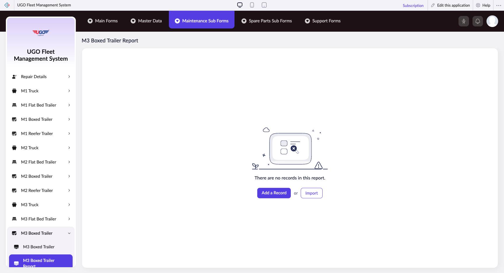

# M3 Boxed Trailer Report

The M3 Boxed Trailer Report lets you view, filter, and manage maintenance records for your M3 boxed trailers in the U-Go fleet. Use this page to check trailer conditions, record maintenance work, and generate reports for compliance and scheduling purposes.

**URL:** `https://creatorapp.zoho.com/m.fahmy_ugologistics/u-go-garage-maintenance#Report:M3_Boxed_Trailer_Report`

## How to Use

1. Select your preferred language from the language dropdown at the top if needed.
2. Use the volume range slider to filter trailers by cargo capacity if you need to focus on specific trailer sizes.
3. For each maintenance item row, check the checkbox to select which maintenance tasks or inspections apply to this trailer.
4. Click on the text field or dropdown for each row to enter or select specific maintenance details, equipment, or service codes.
5. Use the Add a Record button to include additional maintenance entries for other trailers or new service dates.
6. Click Submit Request when all maintenance information is complete and verified.

## Page Sections

- M3 Boxed Trailer Report

## Form Fields

| Field | Description | Type | Required |
|-------|-------------|------|----------|
| lang-select-dropdown | Choose the language for viewing and completing this report. Select your preferred language from the list. | dropdown | No |
| volume | Set the cargo capacity range in cubic meters to filter which M3 trailers appear in your report. Drag the slider to show only trailers within your specified size range. | range | No |
| checkbox-Radio136-ZC_79QR9T |  | checkbox | No |
| s2id_autogen4 |  | text | No |
| s2id_autogen4_search |  | text | No |
| zc_searchSelect |  | dropdown | No |
| checkbox-Radio137-ZC_79QR9T |  | checkbox | No |
| s2id_autogen6 |  | text | No |
| s2id_autogen6_search |  | text | No |
| zc_searchSelect |  | dropdown | No |
| checkbox-Radio138-ZC_79QR9T |  | checkbox | No |
| s2id_autogen8 |  | text | No |
| s2id_autogen8_search |  | text | No |
| zc_searchSelect |  | dropdown | No |
| checkbox-Radio139-ZC_79QR9T |  | checkbox | No |
| s2id_autogen10 |  | text | No |
| s2id_autogen10_search |  | text | No |
| zc_searchSelect |  | dropdown | No |
| checkbox-Radio140-ZC_79QR9T |  | checkbox | No |
| s2id_autogen12 |  | text | No |
| s2id_autogen12_search |  | text | No |
| zc_searchSelect |  | dropdown | No |
| checkbox-Radio141-ZC_79QR9T |  | checkbox | No |
| s2id_autogen14 |  | text | No |
| s2id_autogen14_search |  | text | No |
| zc_searchSelect |  | dropdown | No |
| checkbox-Radio1-ZC_79QR9T |  | checkbox | No |
| s2id_autogen16 |  | text | No |
| s2id_autogen16_search |  | text | No |
| zc_searchSelect |  | dropdown | No |
| checkbox-Notes-ZC_79QR9T |  | checkbox | No |
| s2id_autogen18 |  | text | No |
| s2id_autogen18_search |  | text | No |
| zc_searchSelect |  | dropdown | No |
| checkbox-Radio142-ZC_79QR9T |  | checkbox | No |
| s2id_autogen20 |  | text | No |
| s2id_autogen20_search |  | text | No |
| zc_searchSelect |  | dropdown | No |
| checkbox-Radio143-ZC_79QR9T |  | checkbox | No |
| s2id_autogen22 |  | text | No |
| s2id_autogen22_search |  | text | No |
| zc_searchSelect |  | dropdown | No |
| checkbox-Radio144-ZC_79QR9T |  | checkbox | No |
| s2id_autogen24 |  | text | No |
| s2id_autogen24_search |  | text | No |
| zc_searchSelect |  | dropdown | No |
| checkbox-Radio145-ZC_79QR9T |  | checkbox | No |
| s2id_autogen26 |  | text | No |
| s2id_autogen26_search |  | text | No |
| zc_searchSelect |  | dropdown | No |
| checkbox-Radio146-ZC_79QR9T |  | checkbox | No |
| s2id_autogen28 |  | text | No |
| s2id_autogen28_search |  | text | No |
| zc_searchSelect |  | dropdown | No |
| checkbox-Radio147-ZC_79QR9T |  | checkbox | No |
| s2id_autogen30 |  | text | No |
| s2id_autogen30_search |  | text | No |
| zc_searchSelect |  | dropdown | No |
| checkbox-Radio148-ZC_79QR9T |  | checkbox | No |
| s2id_autogen32 |  | text | No |
| s2id_autogen32_search |  | text | No |
| zc_searchSelect |  | dropdown | No |
| checkbox-Notes1-ZC_79QR9T |  | checkbox | No |
| s2id_autogen34 |  | text | No |
| s2id_autogen34_search |  | text | No |
| zc_searchSelect |  | dropdown | No |
| checkbox-Radio149-ZC_79QR9T |  | checkbox | No |
| s2id_autogen36 |  | text | No |
| s2id_autogen36_search |  | text | No |
| zc_searchSelect |  | dropdown | No |
| checkbox-Radio150-ZC_79QR9T |  | checkbox | No |
| s2id_autogen38 |  | text | No |
| s2id_autogen38_search |  | text | No |
| zc_searchSelect |  | dropdown | No |
| checkbox-Radio151-ZC_79QR9T |  | checkbox | No |
| s2id_autogen40 |  | text | No |
| s2id_autogen40_search |  | text | No |
| zc_searchSelect |  | dropdown | No |
| checkbox-Radio152-ZC_79QR9T |  | checkbox | No |
| s2id_autogen42 |  | text | No |
| s2id_autogen42_search |  | text | No |
| zc_searchSelect |  | dropdown | No |
| checkbox-Notes2-ZC_79QR9T |  | checkbox | No |
| s2id_autogen44 |  | text | No |
| s2id_autogen44_search |  | text | No |
| zc_searchSelect |  | dropdown | No |
| checkbox-Radio153-ZC_79QR9T |  | checkbox | No |
| s2id_autogen46 |  | text | No |
| s2id_autogen46_search |  | text | No |
| zc_searchSelect |  | dropdown | No |
| checkbox-Radio154-ZC_79QR9T |  | checkbox | No |
| s2id_autogen48 |  | text | No |
| s2id_autogen48_search |  | text | No |
| zc_searchSelect |  | dropdown | No |
| checkbox-Notes3-ZC_79QR9T |  | checkbox | No |
| s2id_autogen50 |  | text | No |
| s2id_autogen50_search |  | text | No |
| zc_searchSelect |  | dropdown | No |
| checkbox-Radio155-ZC_79QR9T |  | checkbox | No |
| s2id_autogen52 |  | text | No |
| s2id_autogen52_search |  | text | No |
| zc_searchSelect |  | dropdown | No |
| checkbox-Radio156-ZC_79QR9T |  | checkbox | No |
| s2id_autogen54 |  | text | No |
| s2id_autogen54_search |  | text | No |
| zc_searchSelect |  | dropdown | No |
| checkbox-Radio157-ZC_79QR9T |  | checkbox | No |
| s2id_autogen56 |  | text | No |
| s2id_autogen56_search |  | text | No |
| zc_searchSelect |  | dropdown | No |
| checkbox-Notes4-ZC_79QR9T |  | checkbox | No |
| s2id_autogen58 |  | text | No |
| s2id_autogen58_search |  | text | No |
| zc_searchSelect |  | dropdown | No |
| checkbox-Radio2-ZC_79QR9T |  | checkbox | No |
| s2id_autogen60 |  | text | No |
| s2id_autogen60_search |  | text | No |
| zc_searchSelect |  | dropdown | No |
| checkbox-Radio3-ZC_79QR9T |  | checkbox | No |
| s2id_autogen62 |  | text | No |
| s2id_autogen62_search |  | text | No |
| zc_searchSelect |  | dropdown | No |
| checkbox-Radio4-ZC_79QR9T |  | checkbox | No |
| s2id_autogen64 |  | text | No |
| s2id_autogen64_search |  | text | No |
| zc_searchSelect |  | dropdown | No |
| checkbox-Radio5-ZC_79QR9T |  | checkbox | No |
| s2id_autogen66 |  | text | No |
| s2id_autogen66_search |  | text | No |
| zc_searchSelect |  | dropdown | No |
| checkbox-Radio6-ZC_79QR9T |  | checkbox | No |
| s2id_autogen68 |  | text | No |
| s2id_autogen68_search |  | text | No |
| zc_searchSelect |  | dropdown | No |
| checkbox-Radio7-ZC_79QR9T |  | checkbox | No |
| s2id_autogen70 |  | text | No |
| s2id_autogen70_search |  | text | No |
| zc_searchSelect |  | dropdown | No |
| checkbox-Radio8-ZC_79QR9T |  | checkbox | No |
| s2id_autogen72 |  | text | No |
| s2id_autogen72_search |  | text | No |
| zc_searchSelect |  | dropdown | No |
| checkbox-Radio9-ZC_79QR9T |  | checkbox | No |
| s2id_autogen74 |  | text | No |
| s2id_autogen74_search |  | text | No |
| zc_searchSelect |  | dropdown | No |
| checkbox-Notes5-ZC_79QR9T |  | checkbox | No |
| s2id_autogen76 |  | text | No |
| s2id_autogen76_search |  | text | No |
| zc_searchSelect |  | dropdown | No |
| checkbox-Technician_Name-ZC_79QR9T |  | checkbox | No |
| s2id_autogen78 |  | text | No |
| s2id_autogen78_search |  | text | No |
| zc_searchSelect |  | dropdown | No |
| allowlocation |  | button | No |
| useIconSwitch |  | checkbox | No |
| toggleIconSwitch |  | checkbox | No |
| saveIcons |  | button | No |
| resetIcons |  | button | No |
| Search... |  | text | No |
| I have read the above conditions. |  | checkbox | No |
| reqEmailId |  | text | No |
| s2id_autogen2 |  | text | No |
| s2id_autogen2_search |  | text | No |
| supportType |  | dropdown | No |
| Please enable edit permission to help with troubleshooting |  | checkbox | No |
| reachusChatDescription |  | textarea | No |
| reachUsStartChat |  | button | No |

## Actions

- **Done**
- **Main Forms**
- **Master Data**
- **Maintenance Sub Forms**
- **Spare Parts Sub Forms**
- **Support Forms**
- **Remove Changes**
- **Add a Record**
- **Import**
- **Submit Request**

## Tips

- Multiple maintenance rows with the same dropdown options can be confusing—always verify the checkbox above each row is selected before filling in that row's details, or you may lose your work.
- Use the Import button to load historical maintenance data or batch records instead of entering them manually one by one, which saves time on large reports.

## Related Pages

- [M1 Truck Report](m1-truck-report.md)
- [M1 Flat Bed Trailer Report](m1-flat-bed-trailer-report.md)
- [M1 Boxed Trailer Report](m1-boxed-trailer-report.md)
- [M1 Reefer Trailer Report](m1-reefer-trailer-report.md)
- [M2 Truck Report](m2-truck-report.md)
- [M2 Flat Bed Trailer Report](m2-flat-bed-trailer-report.md)
- [M2 Boxed Trailer Report](m2-boxed-trailer-report.md)
- [M2 Reefer Trailer Report](m2-reefer-trailer-report.md)
- [M3 Truck Report](m3-truck-report.md)
- [M3 Flat Bed Trailer Report](m3-flat-bed-trailer-report.md)
- [M3 Reefer Trailer Report](m3-reefer-trailer-report.md)
- [M4 Truck Report](m4-truck-report.md)
- [M4 Flat Bed Trailer Report](m4-flat-bed-trailer-report.md)
- [M4 Boxed Trailer Report](m4-boxed-trailer-report.md)
- [M4 Reefer Trailer Report](m4-reefer-trailer-report.md)

## Common Workflows

_Add step-by-step workflows specific to your organisation here._
