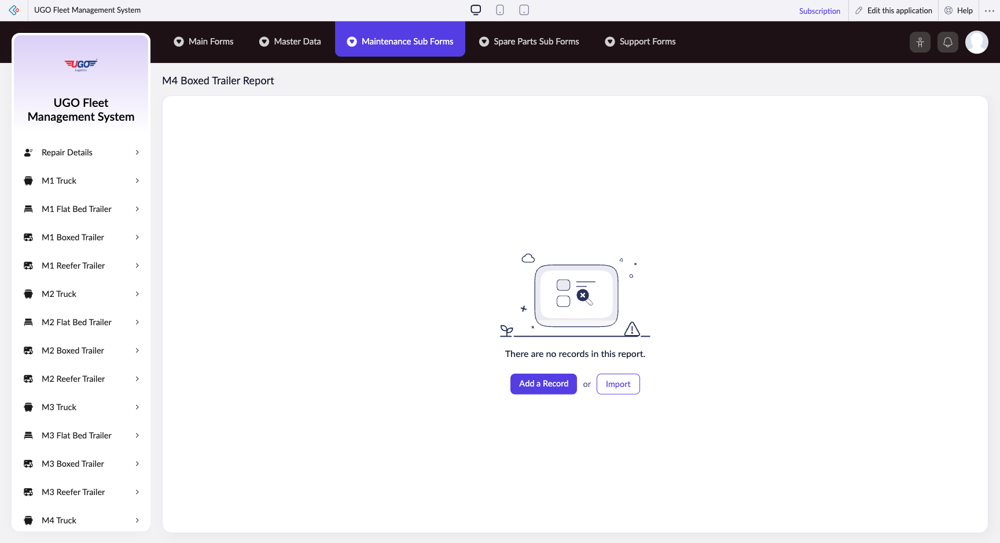

# M4 Boxed Trailer Report

The M4 Boxed Trailer Report lets you record and manage maintenance details for boxed trailers in your fleet. Use this page to log repair work, track maintenance history, and keep your trailers in safe operating condition. Fleet managers and maintenance staff use this report during routine inspections and after service appointments.

**URL:** `https://creatorapp.zoho.com/m.fahmy_ugologistics/u-go-garage-maintenance#Report:M4_Boxed_Trailer_Report`

## How to Use

1. Select your preferred language from the Language dropdown at the top if needed.
2. Use the Volume range slider to specify the cargo capacity or load size relevant to your maintenance entry.
3. For each maintenance item, check the corresponding checkbox to activate that record row.
4. In the text field next to each activated row, enter the maintenance task description (for example, 'Brake inspection' or 'Tire replacement').
5. Use the associated search dropdown to select the trailer unit ID or maintenance category from your system list.
6. Repeat steps 3-5 for each maintenance task you need to record, up to seven separate items per report.
7. Click 'Submit Request' to save your completed report, or 'Add a Record' to include additional maintenance entries.

## Page Sections

- M4 Boxed Trailer Report

## Form Fields

| Field | Description | Type | Required |
|-------|-------------|------|----------|
| lang-select-dropdown | Choose your working language for the form interface. Leave blank to use system default. | dropdown | No |
| volume | Set the cargo volume range applicable to this trailer maintenance record. Helps track maintenance by vehicle size category. | range | No |
| checkbox-Radio136-ZC_KWBHGA |  | checkbox | No |
| s2id_autogen4 |  | text | No |
| s2id_autogen4_search |  | text | No |
| zc_searchSelect | Select the matching item from the dropdown list that appears after you start typing in the search field above it. | dropdown | No |
| checkbox-Radio137-ZC_KWBHGA |  | checkbox | No |
| s2id_autogen6 |  | text | No |
| s2id_autogen6_search |  | text | No |
| zc_searchSelect | Select the matching item from the dropdown list that appears after you start typing in the search field above it. | dropdown | No |
| checkbox-Radio138-ZC_KWBHGA |  | checkbox | No |
| s2id_autogen8 |  | text | No |
| s2id_autogen8_search |  | text | No |
| zc_searchSelect | Select the matching item from the dropdown list that appears after you start typing in the search field above it. | dropdown | No |
| checkbox-Radio139-ZC_KWBHGA |  | checkbox | No |
| s2id_autogen10 |  | text | No |
| s2id_autogen10_search |  | text | No |
| zc_searchSelect | Select the matching item from the dropdown list that appears after you start typing in the search field above it. | dropdown | No |
| checkbox-Radio140-ZC_KWBHGA |  | checkbox | No |
| s2id_autogen12 |  | text | No |
| s2id_autogen12_search |  | text | No |
| zc_searchSelect | Select the matching item from the dropdown list that appears after you start typing in the search field above it. | dropdown | No |
| checkbox-Radio141-ZC_KWBHGA |  | checkbox | No |
| s2id_autogen14 |  | text | No |
| s2id_autogen14_search |  | text | No |
| zc_searchSelect | Select the matching item from the dropdown list that appears after you start typing in the search field above it. | dropdown | No |
| checkbox-Radio1-ZC_KWBHGA |  | checkbox | No |
| s2id_autogen16 |  | text | No |
| s2id_autogen16_search |  | text | No |
| zc_searchSelect | Select the matching item from the dropdown list that appears after you start typing in the search field above it. | dropdown | No |
| checkbox-Radio2-ZC_KWBHGA |  | checkbox | No |
| s2id_autogen18 |  | text | No |
| s2id_autogen18_search |  | text | No |
| zc_searchSelect | Select the matching item from the dropdown list that appears after you start typing in the search field above it. | dropdown | No |
| checkbox-Radio3-ZC_KWBHGA |  | checkbox | No |
| s2id_autogen20 |  | text | No |
| s2id_autogen20_search |  | text | No |
| zc_searchSelect | Select the matching item from the dropdown list that appears after you start typing in the search field above it. | dropdown | No |
| checkbox-Radio4-ZC_KWBHGA |  | checkbox | No |
| s2id_autogen22 |  | text | No |
| s2id_autogen22_search |  | text | No |
| zc_searchSelect | Select the matching item from the dropdown list that appears after you start typing in the search field above it. | dropdown | No |
| checkbox-Notes-ZC_KWBHGA |  | checkbox | No |
| s2id_autogen24 |  | text | No |
| s2id_autogen24_search |  | text | No |
| zc_searchSelect | Select the matching item from the dropdown list that appears after you start typing in the search field above it. | dropdown | No |
| checkbox-Radio142-ZC_KWBHGA |  | checkbox | No |
| s2id_autogen26 |  | text | No |
| s2id_autogen26_search |  | text | No |
| zc_searchSelect | Select the matching item from the dropdown list that appears after you start typing in the search field above it. | dropdown | No |
| checkbox-Radio143-ZC_KWBHGA |  | checkbox | No |
| s2id_autogen28 |  | text | No |
| s2id_autogen28_search |  | text | No |
| zc_searchSelect | Select the matching item from the dropdown list that appears after you start typing in the search field above it. | dropdown | No |
| checkbox-Radio144-ZC_KWBHGA |  | checkbox | No |
| s2id_autogen30 |  | text | No |
| s2id_autogen30_search |  | text | No |
| zc_searchSelect | Select the matching item from the dropdown list that appears after you start typing in the search field above it. | dropdown | No |
| checkbox-Radio145-ZC_KWBHGA |  | checkbox | No |
| s2id_autogen32 |  | text | No |
| s2id_autogen32_search |  | text | No |
| zc_searchSelect | Select the matching item from the dropdown list that appears after you start typing in the search field above it. | dropdown | No |
| checkbox-Radio146-ZC_KWBHGA |  | checkbox | No |
| s2id_autogen34 |  | text | No |
| s2id_autogen34_search |  | text | No |
| zc_searchSelect | Select the matching item from the dropdown list that appears after you start typing in the search field above it. | dropdown | No |
| checkbox-Radio147-ZC_KWBHGA |  | checkbox | No |
| s2id_autogen36 |  | text | No |
| s2id_autogen36_search |  | text | No |
| zc_searchSelect | Select the matching item from the dropdown list that appears after you start typing in the search field above it. | dropdown | No |
| checkbox-Radio148-ZC_KWBHGA |  | checkbox | No |
| s2id_autogen38 |  | text | No |
| s2id_autogen38_search |  | text | No |
| zc_searchSelect | Select the matching item from the dropdown list that appears after you start typing in the search field above it. | dropdown | No |
| checkbox-Radio5-ZC_KWBHGA |  | checkbox | No |
| s2id_autogen40 |  | text | No |
| s2id_autogen40_search |  | text | No |
| zc_searchSelect | Select the matching item from the dropdown list that appears after you start typing in the search field above it. | dropdown | No |
| checkbox-Radio6-ZC_KWBHGA |  | checkbox | No |
| s2id_autogen42 |  | text | No |
| s2id_autogen42_search |  | text | No |
| zc_searchSelect | Select the matching item from the dropdown list that appears after you start typing in the search field above it. | dropdown | No |
| checkbox-Radio7-ZC_KWBHGA |  | checkbox | No |
| s2id_autogen44 |  | text | No |
| s2id_autogen44_search |  | text | No |
| zc_searchSelect | Select the matching item from the dropdown list that appears after you start typing in the search field above it. | dropdown | No |
| checkbox-Notes1-ZC_KWBHGA |  | checkbox | No |
| s2id_autogen46 |  | text | No |
| s2id_autogen46_search |  | text | No |
| zc_searchSelect | Select the matching item from the dropdown list that appears after you start typing in the search field above it. | dropdown | No |
| checkbox-Radio149-ZC_KWBHGA |  | checkbox | No |
| s2id_autogen48 |  | text | No |
| s2id_autogen48_search |  | text | No |
| zc_searchSelect | Select the matching item from the dropdown list that appears after you start typing in the search field above it. | dropdown | No |
| checkbox-Radio150-ZC_KWBHGA |  | checkbox | No |
| s2id_autogen50 |  | text | No |
| s2id_autogen50_search |  | text | No |
| zc_searchSelect | Select the matching item from the dropdown list that appears after you start typing in the search field above it. | dropdown | No |
| checkbox-Radio151-ZC_KWBHGA |  | checkbox | No |
| s2id_autogen52 |  | text | No |
| s2id_autogen52_search |  | text | No |
| zc_searchSelect | Select the matching item from the dropdown list that appears after you start typing in the search field above it. | dropdown | No |
| checkbox-Radio152-ZC_KWBHGA |  | checkbox | No |
| s2id_autogen54 |  | text | No |
| s2id_autogen54_search |  | text | No |
| zc_searchSelect | Select the matching item from the dropdown list that appears after you start typing in the search field above it. | dropdown | No |
| checkbox-Notes2-ZC_KWBHGA |  | checkbox | No |
| s2id_autogen56 |  | text | No |
| s2id_autogen56_search |  | text | No |
| zc_searchSelect | Select the matching item from the dropdown list that appears after you start typing in the search field above it. | dropdown | No |
| checkbox-Radio153-ZC_KWBHGA |  | checkbox | No |
| s2id_autogen58 |  | text | No |
| s2id_autogen58_search |  | text | No |
| zc_searchSelect | Select the matching item from the dropdown list that appears after you start typing in the search field above it. | dropdown | No |
| checkbox-Radio154-ZC_KWBHGA |  | checkbox | No |
| s2id_autogen60 |  | text | No |
| s2id_autogen60_search |  | text | No |
| zc_searchSelect | Select the matching item from the dropdown list that appears after you start typing in the search field above it. | dropdown | No |
| checkbox-Notes3-ZC_KWBHGA |  | checkbox | No |
| s2id_autogen62 |  | text | No |
| s2id_autogen62_search |  | text | No |
| zc_searchSelect | Select the matching item from the dropdown list that appears after you start typing in the search field above it. | dropdown | No |
| checkbox-Radio155-ZC_KWBHGA |  | checkbox | No |
| s2id_autogen64 |  | text | No |
| s2id_autogen64_search |  | text | No |
| zc_searchSelect | Select the matching item from the dropdown list that appears after you start typing in the search field above it. | dropdown | No |
| checkbox-Radio156-ZC_KWBHGA |  | checkbox | No |
| s2id_autogen66 |  | text | No |
| s2id_autogen66_search |  | text | No |
| zc_searchSelect | Select the matching item from the dropdown list that appears after you start typing in the search field above it. | dropdown | No |
| checkbox-Radio157-ZC_KWBHGA |  | checkbox | No |
| s2id_autogen68 |  | text | No |
| s2id_autogen68_search |  | text | No |
| zc_searchSelect | Select the matching item from the dropdown list that appears after you start typing in the search field above it. | dropdown | No |
| checkbox-Radio8-ZC_KWBHGA |  | checkbox | No |
| s2id_autogen70 |  | text | No |
| s2id_autogen70_search |  | text | No |
| zc_searchSelect | Select the matching item from the dropdown list that appears after you start typing in the search field above it. | dropdown | No |
| checkbox-Notes4-ZC_KWBHGA |  | checkbox | No |
| s2id_autogen72 |  | text | No |
| s2id_autogen72_search |  | text | No |
| zc_searchSelect | Select the matching item from the dropdown list that appears after you start typing in the search field above it. | dropdown | No |
| checkbox-Radio9-ZC_KWBHGA |  | checkbox | No |
| s2id_autogen74 |  | text | No |
| s2id_autogen74_search |  | text | No |
| zc_searchSelect | Select the matching item from the dropdown list that appears after you start typing in the search field above it. | dropdown | No |
| checkbox-Radio10-ZC_KWBHGA |  | checkbox | No |
| s2id_autogen76 |  | text | No |
| s2id_autogen76_search |  | text | No |
| zc_searchSelect | Select the matching item from the dropdown list that appears after you start typing in the search field above it. | dropdown | No |
| checkbox-Radio11-ZC_KWBHGA |  | checkbox | No |
| s2id_autogen78 |  | text | No |
| s2id_autogen78_search |  | text | No |
| zc_searchSelect | Select the matching item from the dropdown list that appears after you start typing in the search field above it. | dropdown | No |
| checkbox-Radio12-ZC_KWBHGA |  | checkbox | No |
| s2id_autogen80 |  | text | No |
| s2id_autogen80_search |  | text | No |
| zc_searchSelect | Select the matching item from the dropdown list that appears after you start typing in the search field above it. | dropdown | No |
| checkbox-Radio13-ZC_KWBHGA |  | checkbox | No |
| s2id_autogen82 |  | text | No |
| s2id_autogen82_search |  | text | No |
| zc_searchSelect | Select the matching item from the dropdown list that appears after you start typing in the search field above it. | dropdown | No |
| checkbox-Radio14-ZC_KWBHGA |  | checkbox | No |
| s2id_autogen84 |  | text | No |
| s2id_autogen84_search |  | text | No |
| zc_searchSelect | Select the matching item from the dropdown list that appears after you start typing in the search field above it. | dropdown | No |
| checkbox-Radio15-ZC_KWBHGA |  | checkbox | No |
| s2id_autogen86 |  | text | No |
| s2id_autogen86_search |  | text | No |
| zc_searchSelect | Select the matching item from the dropdown list that appears after you start typing in the search field above it. | dropdown | No |
| checkbox-Radio16-ZC_KWBHGA |  | checkbox | No |
| s2id_autogen88 |  | text | No |
| s2id_autogen88_search |  | text | No |
| zc_searchSelect | Select the matching item from the dropdown list that appears after you start typing in the search field above it. | dropdown | No |
| checkbox-Radio17-ZC_KWBHGA |  | checkbox | No |
| s2id_autogen90 |  | text | No |
| s2id_autogen90_search |  | text | No |
| zc_searchSelect | Select the matching item from the dropdown list that appears after you start typing in the search field above it. | dropdown | No |
| checkbox-Notes5-ZC_KWBHGA |  | checkbox | No |
| s2id_autogen92 |  | text | No |
| s2id_autogen92_search |  | text | No |
| zc_searchSelect | Select the matching item from the dropdown list that appears after you start typing in the search field above it. | dropdown | No |
| checkbox-Technician_Name-ZC_KWBHGA |  | checkbox | No |
| s2id_autogen94 |  | text | No |
| s2id_autogen94_search |  | text | No |
| zc_searchSelect | Select the matching item from the dropdown list that appears after you start typing in the search field above it. | dropdown | No |
| allowlocation |  | button | No |
| useIconSwitch |  | checkbox | No |
| toggleIconSwitch |  | checkbox | No |
| saveIcons |  | button | No |
| resetIcons |  | button | No |
| Search... |  | text | No |
| I have read the above conditions. |  | checkbox | No |
| reqEmailId |  | text | No |
| s2id_autogen2 |  | text | No |
| s2id_autogen2_search |  | text | No |
| supportType |  | dropdown | No |
| Please enable edit permission to help with troubleshooting |  | checkbox | No |
| reachusChatDescription |  | textarea | No |
| reachUsStartChat |  | button | No |
| zc-reachus-editaccess-enable-button |  | button | No |
| zc-reachus-editaccess-revoke-button |  | button | No |
| zc-reachus-screenrecord-button |  | button | No |

## Actions

- **Done**
- **Main Forms**
- **Master Data**
- **Maintenance Sub Forms**
- **Spare Parts Sub Forms**
- **Support Forms**
- **Remove Changes**
- **Add a Record**
- **Import**
- **Submit Request**

## Tips

- Always check the checkbox before entering information in a row—unchecked rows are ignored when you submit, which can cause missing maintenance records.
- Use consistent task descriptions across all your reports (for example, always write 'Brake pad replacement' the same way) so your maintenance history is easy to search and audit later.

## Related Pages

- [M1 Truck Report](m1-truck-report.md)
- [M1 Flat Bed Trailer Report](m1-flat-bed-trailer-report.md)
- [M1 Boxed Trailer Report](m1-boxed-trailer-report.md)
- [M1 Reefer Trailer Report](m1-reefer-trailer-report.md)
- [M2 Truck Report](m2-truck-report.md)
- [M2 Flat Bed Trailer Report](m2-flat-bed-trailer-report.md)
- [M2 Boxed Trailer Report](m2-boxed-trailer-report.md)
- [M2 Reefer Trailer Report](m2-reefer-trailer-report.md)
- [M3 Truck Report](m3-truck-report.md)
- [M3 Flat Bed Trailer Report](m3-flat-bed-trailer-report.md)
- [M3 Boxed Trailer Report](m3-boxed-trailer-report.md)
- [M3 Reefer Trailer Report](m3-reefer-trailer-report.md)
- [M4 Truck Report](m4-truck-report.md)
- [M4 Flat Bed Trailer Report](m4-flat-bed-trailer-report.md)
- [M4 Reefer Trailer Report](m4-reefer-trailer-report.md)

## Common Workflows

_Add step-by-step workflows specific to your organisation here._
