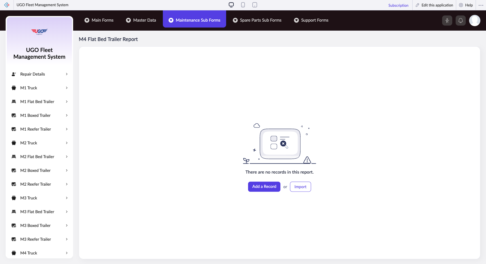

# M4 Flat Bed Trailer Report

The M4 Flat Bed Trailer Report page allows you to record and manage maintenance activities for M4 flat bed trailers in your fleet. You use this form when performing scheduled maintenance, repairs, or inspections on trailers, and it helps track what work was completed and by whom. This report is essential for compliance, maintenance scheduling, and identifying recurring issues.

**URL:** `https://creatorapp.zoho.com/m.fahmy_ugologistics/u-go-garage-maintenance#Report:M4_Flat_Bed_Trailer_Report`

## How to Use

1. Select your language preference using the lang-select dropdown at the top of the form.
2. Enter the cargo volume or trailer capacity using the volume range field if applicable to your maintenance record.
3. For each maintenance item or repair completed, check the corresponding checkbox (Radio136 through Radio141, and Radio1) to indicate that task was performed.
4. In the text field paired with each checkbox, enter the specific details—such as the part replaced, repair description, or maintenance work completed.
5. Use the associated dropdown menu to select the maintenance category or type from the predefined list.
6. Repeat the checkbox-detail-dropdown pattern for all maintenance activities you need to record.
7. Click Submit Request to save your maintenance report, or click Add a Record to log additional trailers or maintenance events.

## Page Sections

- M4 Flat Bed Trailer Report

## Form Fields

| Field | Description | Type | Required |
|-------|-------------|------|----------|
| lang-select-dropdown | Choose the language for viewing and completing the form. Select once at the start. | dropdown | No |
| volume | Specify the cargo volume or load capacity of the trailer if relevant to the maintenance being logged. | range | No |
| checkbox-Radio136-ZC_FUF232 |  | checkbox | No |
| s2id_autogen4 |  | text | No |
| s2id_autogen4_search |  | text | No |
| zc_searchSelect |  | dropdown | No |
| checkbox-Radio137-ZC_FUF232 |  | checkbox | No |
| s2id_autogen6 |  | text | No |
| s2id_autogen6_search |  | text | No |
| zc_searchSelect |  | dropdown | No |
| checkbox-Radio138-ZC_FUF232 |  | checkbox | No |
| s2id_autogen8 |  | text | No |
| s2id_autogen8_search |  | text | No |
| zc_searchSelect |  | dropdown | No |
| checkbox-Radio139-ZC_FUF232 |  | checkbox | No |
| s2id_autogen10 |  | text | No |
| s2id_autogen10_search |  | text | No |
| zc_searchSelect |  | dropdown | No |
| checkbox-Radio140-ZC_FUF232 |  | checkbox | No |
| s2id_autogen12 |  | text | No |
| s2id_autogen12_search |  | text | No |
| zc_searchSelect |  | dropdown | No |
| checkbox-Radio141-ZC_FUF232 |  | checkbox | No |
| s2id_autogen14 |  | text | No |
| s2id_autogen14_search |  | text | No |
| zc_searchSelect |  | dropdown | No |
| checkbox-Radio1-ZC_FUF232 |  | checkbox | No |
| s2id_autogen16 |  | text | No |
| s2id_autogen16_search |  | text | No |
| zc_searchSelect |  | dropdown | No |
| checkbox-Notes-ZC_FUF232 |  | checkbox | No |
| s2id_autogen18 |  | text | No |
| s2id_autogen18_search |  | text | No |
| zc_searchSelect |  | dropdown | No |
| checkbox-Radio142-ZC_FUF232 |  | checkbox | No |
| s2id_autogen20 |  | text | No |
| s2id_autogen20_search |  | text | No |
| zc_searchSelect |  | dropdown | No |
| checkbox-Radio143-ZC_FUF232 |  | checkbox | No |
| s2id_autogen22 |  | text | No |
| s2id_autogen22_search |  | text | No |
| zc_searchSelect |  | dropdown | No |
| checkbox-Radio144-ZC_FUF232 |  | checkbox | No |
| s2id_autogen24 |  | text | No |
| s2id_autogen24_search |  | text | No |
| zc_searchSelect |  | dropdown | No |
| checkbox-Radio145-ZC_FUF232 |  | checkbox | No |
| s2id_autogen26 |  | text | No |
| s2id_autogen26_search |  | text | No |
| zc_searchSelect |  | dropdown | No |
| checkbox-Radio146-ZC_FUF232 |  | checkbox | No |
| s2id_autogen28 |  | text | No |
| s2id_autogen28_search |  | text | No |
| zc_searchSelect |  | dropdown | No |
| checkbox-Radio147-ZC_FUF232 |  | checkbox | No |
| s2id_autogen30 |  | text | No |
| s2id_autogen30_search |  | text | No |
| zc_searchSelect |  | dropdown | No |
| checkbox-Radio148-ZC_FUF232 |  | checkbox | No |
| s2id_autogen32 |  | text | No |
| s2id_autogen32_search |  | text | No |
| zc_searchSelect |  | dropdown | No |
| checkbox-Notes1-ZC_FUF232 |  | checkbox | No |
| s2id_autogen34 |  | text | No |
| s2id_autogen34_search |  | text | No |
| zc_searchSelect |  | dropdown | No |
| checkbox-Radio149-ZC_FUF232 |  | checkbox | No |
| s2id_autogen36 |  | text | No |
| s2id_autogen36_search |  | text | No |
| zc_searchSelect |  | dropdown | No |
| checkbox-Radio150-ZC_FUF232 |  | checkbox | No |
| s2id_autogen38 |  | text | No |
| s2id_autogen38_search |  | text | No |
| zc_searchSelect |  | dropdown | No |
| checkbox-Radio151-ZC_FUF232 |  | checkbox | No |
| s2id_autogen40 |  | text | No |
| s2id_autogen40_search |  | text | No |
| zc_searchSelect |  | dropdown | No |
| checkbox-Radio152-ZC_FUF232 |  | checkbox | No |
| s2id_autogen42 |  | text | No |
| s2id_autogen42_search |  | text | No |
| zc_searchSelect |  | dropdown | No |
| checkbox-Notes2-ZC_FUF232 |  | checkbox | No |
| s2id_autogen44 |  | text | No |
| s2id_autogen44_search |  | text | No |
| zc_searchSelect |  | dropdown | No |
| checkbox-Radio153-ZC_FUF232 |  | checkbox | No |
| s2id_autogen46 |  | text | No |
| s2id_autogen46_search |  | text | No |
| zc_searchSelect |  | dropdown | No |
| checkbox-Radio154-ZC_FUF232 |  | checkbox | No |
| s2id_autogen48 |  | text | No |
| s2id_autogen48_search |  | text | No |
| zc_searchSelect |  | dropdown | No |
| checkbox-Notes3-ZC_FUF232 |  | checkbox | No |
| s2id_autogen50 |  | text | No |
| s2id_autogen50_search |  | text | No |
| zc_searchSelect |  | dropdown | No |
| checkbox-Radio155-ZC_FUF232 |  | checkbox | No |
| s2id_autogen52 |  | text | No |
| s2id_autogen52_search |  | text | No |
| zc_searchSelect |  | dropdown | No |
| checkbox-Radio156-ZC_FUF232 |  | checkbox | No |
| s2id_autogen54 |  | text | No |
| s2id_autogen54_search |  | text | No |
| zc_searchSelect |  | dropdown | No |
| checkbox-Radio157-ZC_FUF232 |  | checkbox | No |
| s2id_autogen56 |  | text | No |
| s2id_autogen56_search |  | text | No |
| zc_searchSelect |  | dropdown | No |
| checkbox-Notes4-ZC_FUF232 |  | checkbox | No |
| s2id_autogen58 |  | text | No |
| s2id_autogen58_search |  | text | No |
| zc_searchSelect |  | dropdown | No |
| checkbox-Radio2-ZC_FUF232 |  | checkbox | No |
| s2id_autogen60 |  | text | No |
| s2id_autogen60_search |  | text | No |
| zc_searchSelect |  | dropdown | No |
| checkbox-Radio3-ZC_FUF232 |  | checkbox | No |
| s2id_autogen62 |  | text | No |
| s2id_autogen62_search |  | text | No |
| zc_searchSelect |  | dropdown | No |
| checkbox-Radio4-ZC_FUF232 |  | checkbox | No |
| s2id_autogen64 |  | text | No |
| s2id_autogen64_search |  | text | No |
| zc_searchSelect |  | dropdown | No |
| checkbox-Radio5-ZC_FUF232 |  | checkbox | No |
| s2id_autogen66 |  | text | No |
| s2id_autogen66_search |  | text | No |
| zc_searchSelect |  | dropdown | No |
| checkbox-Radio6-ZC_FUF232 |  | checkbox | No |
| s2id_autogen68 |  | text | No |
| s2id_autogen68_search |  | text | No |
| zc_searchSelect |  | dropdown | No |
| checkbox-Radio7-ZC_FUF232 |  | checkbox | No |
| s2id_autogen70 |  | text | No |
| s2id_autogen70_search |  | text | No |
| zc_searchSelect |  | dropdown | No |
| checkbox-Radio8-ZC_FUF232 |  | checkbox | No |
| s2id_autogen72 |  | text | No |
| s2id_autogen72_search |  | text | No |
| zc_searchSelect |  | dropdown | No |
| checkbox-Technician_Name-ZC_FUF232 |  | checkbox | No |
| s2id_autogen74 |  | text | No |
| s2id_autogen74_search |  | text | No |
| zc_searchSelect |  | dropdown | No |
| allowlocation |  | button | No |
| useIconSwitch |  | checkbox | No |
| toggleIconSwitch |  | checkbox | No |
| saveIcons |  | button | No |
| resetIcons |  | button | No |
| Search... |  | text | No |
| I have read the above conditions. |  | checkbox | No |
| reqEmailId |  | text | No |
| s2id_autogen2 |  | text | No |
| s2id_autogen2_search |  | text | No |
| supportType |  | dropdown | No |
| Please enable edit permission to help with troubleshooting |  | checkbox | No |
| reachusChatDescription |  | textarea | No |
| reachUsStartChat |  | button | No |

## Actions

- **Done**
- **Main Forms**
- **Master Data**
- **Maintenance Sub Forms**
- **Spare Parts Sub Forms**
- **Support Forms**
- **Remove Changes**
- **Add a Record**
- **Import**
- **Submit Request**

## Tips

- If you need to correct an entry, click Remove Changes to revert your recent work, then re-enter the correct information.
- Use Import to bulk-load maintenance records from a file if you have multiple trailers or historical data to add at once—this saves time over manual entry.

## Related Pages

- [M1 Truck Report](m1-truck-report.md)
- [M1 Flat Bed Trailer Report](m1-flat-bed-trailer-report.md)
- [M1 Boxed Trailer Report](m1-boxed-trailer-report.md)
- [M1 Reefer Trailer Report](m1-reefer-trailer-report.md)
- [M2 Truck Report](m2-truck-report.md)
- [M2 Flat Bed Trailer Report](m2-flat-bed-trailer-report.md)
- [M2 Boxed Trailer Report](m2-boxed-trailer-report.md)
- [M2 Reefer Trailer Report](m2-reefer-trailer-report.md)
- [M3 Truck Report](m3-truck-report.md)
- [M3 Flat Bed Trailer Report](m3-flat-bed-trailer-report.md)
- [M3 Boxed Trailer Report](m3-boxed-trailer-report.md)
- [M3 Reefer Trailer Report](m3-reefer-trailer-report.md)
- [M4 Truck Report](m4-truck-report.md)
- [M4 Boxed Trailer Report](m4-boxed-trailer-report.md)
- [M4 Reefer Trailer Report](m4-reefer-trailer-report.md)

## Common Workflows

_Add step-by-step workflows specific to your organisation here._
