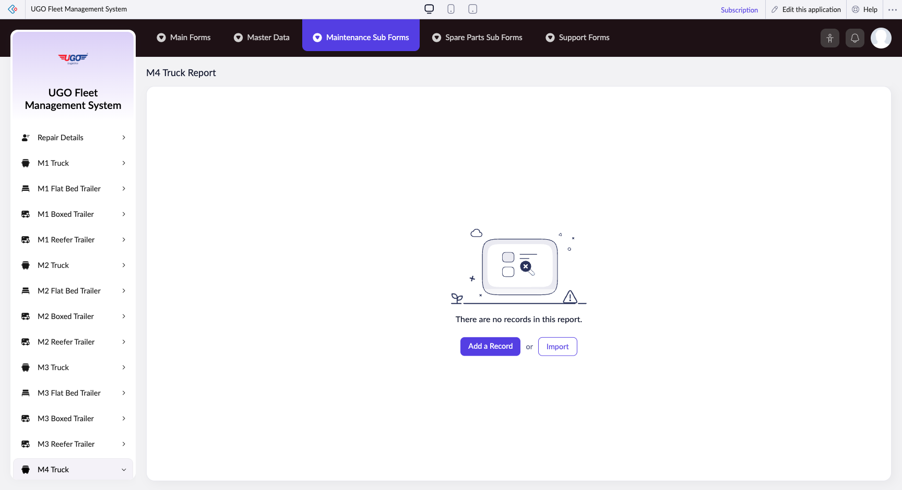

# M4 Truck Report

The M4 Truck Report page lets you document and track maintenance activities, inspections, and service records for M4 trucks in your fleet. Operations staff use this page to record what maintenance was performed, which parts were used, and the current condition of each truck. Complete this form during or immediately after maintenance work to keep your fleet records accurate and up to date.

**URL:** `https://creatorapp.zoho.com/m.fahmy_ugologistics/u-go-garage-maintenance#Report:M4_Truck_Report`

## How to Use

1. Select your preferred language from the dropdown at the top if needed.
2. Use the Volume field to enter the quantity or capacity measurement relevant to your maintenance record.
3. For each maintenance item or inspection area, check the corresponding checkbox to mark it as applicable, then use the associated text field to enter details about what was done or observed.
4. Use the dropdown menus (zc_searchSelect) to select specific parts, components, or maintenance categories from your system's standard lists.
5. Fill in the Notes section if you need to record additional observations, problems found, or follow-up actions required.
6. Click 'Add a Record' if you need to log multiple maintenance items for the same truck in one session.
7. Click 'Submit Request' when all information is entered and verified to save the report to your fleet maintenance database.

## Page Sections

- M4 Truck Report

## Form Fields

| Field | Description | Type | Required |
|-------|-------------|------|----------|
| lang-select-dropdown | Choose your working language for the form display and any generated reports. | dropdown | No |
| volume | Enter the measurement quantity (such as fuel capacity checked, fluid volume added, or service hours logged) relevant to the maintenance work performed. | range | No |
| checkbox-Radio74-ZC_ES36IV |  | checkbox | No |
| s2id_autogen4 |  | text | No |
| s2id_autogen4_search |  | text | No |
| zc_searchSelect |  | dropdown | No |
| checkbox-Radio75-ZC_ES36IV |  | checkbox | No |
| s2id_autogen6 |  | text | No |
| s2id_autogen6_search |  | text | No |
| zc_searchSelect |  | dropdown | No |
| checkbox-Radio76-ZC_ES36IV |  | checkbox | No |
| s2id_autogen8 |  | text | No |
| s2id_autogen8_search |  | text | No |
| zc_searchSelect |  | dropdown | No |
| checkbox-Radio77-ZC_ES36IV |  | checkbox | No |
| s2id_autogen10 |  | text | No |
| s2id_autogen10_search |  | text | No |
| zc_searchSelect |  | dropdown | No |
| checkbox-Radio78-ZC_ES36IV |  | checkbox | No |
| s2id_autogen12 |  | text | No |
| s2id_autogen12_search |  | text | No |
| zc_searchSelect |  | dropdown | No |
| checkbox-Notes17-ZC_ES36IV |  | checkbox | No |
| s2id_autogen14 |  | text | No |
| s2id_autogen14_search |  | text | No |
| zc_searchSelect |  | dropdown | No |
| checkbox-Radio79-ZC_ES36IV |  | checkbox | No |
| s2id_autogen16 |  | text | No |
| s2id_autogen16_search |  | text | No |
| zc_searchSelect |  | dropdown | No |
| checkbox-Radio80-ZC_ES36IV |  | checkbox | No |
| s2id_autogen18 |  | text | No |
| s2id_autogen18_search |  | text | No |
| zc_searchSelect |  | dropdown | No |
| checkbox-Radio81-ZC_ES36IV |  | checkbox | No |
| s2id_autogen20 |  | text | No |
| s2id_autogen20_search |  | text | No |
| zc_searchSelect |  | dropdown | No |
| checkbox-Radio82-ZC_ES36IV |  | checkbox | No |
| s2id_autogen22 |  | text | No |
| s2id_autogen22_search |  | text | No |
| zc_searchSelect |  | dropdown | No |
| checkbox-Radio83-ZC_ES36IV |  | checkbox | No |
| s2id_autogen24 |  | text | No |
| s2id_autogen24_search |  | text | No |
| zc_searchSelect |  | dropdown | No |
| checkbox-Radio84-ZC_ES36IV |  | checkbox | No |
| s2id_autogen26 |  | text | No |
| s2id_autogen26_search |  | text | No |
| zc_searchSelect |  | dropdown | No |
| checkbox-Radio85-ZC_ES36IV |  | checkbox | No |
| s2id_autogen28 |  | text | No |
| s2id_autogen28_search |  | text | No |
| zc_searchSelect |  | dropdown | No |
| checkbox-Radio86-ZC_ES36IV |  | checkbox | No |
| s2id_autogen30 |  | text | No |
| s2id_autogen30_search |  | text | No |
| zc_searchSelect |  | dropdown | No |
| checkbox-Notes18-ZC_ES36IV |  | checkbox | No |
| s2id_autogen32 |  | text | No |
| s2id_autogen32_search |  | text | No |
| zc_searchSelect |  | dropdown | No |
| checkbox-Radio87-ZC_ES36IV |  | checkbox | No |
| s2id_autogen34 |  | text | No |
| s2id_autogen34_search |  | text | No |
| zc_searchSelect |  | dropdown | No |
| checkbox-Radio88-ZC_ES36IV |  | checkbox | No |
| s2id_autogen36 |  | text | No |
| s2id_autogen36_search |  | text | No |
| zc_searchSelect |  | dropdown | No |
| checkbox-Radio89-ZC_ES36IV |  | checkbox | No |
| s2id_autogen38 |  | text | No |
| s2id_autogen38_search |  | text | No |
| zc_searchSelect |  | dropdown | No |
| checkbox-Radio90-ZC_ES36IV |  | checkbox | No |
| s2id_autogen40 |  | text | No |
| s2id_autogen40_search |  | text | No |
| zc_searchSelect |  | dropdown | No |
| checkbox-Radio91-ZC_ES36IV |  | checkbox | No |
| s2id_autogen42 |  | text | No |
| s2id_autogen42_search |  | text | No |
| zc_searchSelect |  | dropdown | No |
| checkbox-Radio92-ZC_ES36IV |  | checkbox | No |
| s2id_autogen44 |  | text | No |
| s2id_autogen44_search |  | text | No |
| zc_searchSelect |  | dropdown | No |
| checkbox-Radio1-ZC_ES36IV |  | checkbox | No |
| s2id_autogen46 |  | text | No |
| s2id_autogen46_search |  | text | No |
| zc_searchSelect |  | dropdown | No |
| checkbox-Notes19-ZC_ES36IV |  | checkbox | No |
| s2id_autogen48 |  | text | No |
| s2id_autogen48_search |  | text | No |
| zc_searchSelect |  | dropdown | No |
| checkbox-Radio93-ZC_ES36IV |  | checkbox | No |
| s2id_autogen50 |  | text | No |
| s2id_autogen50_search |  | text | No |
| zc_searchSelect |  | dropdown | No |
| checkbox-Radio94-ZC_ES36IV |  | checkbox | No |
| s2id_autogen52 |  | text | No |
| s2id_autogen52_search |  | text | No |
| zc_searchSelect |  | dropdown | No |
| checkbox-Radio95-ZC_ES36IV |  | checkbox | No |
| s2id_autogen54 |  | text | No |
| s2id_autogen54_search |  | text | No |
| zc_searchSelect |  | dropdown | No |
| checkbox-Notes20-ZC_ES36IV |  | checkbox | No |
| s2id_autogen56 |  | text | No |
| s2id_autogen56_search |  | text | No |
| zc_searchSelect |  | dropdown | No |
| checkbox-Radio96-ZC_ES36IV |  | checkbox | No |
| s2id_autogen58 |  | text | No |
| s2id_autogen58_search |  | text | No |
| zc_searchSelect |  | dropdown | No |
| checkbox-Radio97-ZC_ES36IV |  | checkbox | No |
| s2id_autogen60 |  | text | No |
| s2id_autogen60_search |  | text | No |
| zc_searchSelect |  | dropdown | No |
| checkbox-Radio98-ZC_ES36IV |  | checkbox | No |
| s2id_autogen62 |  | text | No |
| s2id_autogen62_search |  | text | No |
| zc_searchSelect |  | dropdown | No |
| checkbox-Radio2-ZC_ES36IV |  | checkbox | No |
| s2id_autogen64 |  | text | No |
| s2id_autogen64_search |  | text | No |
| zc_searchSelect |  | dropdown | No |
| checkbox-Radio3-ZC_ES36IV |  | checkbox | No |
| s2id_autogen66 |  | text | No |
| s2id_autogen66_search |  | text | No |
| zc_searchSelect |  | dropdown | No |
| checkbox-Notes21-ZC_ES36IV |  | checkbox | No |
| s2id_autogen68 |  | text | No |
| s2id_autogen68_search |  | text | No |
| zc_searchSelect |  | dropdown | No |
| checkbox-Radio99-ZC_ES36IV |  | checkbox | No |
| s2id_autogen70 |  | text | No |
| s2id_autogen70_search |  | text | No |
| zc_searchSelect |  | dropdown | No |
| checkbox-Radio4-ZC_ES36IV |  | checkbox | No |
| s2id_autogen72 |  | text | No |
| s2id_autogen72_search |  | text | No |
| zc_searchSelect |  | dropdown | No |
| checkbox-Radio5-ZC_ES36IV |  | checkbox | No |
| s2id_autogen74 |  | text | No |
| s2id_autogen74_search |  | text | No |
| zc_searchSelect |  | dropdown | No |
| checkbox-Radio6-ZC_ES36IV |  | checkbox | No |
| s2id_autogen76 |  | text | No |
| s2id_autogen76_search |  | text | No |
| zc_searchSelect |  | dropdown | No |
| checkbox-Notes22-ZC_ES36IV |  | checkbox | No |
| s2id_autogen78 |  | text | No |
| s2id_autogen78_search |  | text | No |
| zc_searchSelect |  | dropdown | No |
| checkbox-Radio100-ZC_ES36IV |  | checkbox | No |
| s2id_autogen80 |  | text | No |
| s2id_autogen80_search |  | text | No |
| zc_searchSelect |  | dropdown | No |
| checkbox-Radio101-ZC_ES36IV |  | checkbox | No |
| s2id_autogen82 |  | text | No |
| s2id_autogen82_search |  | text | No |
| zc_searchSelect |  | dropdown | No |
| checkbox-Radio102-ZC_ES36IV |  | checkbox | No |
| s2id_autogen84 |  | text | No |
| s2id_autogen84_search |  | text | No |
| zc_searchSelect |  | dropdown | No |
| checkbox-Radio103-ZC_ES36IV |  | checkbox | No |
| s2id_autogen86 |  | text | No |
| s2id_autogen86_search |  | text | No |
| zc_searchSelect |  | dropdown | No |
| checkbox-Radio104-ZC_ES36IV |  | checkbox | No |
| s2id_autogen88 |  | text | No |
| s2id_autogen88_search |  | text | No |
| zc_searchSelect |  | dropdown | No |
| checkbox-Notes23-ZC_ES36IV |  | checkbox | No |
| s2id_autogen90 |  | text | No |
| s2id_autogen90_search |  | text | No |
| zc_searchSelect |  | dropdown | No |
| checkbox-Radio105-ZC_ES36IV |  | checkbox | No |
| s2id_autogen92 |  | text | No |
| s2id_autogen92_search |  | text | No |
| zc_searchSelect |  | dropdown | No |
| checkbox-Radio106-ZC_ES36IV |  | checkbox | No |
| s2id_autogen94 |  | text | No |
| s2id_autogen94_search |  | text | No |
| zc_searchSelect |  | dropdown | No |
| checkbox-Radio107-ZC_ES36IV |  | checkbox | No |
| s2id_autogen96 |  | text | No |
| s2id_autogen96_search |  | text | No |
| zc_searchSelect |  | dropdown | No |
| checkbox-Radio108-ZC_ES36IV |  | checkbox | No |
| s2id_autogen98 |  | text | No |
| s2id_autogen98_search |  | text | No |
| zc_searchSelect |  | dropdown | No |
| checkbox-Radio109-ZC_ES36IV |  | checkbox | No |
| s2id_autogen100 |  | text | No |
| s2id_autogen100_search |  | text | No |
| zc_searchSelect |  | dropdown | No |
| checkbox-Radio110-ZC_ES36IV |  | checkbox | No |
| s2id_autogen102 |  | text | No |
| s2id_autogen102_search |  | text | No |
| zc_searchSelect |  | dropdown | No |
| checkbox-Radio111-ZC_ES36IV |  | checkbox | No |
| s2id_autogen104 |  | text | No |
| s2id_autogen104_search |  | text | No |
| zc_searchSelect |  | dropdown | No |
| checkbox-Radio112-ZC_ES36IV |  | checkbox | No |
| s2id_autogen106 |  | text | No |
| s2id_autogen106_search |  | text | No |
| zc_searchSelect |  | dropdown | No |
| checkbox-Radio113-ZC_ES36IV |  | checkbox | No |
| s2id_autogen108 |  | text | No |
| s2id_autogen108_search |  | text | No |
| zc_searchSelect |  | dropdown | No |
| checkbox-Radio7-ZC_ES36IV |  | checkbox | No |
| s2id_autogen110 |  | text | No |
| s2id_autogen110_search |  | text | No |
| zc_searchSelect |  | dropdown | No |
| checkbox-Radio8-ZC_ES36IV |  | checkbox | No |
| s2id_autogen112 |  | text | No |
| s2id_autogen112_search |  | text | No |
| zc_searchSelect |  | dropdown | No |
| checkbox-Radio9-ZC_ES36IV |  | checkbox | No |
| s2id_autogen114 |  | text | No |
| s2id_autogen114_search |  | text | No |
| zc_searchSelect |  | dropdown | No |
| checkbox-Notes24-ZC_ES36IV |  | checkbox | No |
| s2id_autogen116 |  | text | No |
| s2id_autogen116_search |  | text | No |
| zc_searchSelect |  | dropdown | No |
| checkbox-Radio114-ZC_ES36IV |  | checkbox | No |
| s2id_autogen118 |  | text | No |
| s2id_autogen118_search |  | text | No |
| zc_searchSelect |  | dropdown | No |
| checkbox-Radio115-ZC_ES36IV |  | checkbox | No |
| s2id_autogen120 |  | text | No |
| s2id_autogen120_search |  | text | No |
| zc_searchSelect |  | dropdown | No |
| checkbox-Radio116-ZC_ES36IV |  | checkbox | No |
| s2id_autogen122 |  | text | No |
| s2id_autogen122_search |  | text | No |
| zc_searchSelect |  | dropdown | No |
| checkbox-Radio117-ZC_ES36IV |  | checkbox | No |
| s2id_autogen124 |  | text | No |
| s2id_autogen124_search |  | text | No |
| zc_searchSelect |  | dropdown | No |
| checkbox-Radio118-ZC_ES36IV |  | checkbox | No |
| s2id_autogen126 |  | text | No |
| s2id_autogen126_search |  | text | No |
| zc_searchSelect |  | dropdown | No |
| checkbox-Radio119-ZC_ES36IV |  | checkbox | No |
| s2id_autogen128 |  | text | No |
| s2id_autogen128_search |  | text | No |
| zc_searchSelect |  | dropdown | No |
| checkbox-Radio120-ZC_ES36IV |  | checkbox | No |
| s2id_autogen130 |  | text | No |
| s2id_autogen130_search |  | text | No |
| zc_searchSelect |  | dropdown | No |
| checkbox-Radio121-ZC_ES36IV |  | checkbox | No |
| s2id_autogen132 |  | text | No |
| s2id_autogen132_search |  | text | No |
| zc_searchSelect |  | dropdown | No |
| checkbox-Radio122-ZC_ES36IV |  | checkbox | No |
| s2id_autogen134 |  | text | No |
| s2id_autogen134_search |  | text | No |
| zc_searchSelect |  | dropdown | No |
| checkbox-Notes25-ZC_ES36IV |  | checkbox | No |
| s2id_autogen136 |  | text | No |
| s2id_autogen136_search |  | text | No |
| zc_searchSelect |  | dropdown | No |
| checkbox-Radio123-ZC_ES36IV |  | checkbox | No |
| s2id_autogen138 |  | text | No |
| s2id_autogen138_search |  | text | No |
| zc_searchSelect |  | dropdown | No |
| checkbox-Radio124-ZC_ES36IV |  | checkbox | No |
| s2id_autogen140 |  | text | No |
| s2id_autogen140_search |  | text | No |
| zc_searchSelect |  | dropdown | No |
| checkbox-Radio125-ZC_ES36IV |  | checkbox | No |
| s2id_autogen142 |  | text | No |
| s2id_autogen142_search |  | text | No |
| zc_searchSelect |  | dropdown | No |
| checkbox-Radio126-ZC_ES36IV |  | checkbox | No |
| s2id_autogen144 |  | text | No |
| s2id_autogen144_search |  | text | No |
| zc_searchSelect |  | dropdown | No |
| checkbox-Radio127-ZC_ES36IV |  | checkbox | No |
| s2id_autogen146 |  | text | No |
| s2id_autogen146_search |  | text | No |
| zc_searchSelect |  | dropdown | No |
| checkbox-Radio128-ZC_ES36IV |  | checkbox | No |
| s2id_autogen148 |  | text | No |
| s2id_autogen148_search |  | text | No |
| zc_searchSelect |  | dropdown | No |
| checkbox-Radio129-ZC_ES36IV |  | checkbox | No |
| s2id_autogen150 |  | text | No |
| s2id_autogen150_search |  | text | No |
| zc_searchSelect |  | dropdown | No |
| checkbox-Radio130-ZC_ES36IV |  | checkbox | No |
| s2id_autogen152 |  | text | No |
| s2id_autogen152_search |  | text | No |
| zc_searchSelect |  | dropdown | No |
| checkbox-Radio131-ZC_ES36IV |  | checkbox | No |
| s2id_autogen154 |  | text | No |
| s2id_autogen154_search |  | text | No |
| zc_searchSelect |  | dropdown | No |
| checkbox-Radio132-ZC_ES36IV |  | checkbox | No |
| s2id_autogen156 |  | text | No |
| s2id_autogen156_search |  | text | No |
| zc_searchSelect |  | dropdown | No |
| checkbox-Radio133-ZC_ES36IV |  | checkbox | No |
| s2id_autogen158 |  | text | No |
| s2id_autogen158_search |  | text | No |
| zc_searchSelect |  | dropdown | No |
| checkbox-Radio134-ZC_ES36IV |  | checkbox | No |
| s2id_autogen160 |  | text | No |
| s2id_autogen160_search |  | text | No |
| zc_searchSelect |  | dropdown | No |
| checkbox-Radio135-ZC_ES36IV |  | checkbox | No |
| s2id_autogen162 |  | text | No |
| s2id_autogen162_search |  | text | No |
| zc_searchSelect |  | dropdown | No |
| checkbox-Radio10-ZC_ES36IV |  | checkbox | No |
| s2id_autogen164 |  | text | No |
| s2id_autogen164_search |  | text | No |
| zc_searchSelect |  | dropdown | No |
| checkbox-Radio11-ZC_ES36IV |  | checkbox | No |
| s2id_autogen166 |  | text | No |
| s2id_autogen166_search |  | text | No |
| zc_searchSelect |  | dropdown | No |
| checkbox-Radio12-ZC_ES36IV |  | checkbox | No |
| s2id_autogen168 |  | text | No |
| s2id_autogen168_search |  | text | No |
| zc_searchSelect |  | dropdown | No |
| checkbox-Notes26-ZC_ES36IV |  | checkbox | No |
| s2id_autogen170 |  | text | No |
| s2id_autogen170_search |  | text | No |
| zc_searchSelect |  | dropdown | No |
| checkbox-Radio13-ZC_ES36IV |  | checkbox | No |
| s2id_autogen172 |  | text | No |
| s2id_autogen172_search |  | text | No |
| zc_searchSelect |  | dropdown | No |
| checkbox-Radio14-ZC_ES36IV |  | checkbox | No |
| s2id_autogen174 |  | text | No |
| s2id_autogen174_search |  | text | No |
| zc_searchSelect |  | dropdown | No |
| checkbox-Radio15-ZC_ES36IV |  | checkbox | No |
| s2id_autogen176 |  | text | No |
| s2id_autogen176_search |  | text | No |
| zc_searchSelect |  | dropdown | No |
| checkbox-Radio16-ZC_ES36IV |  | checkbox | No |
| s2id_autogen178 |  | text | No |
| s2id_autogen178_search |  | text | No |
| zc_searchSelect |  | dropdown | No |
| checkbox-Radio17-ZC_ES36IV |  | checkbox | No |
| s2id_autogen180 |  | text | No |
| s2id_autogen180_search |  | text | No |
| zc_searchSelect |  | dropdown | No |
| checkbox-Radio18-ZC_ES36IV |  | checkbox | No |
| s2id_autogen182 |  | text | No |
| s2id_autogen182_search |  | text | No |
| zc_searchSelect |  | dropdown | No |
| checkbox-Radio19-ZC_ES36IV |  | checkbox | No |
| s2id_autogen184 |  | text | No |
| s2id_autogen184_search |  | text | No |
| zc_searchSelect |  | dropdown | No |
| checkbox-Radio20-ZC_ES36IV |  | checkbox | No |
| s2id_autogen186 |  | text | No |
| s2id_autogen186_search |  | text | No |
| zc_searchSelect |  | dropdown | No |
| checkbox-Technician_Name-ZC_ES36IV |  | checkbox | No |
| s2id_autogen188 |  | text | No |
| s2id_autogen188_search |  | text | No |
| zc_searchSelect |  | dropdown | No |
| allowlocation |  | button | No |
| useIconSwitch |  | checkbox | No |
| toggleIconSwitch |  | checkbox | No |
| saveIcons |  | button | No |
| resetIcons |  | button | No |
| Search... |  | text | No |
| I have read the above conditions. |  | checkbox | No |
| reqEmailId |  | text | No |
| s2id_autogen2 |  | text | No |
| s2id_autogen2_search |  | text | No |
| supportType |  | dropdown | No |
| Please enable edit permission to help with troubleshooting |  | checkbox | No |
| reachusChatDescription |  | textarea | No |
| reachUsStartChat |  | button | No |
| zc-reachus-editaccess-enable-button |  | button | No |
| zc-reachus-editaccess-revoke-button |  | button | No |
| zc-reachus-screenrecord-button |  | button | No |

## Actions

- **Done**
- **Main Forms**
- **Master Data**
- **Maintenance Sub Forms**
- **Spare Parts Sub Forms**
- **Support Forms**
- **Remove Changes**
- **Add a Record**
- **Import**
- **Submit Request**

## Tips

- Always check the checkbox before entering details in the corresponding text field—unchecked items may not save properly in the system.
- Use the predefined dropdown lists whenever possible rather than typing free text; this helps the system generate accurate fleet maintenance reports and identify trends across your M4 truck fleet.

## Related Pages

- [M1 Truck Report](m1-truck-report.md)
- [M1 Flat Bed Trailer Report](m1-flat-bed-trailer-report.md)
- [M1 Boxed Trailer Report](m1-boxed-trailer-report.md)
- [M1 Reefer Trailer Report](m1-reefer-trailer-report.md)
- [M2 Truck Report](m2-truck-report.md)
- [M2 Flat Bed Trailer Report](m2-flat-bed-trailer-report.md)
- [M2 Boxed Trailer Report](m2-boxed-trailer-report.md)
- [M2 Reefer Trailer Report](m2-reefer-trailer-report.md)
- [M3 Truck Report](m3-truck-report.md)
- [M3 Flat Bed Trailer Report](m3-flat-bed-trailer-report.md)
- [M3 Boxed Trailer Report](m3-boxed-trailer-report.md)
- [M3 Reefer Trailer Report](m3-reefer-trailer-report.md)
- [M4 Flat Bed Trailer Report](m4-flat-bed-trailer-report.md)
- [M4 Boxed Trailer Report](m4-boxed-trailer-report.md)
- [M4 Reefer Trailer Report](m4-reefer-trailer-report.md)

## Common Workflows

_Add step-by-step workflows specific to your organisation here._
