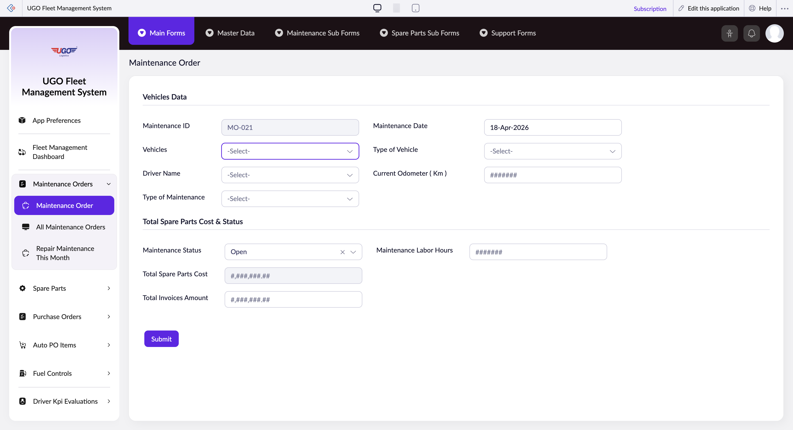

# Maintenance Order

**URL:** `https://creatorapp.zoho.com/m.fahmy_ugologistics/u-go-garage-maintenance#Form:Maintenance_Order`

## Page Sections

- Vehicles Data
- Total Spare Parts Cost & Status

## Form Fields

| Field | Type | Required |
|-------|------|----------|
| lang-select-dropdown | dropdown | No |
| Maintenance ID | text | No |
| zc-sel2-foc-Vehicles | text | No |
| zc-sel2-inp-Vehicles | text | No |
| Vehicles | text | No |
| zc-sel2-foc-Driver_Name | text | No |
| zc-sel2-inp-Driver_Name | text | No |
| Driver_Name | text | No |
| zc-sel2-foc-Type_of_Maintenance | text | No |
| zc-sel2-inp-Type_of_Maintenance | text | No |
| Type_of_Maintenance | text | No |
| Maintenance_Date | text | No |
| zc-sel2-foc-Type_of_Vehicle | text | No |
| zc-sel2-inp-Type_of_Vehicle | text | No |
| Type_of_Vehicle | text | No |
| Current Odometer ( Km ) | text | No |
| zc-sel2-foc-Type_of_Scheduled_Maintenance | text | No |
| zc-sel2-inp-Type_of_Scheduled_Maintenance | text | No |
| Type_of_Scheduled_Maintenance | text | No |
| SF(Request_Spare_Parts).FD(t::row_0_0).SV(record::status) | hidden | No |
| SF(Request_Spare_Parts).FD(t::row_0_0).SV(ID) | hidden | No |
| Request_Spare_Parts.t::row_0.Vehicle_Model | text | No |
| Request_Spare_Parts.t::row_0.Spare_Part_Needed | text | No |
| ####### | text | No |
| Request_Spare_Parts.t::row_0.Stock_Quantity | text | No |
| Request_Spare_Parts.t::row_0.Stock_Status | text | No |
| #######.## | text | No |
| ####### | text | No |
| Request_Spare_Parts.t::row_0.Notes | text | No |
| ####### | text | No |
| ####### | text | No |
| ####### | text | No |
| ####### | text | No |
| ####### | text | No |
| ####### | text | No |
| ####### | text | No |
| ####### | text | No |
| Request_Spare_Parts.t::row_0.Old_Spare_Part_Needed | text | No |
| #######.## | text | No |
| Request_Spare_Parts.t::row_0.Batch_1_Stock_ID | text | No |
| Request_Spare_Parts.t::row_0.Batch_2_Stock_ID | text | No |
| Request_Spare_Parts.t::row_0.Batch_3_Stock_ID | text | No |
| Request_Spare_Parts.t::row_0.Stock_Consumed | text | No |
| zc-sel2-foc-Maintenance_Status | text | No |
| zc-sel2-inp-Maintenance_Status | text | No |
| Maintenance_Status | text | No |
| Total Spare Parts Cost | text | No |
| Total Invoices Amount | text | No |
| Maintenance_End_Date | text | No |
| Maintenance Labor Hours | text | No |
| submit | submit | No |
| searchmap | text | No |
| useIconSwitch | checkbox | No |
| toggleIconSwitch | checkbox | No |
| saveIcons | button | No |
| resetIcons | button | No |
| Search... | text | No |
| I have read the above conditions. | checkbox | No |
| reqEmailId | text | No |
| s2id_autogen2 | text | No |
| s2id_autogen2_search | text | No |
| supportType | dropdown | No |
| Please enable edit permission to help with troubleshooting | checkbox | No |
| reachusChatDescription | textarea | No |
| reachUsStartChat | button | No |
| zc-reachus-editaccess-enable-button | button | No |
| zc-reachus-editaccess-revoke-button | button | No |
| zc-reachus-screenrecord-button | button | No |

## Actions

- **Done**
- **Main Forms**
- **Master Data**
- **Maintenance Sub Forms**
- **Spare Parts Sub Forms**
- **Support Forms**
- **Expand**
- **Add New**
- **Submit**
- **Submit Request**

## Common Workflows

_Document step-by-step workflows for this page here._
