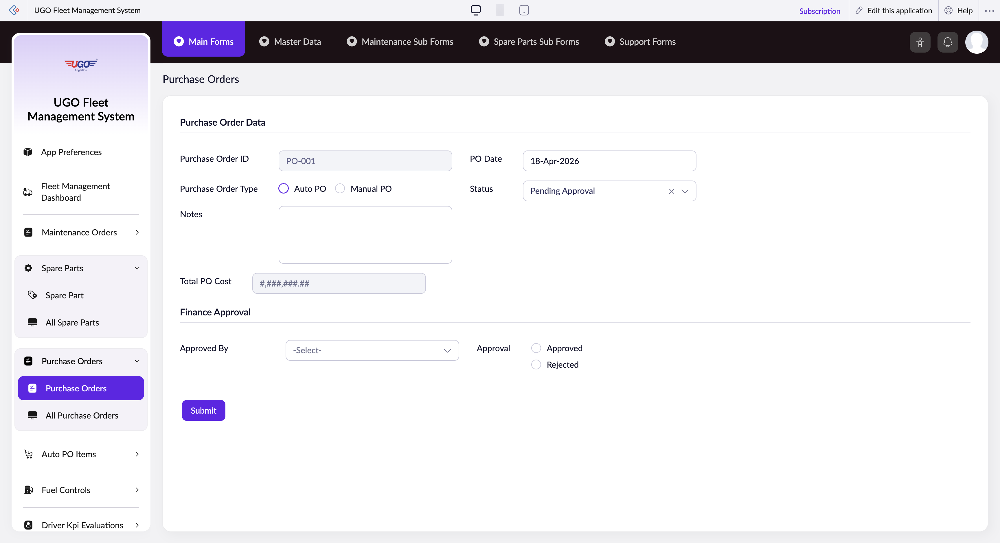

# Purchase Orders

The Purchase Orders page allows you to create and manage purchase orders for vehicle maintenance parts and services. Procurement staff use this form to request spare parts from suppliers, either by linking to existing maintenance orders or by manually entering items. This is where you initiate all purchasing activities in the garage maintenance system.

**URL:** `https://creatorapp.zoho.com/m.fahmy_ugologistics/u-go-garage-maintenance#Form:Purchase_Orders`

## How to Use

1. Enter or locate the Purchase Order ID if one already exists, or leave blank to generate a new one
2. Set the Purchase Order Type using the radio buttons to specify if this is a standard order or a special request
3. Add purchase items by clicking Add New in either the automatic items section (linked to maintenance orders) or the manual items section (for direct purchases)
4. For each item, enter the spare part name, supplier name, and brand name
5. Review the Total PO Cost to confirm all items and quantities are correct
6. Select an Approved_By person from the dropdown to assign approval responsibility
7. Click Submit to send the purchase order for processing

## Page Sections

- Purchase Order Data
- Finance Approval

## Form Fields

| Field | Description | Type | Required |
|-------|-------------|------|----------|
| lang-select-dropdown | Choose your preferred language for the interface display | dropdown | No |
| Purchase Order ID |  | text | No |
| Purchase_Order_Type |  | radio | No |
| Purchase_Order_Type |  | radio | No |
| Notes | Add any special instructions, delivery requirements, or details about this order that the supplier should know | textarea | No |
| PO_Date | The date this purchase order is created; this date is used for record-keeping and supplier communication | text | No |
| zc-sel2-foc-Status |  | text | No |
| zc-sel2-inp-Status |  | text | No |
| Status | Displays the current stage of the purchase order (Draft, Submitted, Approved, Ordered, Received, etc.) | text | No |
| SF(Purchase_Order_Items).FD(t::row_0_0).SV(record::status) |  | hidden | No |
| SF(Purchase_Order_Items).FD(t::row_0_0).SV(ID) |  | hidden | No |
| Purchase_Order_Items.t::row_0.Auto_PO_Items_ID |  | text | No |
| Purchase_Order_Items.t::row_0.Maintenance_Order_Source |  | text | No |
| Purchase_Order_Items.t::row_0.Spare_Part |  | text | No |
| ####### |  | text | No |
| Purchase_Order_Items.t::row_0.Supplier_Name |  | text | No |
| Purchase_Order_Items.t::row_0.Brand_Name |  | text | No |
| ####### |  | text | No |
| ####### |  | text | No |
| SF(Manual_Purchase_Order_Items).FD(t::row_0_0).SV(record::status) |  | hidden | No |
| SF(Manual_Purchase_Order_Items).FD(t::row_0_0).SV(ID) |  | hidden | No |
| Manual_Purchase_Order_Items.t::row_0.Spare_Part |  | text | No |
| ####### |  | text | No |
| Manual_Purchase_Order_Items.t::row_0.Supplier_Name |  | text | No |
| Manual_Purchase_Order_Items.t::row_0.Brand_Name |  | text | No |
| ####### |  | text | No |
| ####### |  | text | No |
| Total PO Cost | The combined cost of all items in this purchase order; system calculates this automatically | text | No |
| zc-sel2-foc-Approved_By |  | text | No |
| zc-sel2-inp-Approved_By |  | text | No |
| Approved_By | Select the person responsible for approving this purchase order before it goes to the supplier | text | No |
| Finance_Approval_Date |  | text | No |
| Approval |  | radio | No |
| Approval |  | radio | No |
| submit |  | submit | No |
| searchmap |  | text | No |
| useIconSwitch |  | checkbox | No |
| toggleIconSwitch |  | checkbox | No |
| saveIcons |  | button | No |
| resetIcons |  | button | No |
| Search... |  | text | No |
| I have read the above conditions. |  | checkbox | No |
| reqEmailId |  | text | No |
| s2id_autogen2 |  | text | No |
| s2id_autogen2_search |  | text | No |
| supportType |  | dropdown | No |
| Please enable edit permission to help with troubleshooting |  | checkbox | No |
| reachusChatDescription |  | textarea | No |
| reachUsStartChat |  | button | No |
| zc-reachus-editaccess-enable-button |  | button | No |
| zc-reachus-editaccess-revoke-button |  | button | No |
| zc-reachus-screenrecord-button |  | button | No |

## Actions

- **Done**
- **Main Forms**
- **Master Data**
- **Maintenance Sub Forms**
- **Spare Parts Sub Forms**
- **Support Forms**
- **Expand**
- **Add New**
- **Submit**
- **Submit Request**

## Tips

- Always verify supplier and brand names match your approved vendor list to avoid delivery delays and cost overruns
- Use the automatic items section when possible to link purchases to specific maintenance jobs; this keeps your records organized and trackable
- Check the Total PO Cost before submitting—if it exceeds your authorization limit, assign it to the appropriate approval person or manager

## Related Pages

- [All Purchase Orders](all-purchase-orders.md)
- [Auto PO Items](auto-po-items.md)
- [All Auto PO Items](all-auto-po-items.md)

## Common Workflows

_Add step-by-step workflows specific to your organisation here._
