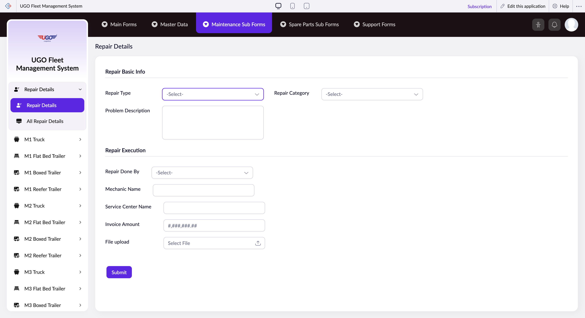

# Repair Details

**URL:** `https://creatorapp.zoho.com/m.fahmy_ugologistics/u-go-garage-maintenance#Form:Repair_Details`

## Page Sections

- Upgrade to Creator 5
- Update your subscription plan
- UGO Fleet Management System
- Repair Basic Info
- Repair Execution
- In-house Garage
- External Service Center
- Introducing the New zoho Creator ui
- Introducing the New zoho Creator ui
- Introducing the New zoho Creator ui
- Introducing the New zoho Creator ui

## Form Fields

| Field | Type | Required |
|-------|------|----------|
| lang-select-dropdown | dropdown | No |
| zc-sel2-foc-Repair_Type | text | No |
| zc-sel2-inp-Repair_Type | text | No |
| Repair_Type | text | No |
| Problem Description | textarea | No |
| zc-sel2-foc-Repair_Category | text | No |
| zc-sel2-inp-Repair_Category | text | No |
| Repair_Category | text | No |
| zc-sel2-foc-Repair_Done_By | text | No |
| zc-sel2-inp-Repair_Done_By | text | No |
| Repair_Done_By | text | No |
| Mechanic Name | text | No |
| Service Center Name | text | No |
| Invoice Amount | text | No |
| File_upload | hidden | No |
| uploadFile | file | No |
| submit | submit | No |
| searchmap | text | No |
| useIconSwitch | checkbox | No |
| toggleIconSwitch | checkbox | No |
| saveIcons | button | No |
| resetIcons | button | No |
| Search... | text | No |
| I have read the above conditions. | checkbox | No |
| reqEmailId | text | No |
| s2id_autogen2 | text | No |
| s2id_autogen2_search | text | No |
| supportType | dropdown | No |
| Please enable edit permission to help with troubleshooting | checkbox | No |
| reachusChatDescription | textarea | No |
| reachUsStartChat | button | No |
| zc-reachus-editaccess-enable-button | button | No |
| zc-reachus-editaccess-revoke-button | button | No |
| zc-reachus-screenrecord-button | button | No |

## Actions

- **Done**
- **Main Forms**
- **Master Data**
- **Maintenance Sub Forms**
- **Spare Parts Sub Forms**
- **Support Forms**
- **Submit**
- **Submit Request**

## Common Workflows

_Document step-by-step workflows for this page here._
