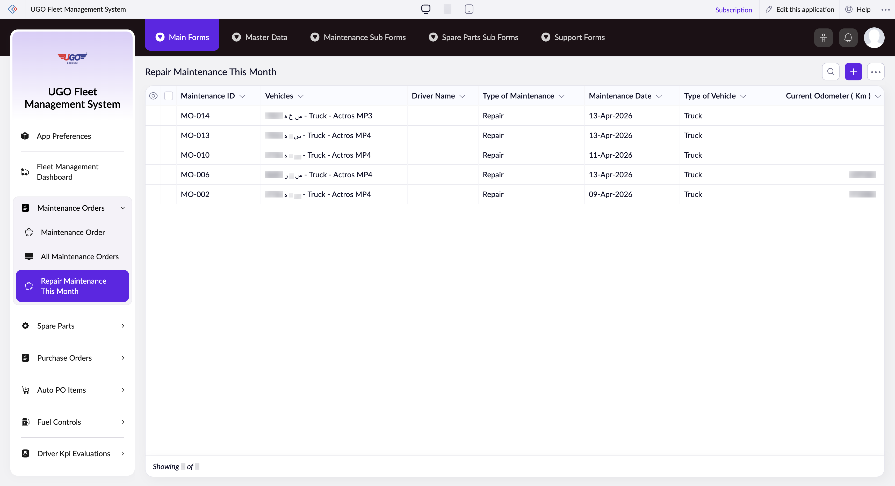

# Repair Maintenance This Month

This page displays all repair and maintenance work scheduled for your vehicles this month. Use it to track which vehicles need service, monitor maintenance history, and manage your garage workload. Operations staff use this to plan maintenance schedules and ensure vehicles stay in working condition.

**URL:** `https://creatorapp.zoho.com/m.fahmy_ugologistics/u-go-garage-maintenance#Report:Repair_Maintenance_This_Month`

## How to Use

1. Open the Repair Maintenance This Month page from the Maintenance Management section.
2. Review the table to see all scheduled maintenance tasks, including vehicle, driver, and maintenance date.
3. Use the search fields (Maintenance ID, Vehicles, Driver Name) to find specific records quickly.
4. Click the checkboxes next to any records you need to work with for bulk actions like editing or deletion.
5. Use the Print button to generate a maintenance report, or Export to send data to another system.
6. Click Done when finished viewing, or navigate to related forms using the buttons at the top (Maintenance Sub Forms, Spare Parts Sub Forms).

## Page Sections

- Repair Maintenance This Month

## Form Fields

| Field | Description | Type | Required |
|-------|-------------|------|----------|
| lang-select-dropdown | Choose your preferred language for the interface display. | dropdown | No |
| Checkbox |  | checkbox | No |
| 4780709000000821025_checkbox |  | checkbox | No |
| 4780709000000821020_checkbox |  | checkbox | No |
| 4780709000000821005_checkbox |  | checkbox | No |
| 4780709000000814098_checkbox |  | checkbox | No |
| 4780709000000814058_checkbox |  | checkbox | No |
| Checkbox |  | checkbox | No |
| wrapColsInputEl |  | checkbox | No |
| show-hide-col-all |  | checkbox | No |
| viewdel |  | checkbox | No |
| viewdel |  | checkbox | No |
| viewdel |  | checkbox | No |
| viewdel |  | checkbox | No |
| viewdel |  | checkbox | No |
| viewdel |  | checkbox | No |
| viewdel |  | checkbox | No |
| volume | Adjust this slider to control the zoom or display size of the table content. | range | No |
| checkbox-Maintenance_ID-ZC_T6YIEK | Check this box to show or hide the Maintenance ID column in the table. | checkbox | No |
| s2id_autogen68 |  | text | No |
| s2id_autogen68_search | Type a maintenance ID to search and filter records by that specific maintenance task. | text | No |
| zc_searchSelect |  | dropdown | No |
| checkbox-Vehicles-ZC_T6YIEK | Check this box to show or hide the Vehicles column in the table. | checkbox | No |
| s2id_autogen70 |  | text | No |
| s2id_autogen70_search | Type a vehicle name or number to filter the list to show only that vehicle's maintenance records. | text | No |
| zc_searchSelect |  | dropdown | No |
| checkbox-Driver_Name-ZC_T6YIEK | Check this box to show or hide the Driver Name column in the table. | checkbox | No |
| s2id_autogen72 |  | text | No |
| s2id_autogen72_search | Type a driver's name to filter records by that specific driver. | text | No |
| zc_searchSelect |  | dropdown | No |
| checkbox-Type_of_Maintenance-ZC_T6YIEK |  | checkbox | No |
| s2id_autogen74 |  | text | No |
| s2id_autogen74_search |  | text | No |
| zc_searchSelect |  | dropdown | No |
| checkbox-Maintenance_Date-ZC_T6YIEK |  | checkbox | No |
| s2id_autogen76 |  | text | No |
| s2id_autogen76_search |  | text | No |
| zc_searchSelect |  | dropdown | No |
| viewSearchEl_Maintenance_Date |  | text | No |
| From |  | text | No |
| To |  | text | No |
| checkbox-Type_of_Vehicle-ZC_T6YIEK |  | checkbox | No |
| s2id_autogen78 |  | text | No |
| s2id_autogen78_search |  | text | No |
| zc_searchSelect |  | dropdown | No |
| checkbox-Current_Odometer_Km-ZC_T6YIEK |  | checkbox | No |
| s2id_autogen80 |  | text | No |
| s2id_autogen80_search |  | text | No |
| zc_searchSelect |  | dropdown | No |
| From |  | text | No |
| To |  | text | No |
| checkbox-Type_of_Scheduled_Maintenance-ZC_T6YIEK |  | checkbox | No |
| s2id_autogen82 |  | text | No |
| s2id_autogen82_search |  | text | No |
| zc_searchSelect |  | dropdown | No |
| checkbox-Total_Spare_Parts_Cost-ZC_T6YIEK |  | checkbox | No |
| s2id_autogen84 |  | text | No |
| s2id_autogen84_search |  | text | No |
| zc_searchSelect |  | dropdown | No |
| From |  | text | No |
| To |  | text | No |
| checkbox-Maintenance_End_Date-ZC_T6YIEK |  | checkbox | No |
| s2id_autogen86 |  | text | No |
| s2id_autogen86_search |  | text | No |
| zc_searchSelect |  | dropdown | No |
| viewSearchEl_Maintenance_End_Date |  | text | No |
| From |  | text | No |
| To |  | text | No |
| checkbox-Maintenance_Status-ZC_T6YIEK |  | checkbox | No |
| s2id_autogen88 |  | text | No |
| s2id_autogen88_search |  | text | No |
| zc_searchSelect |  | dropdown | No |
| checkbox-Maintenance_Labor_Hours-ZC_T6YIEK |  | checkbox | No |
| s2id_autogen90 |  | text | No |
| s2id_autogen90_search |  | text | No |
| zc_searchSelect |  | dropdown | No |
| From |  | text | No |
| To |  | text | No |
| allowlocation |  | button | No |
| useIconSwitch |  | checkbox | No |
| toggleIconSwitch |  | checkbox | No |
| saveIcons |  | button | No |
| resetIcons |  | button | No |
| Search... |  | text | No |
| I have read the above conditions. |  | checkbox | No |
| reqEmailId |  | text | No |
| s2id_autogen2 |  | text | No |
| s2id_autogen2_search |  | text | No |
| supportType |  | dropdown | No |
| Please enable edit permission to help with troubleshooting |  | checkbox | No |
| reachusChatDescription |  | textarea | No |
| reachUsStartChat |  | button | No |

## Table Columns

- Maintenance ID
- Vehicles
- Driver Name
- Type of Maintenance
- Maintenance Date
- Type of Vehicle
- Current Odometer ( Km )

## Actions

- **Done**
- **Main Forms**
- **Master Data**
- **Maintenance Sub Forms**
- **Spare Parts Sub Forms**
- **Support Forms**
- **Remove Changes**
- **Show as**
- **Print**
- **Import**
- **Export**
- **Bulk Edit**
- **Duplicate**
- **Delete**
- **AddAdd (Option + Shift + N)**
- **Submit Request**

## Tips

- Use the search fields to quickly locate records instead of scrolling through the entire list—this saves time when managing multiple vehicles.
- Always export or print your maintenance list at the beginning of the month so your garage team has a clear action plan.

## Related Pages

- [Maintenance Order](maintenance-order.md)
- [All Maintenance Orders](all-maintenance-orders.md)
- [Repair Details](repair-details.md)
- [All Repair Details](all-repair-details.md)

## Common Workflows

_Add step-by-step workflows specific to your organisation here._
