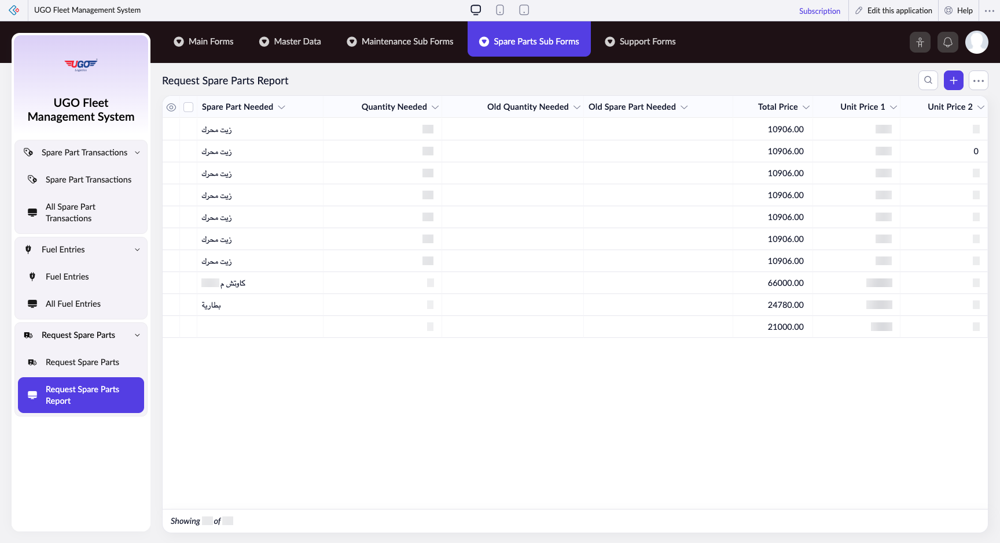

# Request Spare Parts Report

The Request Spare Parts Report page lets you view, manage, and request spare parts needed for vehicle maintenance. Garage operations staff use this page to track which parts are required, update quantities, and generate reports for ordering or inventory purposes.

**URL:** `https://creatorapp.zoho.com/m.fahmy_ugologistics/u-go-garage-maintenance#Report:Request_Spare_Parts_Report`

## How to Use

1. Select your preferred language from the lang-select-dropdown at the top if needed.
2. Review the table to see all spare parts currently listed with their quantities and prices.
3. Check the checkboxes next to the spare parts you want to include in your report or request.
4. Update the Quantity Needed field for any parts where the amount has changed since the last entry.
5. Click the Print button to generate a printable report, or Export to save the data to a file.
6. Click Done when you have finished making changes and are ready to submit your request.

## Page Sections

- Request Spare Parts Report

## Form Fields

| Field | Description | Type | Required |
|-------|-------------|------|----------|
| lang-select-dropdown |  | dropdown | No |
| Checkbox |  | checkbox | No |
| 4780709000000819020_checkbox |  | checkbox | No |
| 4780709000000819012_checkbox |  | checkbox | No |
| 4780709000000819004_checkbox |  | checkbox | No |
| 4780709000000814096_checkbox |  | checkbox | No |
| 4780709000000814082_checkbox |  | checkbox | No |
| 4780709000000814074_checkbox |  | checkbox | No |
| 4780709000000814066_checkbox |  | checkbox | No |
| 4780709000000814056_checkbox |  | checkbox | No |
| 4780709000000814048_checkbox |  | checkbox | No |
| 4780709000000767017_checkbox |  | checkbox | No |
| Checkbox |  | checkbox | No |
| wrapColsInputEl |  | checkbox | No |
| show-hide-col-all |  | checkbox | No |
| viewdel |  | checkbox | No |
| viewdel |  | checkbox | No |
| viewdel |  | checkbox | No |
| viewdel |  | checkbox | No |
| viewdel |  | checkbox | No |
| viewdel |  | checkbox | No |
| viewdel |  | checkbox | No |
| volume |  | range | No |
| checkbox-Spare_Part_Needed-ZC_9W14K9 |  | checkbox | No |
| s2id_autogen204 |  | text | No |
| s2id_autogen204_search |  | text | No |
| zc_searchSelect |  | dropdown | No |
| checkbox-Quantity_Needed-ZC_9W14K9 |  | checkbox | No |
| s2id_autogen206 |  | text | No |
| s2id_autogen206_search |  | text | No |
| zc_searchSelect |  | dropdown | No |
| From |  | text | No |
| To |  | text | No |
| checkbox-Old_Quantity_Needed-ZC_9W14K9 |  | checkbox | No |
| s2id_autogen208 |  | text | No |
| s2id_autogen208_search |  | text | No |
| zc_searchSelect |  | dropdown | No |
| From |  | text | No |
| To |  | text | No |
| checkbox-Old_Spare_Part_Needed-ZC_9W14K9 |  | checkbox | No |
| s2id_autogen210 |  | text | No |
| s2id_autogen210_search |  | text | No |
| zc_searchSelect |  | dropdown | No |
| checkbox-Total_Price-ZC_9W14K9 |  | checkbox | No |
| s2id_autogen212 |  | text | No |
| s2id_autogen212_search |  | text | No |
| zc_searchSelect |  | dropdown | No |
| From |  | text | No |
| To |  | text | No |
| checkbox-Unit_Price_1-ZC_9W14K9 |  | checkbox | No |
| s2id_autogen214 |  | text | No |
| s2id_autogen214_search |  | text | No |
| zc_searchSelect |  | dropdown | No |
| From |  | text | No |
| To |  | text | No |
| checkbox-Unit_Price_2-ZC_9W14K9 |  | checkbox | No |
| s2id_autogen216 |  | text | No |
| s2id_autogen216_search |  | text | No |
| zc_searchSelect |  | dropdown | No |
| From |  | text | No |
| To |  | text | No |
| checkbox-Unit_Price_3-ZC_9W14K9 |  | checkbox | No |
| s2id_autogen218 |  | text | No |
| s2id_autogen218_search |  | text | No |
| zc_searchSelect |  | dropdown | No |
| From |  | text | No |
| To |  | text | No |
| checkbox-Quantity_Batch_1-ZC_9W14K9 |  | checkbox | No |
| s2id_autogen220 |  | text | No |
| s2id_autogen220_search |  | text | No |
| zc_searchSelect |  | dropdown | No |
| From |  | text | No |
| To |  | text | No |
| checkbox-Quantity_Batch_2-ZC_9W14K9 |  | checkbox | No |
| s2id_autogen222 |  | text | No |
| s2id_autogen222_search |  | text | No |
| zc_searchSelect |  | dropdown | No |
| From |  | text | No |
| To |  | text | No |
| checkbox-Quantity_Batch_3-ZC_9W14K9 |  | checkbox | No |
| s2id_autogen224 |  | text | No |
| s2id_autogen224_search |  | text | No |
| zc_searchSelect |  | dropdown | No |
| From |  | text | No |
| To |  | text | No |
| checkbox-Batch_1_Stock_ID-ZC_9W14K9 |  | checkbox | No |
| s2id_autogen226 |  | text | No |
| s2id_autogen226_search |  | text | No |
| zc_searchSelect |  | dropdown | No |
| From |  | text | No |
| To |  | text | No |
| checkbox-Batch_2_Stock_ID-ZC_9W14K9 |  | checkbox | No |
| s2id_autogen228 |  | text | No |
| s2id_autogen228_search |  | text | No |
| zc_searchSelect |  | dropdown | No |
| From |  | text | No |
| To |  | text | No |
| checkbox-Batch_3_Stock_ID-ZC_9W14K9 |  | checkbox | No |
| s2id_autogen230 |  | text | No |
| s2id_autogen230_search |  | text | No |
| zc_searchSelect |  | dropdown | No |
| From |  | text | No |
| To |  | text | No |
| checkbox-Stock_Consumed-ZC_9W14K9 |  | checkbox | No |
| s2id_autogen232 |  | text | No |
| s2id_autogen232_search |  | text | No |
| zc_searchSelect |  | dropdown | No |
| checkbox-Previously_Deducted-ZC_9W14K9 |  | checkbox | No |
| s2id_autogen234 |  | text | No |
| s2id_autogen234_search |  | text | No |
| zc_searchSelect |  | dropdown | No |
| From |  | text | No |
| To |  | text | No |
| checkbox-Live_Total_Engine-ZC_9W14K9 |  | checkbox | No |
| s2id_autogen236 |  | text | No |
| s2id_autogen236_search |  | text | No |
| zc_searchSelect |  | dropdown | No |
| From |  | text | No |
| To |  | text | No |
| checkbox-Stock_Quantity-ZC_9W14K9 |  | checkbox | No |
| s2id_autogen238 |  | text | No |
| s2id_autogen238_search |  | text | No |
| zc_searchSelect |  | dropdown | No |
| From |  | text | No |
| To |  | text | No |
| checkbox-Stock_Status-ZC_9W14K9 |  | checkbox | No |
| s2id_autogen240 |  | text | No |
| s2id_autogen240_search |  | text | No |
| zc_searchSelect |  | dropdown | No |
| checkbox-Notes-ZC_9W14K9 |  | checkbox | No |
| s2id_autogen242 |  | text | No |
| s2id_autogen242_search |  | text | No |
| zc_searchSelect |  | dropdown | No |
| checkbox-Shortage_Quantity-ZC_9W14K9 |  | checkbox | No |
| s2id_autogen244 |  | text | No |
| s2id_autogen244_search |  | text | No |
| zc_searchSelect |  | dropdown | No |
| From |  | text | No |
| To |  | text | No |
| checkbox-Vehicle_Model-ZC_9W14K9 |  | checkbox | No |
| s2id_autogen246 |  | text | No |
| s2id_autogen246_search |  | text | No |
| zc_searchSelect |  | dropdown | No |
| allowlocation |  | button | No |
| useIconSwitch |  | checkbox | No |
| toggleIconSwitch |  | checkbox | No |
| saveIcons |  | button | No |
| resetIcons |  | button | No |
| Search... |  | text | No |
| I have read the above conditions. |  | checkbox | No |
| reqEmailId |  | text | No |
| s2id_autogen2 |  | text | No |
| s2id_autogen2_search |  | text | No |
| supportType |  | dropdown | No |
| Please enable edit permission to help with troubleshooting |  | checkbox | No |
| reachusChatDescription |  | textarea | No |
| reachUsStartChat |  | button | No |
| zc-reachus-editaccess-enable-button |  | button | No |
| zc-reachus-editaccess-revoke-button |  | button | No |
| zc-reachus-screenrecord-button |  | button | No |

## Table Columns

- Spare Part Needed
- Quantity Needed
- Old Quantity Needed
- Old Spare Part Needed
- Total Price
- Unit Price 1
- Unit Price 2

## Actions

- **Done**
- **Main Forms**
- **Master Data**
- **Maintenance Sub Forms**
- **Spare Parts Sub Forms**
- **Support Forms**
- **Remove Changes**
- **Show as**
- **Print**
- **Import**
- **Export**
- **Bulk Edit**
- **Duplicate**
- **Delete**
- **AddAdd (Option + Shift + N)**
- **Submit Request**

## Tips

- Always verify quantities are correct before printing or exporting the report—incorrect amounts can delay maintenance schedules and affect inventory planning.
- Use the Bulk Edit button if you need to update multiple spare parts at once, or the Duplicate button to copy a request for similar maintenance jobs.

## Related Pages

- [All Spare Parts](all-spare-parts.md)
- [Spare Part Stock](spare-part-stock.md)
- [All Spare Part Stocks](all-spare-part-stocks.md)
- [Spare Part Transactions](spare-part-transactions.md)
- [All Spare Part Transactions](all-spare-part-transactions.md)
- [Request Spare Parts](request-spare-parts.md)

## Common Workflows

_Add step-by-step workflows specific to your organisation here._
