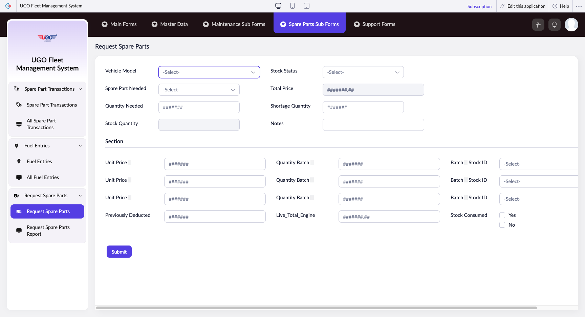

# Request Spare Parts

**URL:** `https://creatorapp.zoho.com/m.fahmy_ugologistics/u-go-garage-maintenance#Form:Request_Spare_Parts`

## Page Sections

- Upgrade to Creator 5
- Update your subscription plan
- UGO Fleet Management System
- Section
- Section
- Introducing the New zoho Creator ui
- Introducing the New zoho Creator ui
- Introducing the New zoho Creator ui
- Introducing the New zoho Creator ui

## Form Fields

| Field | Type | Required |
|-------|------|----------|
| lang-select-dropdown | dropdown | No |
| zc-sel2-foc-Vehicle_Model | text | No |
| zc-sel2-inp-Vehicle_Model | text | No |
| Vehicle_Model | text | No |
| zc-sel2-foc-Spare_Part_Needed | text | No |
| zc-sel2-inp-Spare_Part_Needed | text | No |
| Spare_Part_Needed | text | No |
| Quantity Needed | text | No |
| Stock Quantity | text | No |
| zc-sel2-foc-Stock_Status | text | No |
| zc-sel2-inp-Stock_Status | text | No |
| Stock_Status | text | No |
| Total Price | text | No |
| Shortage Quantity | text | No |
| Notes | text | No |
| Unit Price 1 | text | No |
| Unit Price 2 | text | No |
| Unit Price 3 | text | No |
| Old Quantity Needed | text | No |
| Previously Deducted | text | No |
| Quantity Batch 1 | text | No |
| Quantity Batch 2 | text | No |
| Quantity Batch 3 | text | No |
| zc-sel2-foc-Old_Spare_Part_Needed | text | No |
| zc-sel2-inp-Old_Spare_Part_Needed | text | No |
| Old_Spare_Part_Needed | text | No |
| Live_Total_Engine | text | No |
| zc-sel2-foc-Batch_1_Stock_ID | text | No |
| zc-sel2-inp-Batch_1_Stock_ID | text | No |
| Batch_1_Stock_ID | text | No |
| zc-sel2-foc-Batch_2_Stock_ID | text | No |
| zc-sel2-inp-Batch_2_Stock_ID | text | No |
| Batch_2_Stock_ID | text | No |
| zc-sel2-foc-Batch_3_Stock_ID | text | No |
| zc-sel2-inp-Batch_3_Stock_ID | text | No |
| Batch_3_Stock_ID | text | No |
| Yes | checkbox | No |
| No | checkbox | No |
| submit | submit | No |
| searchmap | text | No |
| useIconSwitch | checkbox | No |
| toggleIconSwitch | checkbox | No |
| saveIcons | button | No |
| resetIcons | button | No |
| Search... | text | No |
| I have read the above conditions. | checkbox | No |
| reqEmailId | text | No |
| s2id_autogen2 | text | No |
| s2id_autogen2_search | text | No |
| supportType | dropdown | No |
| Please enable edit permission to help with troubleshooting | checkbox | No |
| reachusChatDescription | textarea | No |
| reachUsStartChat | button | No |
| zc-reachus-editaccess-enable-button | button | No |
| zc-reachus-editaccess-revoke-button | button | No |
| zc-reachus-screenrecord-button | button | No |

## Actions

- **Done**
- **Main Forms**
- **Master Data**
- **Maintenance Sub Forms**
- **Spare Parts Sub Forms**
- **Support Forms**
- **Submit**
- **Submit Request**

## Common Workflows

_Document step-by-step workflows for this page here._
