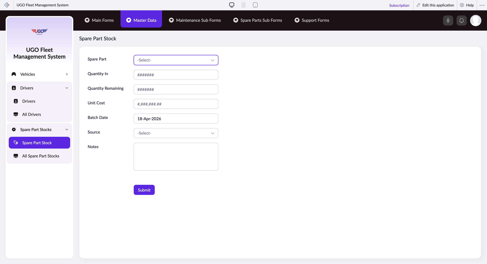

# Spare Part Stock

The Spare Part Stock page lets you record and track inventory for vehicle maintenance parts in your garage. You'll use this to log new parts received, monitor stock levels, and update part information. Operations staff use this daily to manage what's in stock and what's been used.

**URL:** `https://creatorapp.zoho.com/m.fahmy_ugologistics/u-go-garage-maintenance#Form:Spare_Part_Stock`

## How to Use

1. Select your preferred language from the dropdown at the top if needed
2. Enter the spare part name in the Spare Part field (use the search box to find existing parts)
3. Enter the number of units received in the Quantity In field
4. Enter how many units are still available in the Quantity Remaining field
5. Enter the cost per unit in the Unit Cost field
6. Select the supplier or source in the Source field
7. Click Submit to save the record

## Form Fields

| Field | Description | Type | Required |
|-------|-------------|------|----------|
| lang-select-dropdown |  | dropdown | No |
| Spare_Part |  | text | No |
| Quantity In | The number of units received in this stock delivery or purchase. | text | No |
| Quantity Remaining | How many units of this part are currently available for use. | text | No |
| Unit Cost | The price paid per single unit of this part. Used to calculate total stock value. | text | No |
| Batch_Date | The date this batch of parts was received or purchased. | text | No |
| Source | The supplier or vendor who provided these parts (e.g., 'ABC Parts Ltd', 'Direct Manufacturer'). | text | No |
| Notes | Any additional information about the parts, such as condition, storage location, or special handling instructions. | textarea | No |
| submit |  | submit | No |
| searchmap |  | text | No |
| useIconSwitch |  | checkbox | No |
| toggleIconSwitch |  | checkbox | No |
| saveIcons |  | button | No |
| resetIcons |  | button | No |
| Search... |  | text | No |
| I have read the above conditions. |  | checkbox | No |
| reqEmailId |  | text | No |
| s2id_autogen2 |  | text | No |
| s2id_autogen2_search |  | text | No |
| supportType |  | dropdown | No |
| Please enable edit permission to help with troubleshooting |  | checkbox | No |
| reachusChatDescription |  | textarea | No |
| reachUsStartChat |  | button | No |

## Actions

- **Done**
- **Main Forms**
- **Master Data**
- **Maintenance Sub Forms**
- **Spare Parts Sub Forms**
- **Support Forms**
- **Submit**
- **Submit Request**

## Tips

- Always update Quantity Remaining immediately after parts are used during maintenance work. This keeps your stock levels accurate for ordering decisions.
- If you need support with the system or troubleshooting, check the 'Please enable edit permission to help with troubleshooting' checkbox and use the chat option at the bottom to contact the support team.

## Related Pages

- [All Spare Parts](all-spare-parts.md)
- [All Spare Part Stocks](all-spare-part-stocks.md)
- [Spare Part Transactions](spare-part-transactions.md)
- [All Spare Part Transactions](all-spare-part-transactions.md)
- [Request Spare Parts](request-spare-parts.md)
- [Request Spare Parts Report](request-spare-parts-report.md)

## Common Workflows

_Add step-by-step workflows specific to your organisation here._
