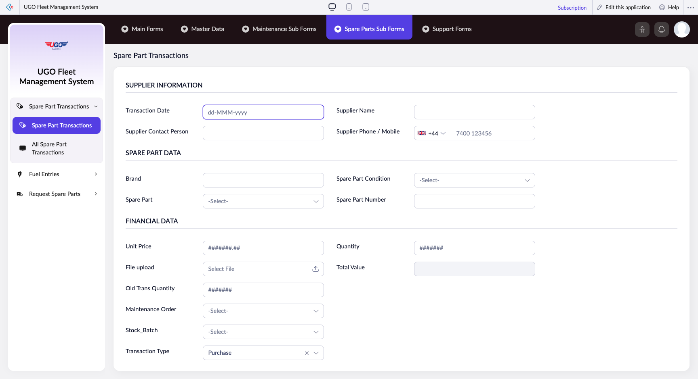

# Spare Part Transactions

This page manages spare part transactions records.

**URL:** `https://creatorapp.zoho.com/m.fahmy_ugologistics/u-go-garage-maintenance#Form:Spare_Part_Transactions`

## How to Use

1. Open this page from the sidebar.
2. Review or enter the required information.
3. Save your changes.

## Page Sections

- SUPPLIER INFORMATION
- SPARE PART DATA
- FINANCIAL DATA

## Form Fields

| Field | Description | Type | Required |
|-------|-------------|------|----------|
| lang-select-dropdown |  | dropdown | No |
| Transaction_Date |  | text | No |
| Supplier Contact Person |  | text | No |
| Supplier Name |  | text | No |
| Supplier Phone / Mobile |  | tel | No |
| Brand |  | text | No |
| Spare_Part |  | text | No |
| Spare_Part_Condition |  | text | No |
| Spare Part Number |  | text | No |
| Unit Price |  | text | No |
| uploadFile |  | file | No |
| Quantity |  | text | No |
| Total Value |  | text | No |
| Old Trans Quantity |  | text | No |
| Maintenance_Order |  | text | No |
| Stock_Batch |  | text | No |
| Transaction_Type |  | text | No |
| submit |  | submit | No |
| searchmap |  | text | No |
| useIconSwitch |  | checkbox | No |
| toggleIconSwitch |  | checkbox | No |
| saveIcons |  | button | No |
| resetIcons |  | button | No |
| Search... |  | text | No |
| I have read the above conditions. |  | checkbox | No |
| reqEmailId |  | text | No |
| s2id_autogen2 |  | text | No |
| s2id_autogen2_search |  | text | No |
| supportType |  | dropdown | No |
| Please enable edit permission to help with troubleshooting |  | checkbox | No |
| reachusChatDescription |  | textarea | No |
| reachUsStartChat |  | button | No |

## Actions

- **Done**
- **Main Forms**
- **Master Data**
- **Maintenance Sub Forms**
- **Spare Parts Sub Forms**
- **Support Forms**
- **Submit**
- **Submit Request**

## Related Pages

- [All Spare Parts](all-spare-parts.md)
- [Spare Part Stock](spare-part-stock.md)
- [All Spare Part Stocks](all-spare-part-stocks.md)
- [All Spare Part Transactions](all-spare-part-transactions.md)
- [Request Spare Parts](request-spare-parts.md)
- [Request Spare Parts Report](request-spare-parts-report.md)

## Common Workflows

_Add step-by-step workflows specific to your organisation here._
