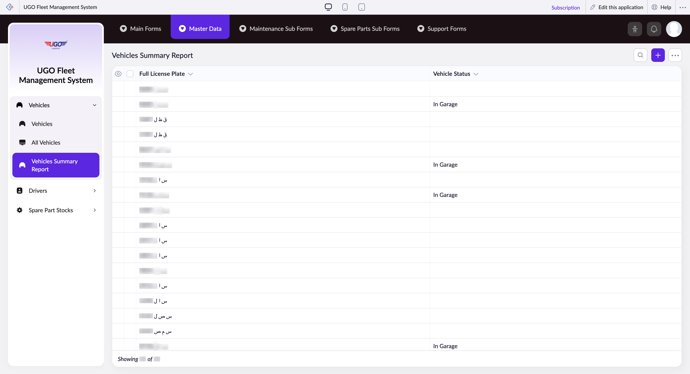

# Vehicles Summary Report

The Vehicles Summary Report displays your complete fleet of vehicles with their current status and license plate information. Fleet managers and maintenance coordinators use this page to monitor vehicle availability, track maintenance status, and manage vehicle records across your logistics operation.

**URL:** `https://creatorapp.zoho.com/m.fahmy_ugologistics/u-go-garage-maintenance#Report:Vehicles_Summary_Report`

## How to Use

1. Open the Vehicles Summary Report from the Fleet & Drivers menu to view all registered vehicles in your fleet.
2. Review the Full License Plate and Vehicle Status columns to identify which vehicles are active, in maintenance, or out of service.
3. Use the checkboxes next to vehicle records to select multiple vehicles if you need to perform bulk actions like editing maintenance schedules or updating status.
4. Click the language dropdown (lang-select-dropdown) at the top if you need to view the report in a different language.
5. Use the Print button to generate a physical copy of the report for your records or to share with your team.
6. Click Export to save vehicle data to a file for backup or external analysis.
7. Use Bulk Edit to make the same changes across multiple selected vehicles at once, such as assigning a new maintenance category or updating driver assignments.

## Page Sections

- Vehicles Summary Report

## Form Fields

| Field | Description | Type | Required |
|-------|-------------|------|----------|
| lang-select-dropdown | Select your preferred language for viewing the report and system interface. Choose from available languages to display all labels and information in that language. | dropdown | No |
| Checkbox | Use this master checkbox to select or deselect all vehicles in the report at once for bulk operations. | checkbox | No |
| 4780709000000814091_checkbox |  | checkbox | No |
| 4780709000000814088_checkbox |  | checkbox | No |
| 4780709000000805078_checkbox |  | checkbox | No |
| 4780709000000805076_checkbox |  | checkbox | No |
| 4780709000000425107_checkbox |  | checkbox | No |
| 4780709000000425103_checkbox |  | checkbox | No |
| 4780709000000425099_checkbox |  | checkbox | No |
| 4780709000000425095_checkbox |  | checkbox | No |
| 4780709000000425091_checkbox |  | checkbox | No |
| 4780709000000425087_checkbox |  | checkbox | No |
| 4780709000000425083_checkbox |  | checkbox | No |
| 4780709000000425079_checkbox |  | checkbox | No |
| 4780709000000425075_checkbox |  | checkbox | No |
| 4780709000000425071_checkbox |  | checkbox | No |
| 4780709000000425067_checkbox |  | checkbox | No |
| 4780709000000425063_checkbox |  | checkbox | No |
| 4780709000000425059_checkbox |  | checkbox | No |
| 4780709000000425055_checkbox |  | checkbox | No |
| 4780709000000425051_checkbox |  | checkbox | No |
| 4780709000000425047_checkbox |  | checkbox | No |
| 4780709000000425043_checkbox |  | checkbox | No |
| 4780709000000425039_checkbox |  | checkbox | No |
| 4780709000000425035_checkbox |  | checkbox | No |
| 4780709000000425031_checkbox |  | checkbox | No |
| 4780709000000425027_checkbox |  | checkbox | No |
| 4780709000000425023_checkbox |  | checkbox | No |
| 4780709000000425019_checkbox |  | checkbox | No |
| 4780709000000425015_checkbox |  | checkbox | No |
| 4780709000000425011_checkbox |  | checkbox | No |
| 4780709000000425007_checkbox |  | checkbox | No |
| 4780709000000425003_checkbox |  | checkbox | No |
| Checkbox | Use this master checkbox to select or deselect all vehicles in the report at once for bulk operations. | checkbox | No |
| wrapColsInputEl |  | checkbox | No |
| show-hide-col-all |  | checkbox | No |
| viewdel |  | checkbox | No |
| viewdel |  | checkbox | No |
| volume |  | range | No |
| checkbox-Full_License_Plate-ZC_3IETWW |  | checkbox | No |
| s2id_autogen238 |  | text | No |
| s2id_autogen238_search |  | text | No |
| zc_searchSelect |  | dropdown | No |
| checkbox-Vehicle_Status-ZC_3IETWW |  | checkbox | No |
| s2id_autogen240 |  | text | No |
| s2id_autogen240_search |  | text | No |
| zc_searchSelect |  | dropdown | No |
| checkbox-License_Plate_Digits-ZC_3IETWW |  | checkbox | No |
| s2id_autogen242 |  | text | No |
| s2id_autogen242_search |  | text | No |
| zc_searchSelect |  | dropdown | No |
| From |  | text | No |
| To |  | text | No |
| checkbox-License_plate_Letters-ZC_3IETWW |  | checkbox | No |
| s2id_autogen244 |  | text | No |
| s2id_autogen244_search |  | text | No |
| zc_searchSelect |  | dropdown | No |
| checkbox-Vehicles_Type-ZC_3IETWW |  | checkbox | No |
| s2id_autogen246 |  | text | No |
| s2id_autogen246_search |  | text | No |
| zc_searchSelect |  | dropdown | No |
| checkbox-Normal_Fuel_Consumption_Km_L-ZC_3IETWW |  | checkbox | No |
| s2id_autogen248 |  | text | No |
| s2id_autogen248_search |  | text | No |
| zc_searchSelect |  | dropdown | No |
| From |  | text | No |
| To |  | text | No |
| checkbox-Fuel_Type-ZC_3IETWW |  | checkbox | No |
| s2id_autogen250 |  | text | No |
| s2id_autogen250_search |  | text | No |
| zc_searchSelect |  | dropdown | No |
| checkbox-Fuel_Vehicle-ZC_3IETWW |  | checkbox | No |
| s2id_autogen252 |  | text | No |
| s2id_autogen252_search |  | text | No |
| zc_searchSelect |  | dropdown | No |
| checkbox-Octain_ID-ZC_3IETWW |  | checkbox | No |
| s2id_autogen254 |  | text | No |
| s2id_autogen254_search |  | text | No |
| zc_searchSelect |  | dropdown | No |
| From |  | text | No |
| To |  | text | No |
| checkbox-UGO_ID-ZC_3IETWW |  | checkbox | No |
| s2id_autogen256 |  | text | No |
| s2id_autogen256_search |  | text | No |
| zc_searchSelect |  | dropdown | No |
| checkbox-Date_of_Purchase-ZC_3IETWW |  | checkbox | No |
| s2id_autogen258 |  | text | No |
| s2id_autogen258_search |  | text | No |
| zc_searchSelect |  | dropdown | No |
| viewSearchEl_Date_of_Purchase |  | text | No |
| From |  | text | No |
| To |  | text | No |
| checkbox-Make-ZC_3IETWW |  | checkbox | No |
| s2id_autogen260 |  | text | No |
| s2id_autogen260_search |  | text | No |
| zc_searchSelect |  | dropdown | No |
| checkbox-Chassis_Number-ZC_3IETWW |  | checkbox | No |
| s2id_autogen262 |  | text | No |
| s2id_autogen262_search |  | text | No |
| zc_searchSelect |  | dropdown | No |
| checkbox-Year_of_Manufacture-ZC_3IETWW |  | checkbox | No |
| s2id_autogen264 |  | text | No |
| s2id_autogen264_search |  | text | No |
| zc_searchSelect |  | dropdown | No |
| From |  | text | No |
| To |  | text | No |
| checkbox-Model-ZC_3IETWW |  | checkbox | No |
| s2id_autogen266 |  | text | No |
| s2id_autogen266_search |  | text | No |
| zc_searchSelect |  | dropdown | No |
| checkbox-Engine_Number-ZC_3IETWW |  | checkbox | No |
| s2id_autogen268 |  | text | No |
| s2id_autogen268_search |  | text | No |
| zc_searchSelect |  | dropdown | No |
| checkbox-License_Expiry_Date-ZC_3IETWW |  | checkbox | No |
| s2id_autogen270 |  | text | No |
| s2id_autogen270_search |  | text | No |
| zc_searchSelect |  | dropdown | No |
| viewSearchEl_License_Expiry_Date |  | text | No |
| From |  | text | No |
| To |  | text | No |
| checkbox-Current_Mileage_Km-ZC_3IETWW |  | checkbox | No |
| s2id_autogen272 |  | text | No |
| s2id_autogen272_search |  | text | No |
| zc_searchSelect |  | dropdown | No |
| From |  | text | No |
| To |  | text | No |
| checkbox-Upload_License_Photo-ZC_3IETWW |  | checkbox | No |
| s2id_autogen274 |  | text | No |
| s2id_autogen274_search |  | text | No |
| zc_searchSelect |  | dropdown | No |
| checkbox-Notes-ZC_3IETWW |  | checkbox | No |
| s2id_autogen276 |  | text | No |
| s2id_autogen276_search |  | text | No |
| zc_searchSelect |  | dropdown | No |
| allowlocation |  | button | No |
| useIconSwitch |  | checkbox | No |
| toggleIconSwitch |  | checkbox | No |
| saveIcons |  | button | No |
| resetIcons |  | button | No |
| Search... |  | text | No |
| I have read the above conditions. |  | checkbox | No |
| reqEmailId |  | text | No |
| s2id_autogen2 |  | text | No |
| s2id_autogen2_search |  | text | No |
| supportType |  | dropdown | No |
| Please enable edit permission to help with troubleshooting |  | checkbox | No |
| reachusChatDescription |  | textarea | No |
| reachUsStartChat |  | button | No |
| zc-reachus-editaccess-enable-button |  | button | No |
| zc-reachus-editaccess-revoke-button |  | button | No |
| zc-reachus-screenrecord-button |  | button | No |

## Table Columns

- Full License Plate
- Vehicle Status

## Actions

- **Done**
- **Main Forms**
- **Master Data**
- **Maintenance Sub Forms**
- **Spare Parts Sub Forms**
- **Support Forms**
- **Remove Changes**
- **Show as**
- **Print**
- **Import**
- **Export**
- **Bulk Edit**
- **Duplicate**
- **Delete**
- **AddAdd (Option + Shift + N)**
- **Submit Request**

## Tips

- If you need to update vehicle information or maintenance records, select the vehicles first using checkboxes, then use Bulk Edit rather than editing vehicles one at a time. This saves time when managing large fleets.
- Always check Vehicle Status before dispatching a vehicle—only vehicles showing 'Active' status should be assigned to drivers. Vehicles in maintenance or out of service will cause delays if dispatched.

## Related Pages

- [Vehicles](vehicles.md)
- [All Vehicles](all-vehicles.md)
- [All Drivers](all-drivers.md)
- [Driver KPI Evaluation](driver-kpi-evaluation.md)
- [All Driver Kpi Evaluations](all-driver-kpi-evaluations.md)

## Common Workflows

_Add step-by-step workflows specific to your organisation here._
