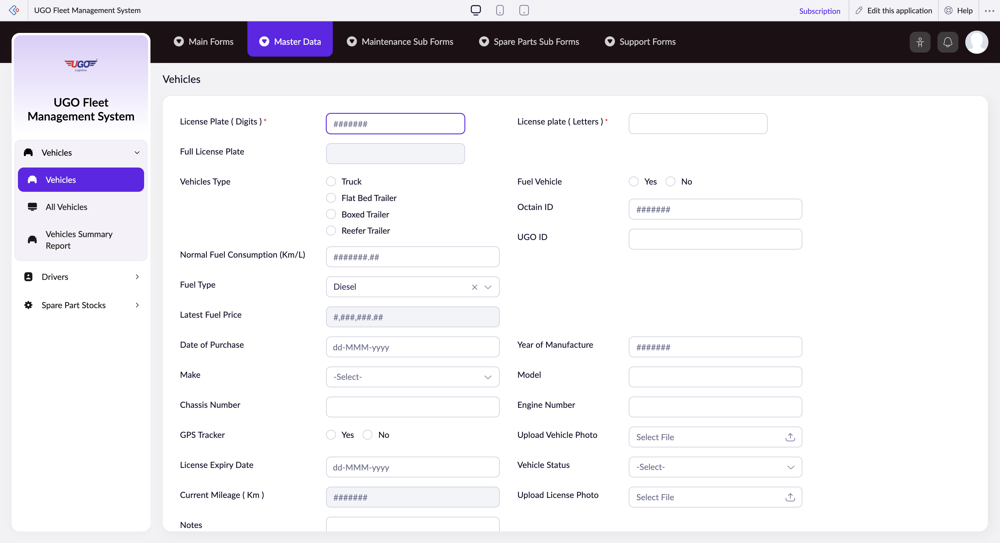

# Vehicles

**URL:** `https://creatorapp.zoho.com/m.fahmy_ugologistics/u-go-garage-maintenance#Form:Vehicles`

## Page Sections

- Plates
- Type
- Data
- Status

## Form Fields

| Field | Type | Required |
|-------|------|----------|
| lang-select-dropdown | dropdown | No |
| License Plate ( Digits )* | text | No |
| Full License Plate | text | No |
| License plate ( Letters )* | text | No |
| Vehicles_Type | radio | No |
| Vehicles_Type | radio | No |
| Vehicles_Type | radio | No |
| Vehicles_Type | radio | No |
| Normal Fuel Consumption (Km/L) | text | No |
| zc-sel2-foc-Fuel_Type | text | No |
| zc-sel2-inp-Fuel_Type | text | No |
| Fuel_Type | text | No |
| Latest Fuel Price | text | No |
| Fuel_Vehicle | radio | No |
| Fuel_Vehicle | radio | No |
| Octain ID | text | No |
| UGO ID | text | No |
| Date_of_Purchase | text | No |
| zc-sel2-foc-Make | text | No |
| zc-sel2-inp-Make | text | No |
| Make | text | No |
| Chassis Number | text | No |
| GPS_Tracker | radio | No |
| GPS_Tracker | radio | No |
| Year of Manufacture | text | No |
| Model | text | No |
| Engine Number | text | No |
| Upload_Vehicle_Photo | hidden | No |
| uploadFile | file | No |
| License_Expiry_Date | text | No |
| Current Mileage ( Km ) | text | No |
| zc-sel2-foc-Vehicle_Status | text | No |
| zc-sel2-inp-Vehicle_Status | text | No |
| Vehicle_Status | text | No |
| Upload_License_Photo | hidden | No |
| uploadFile | file | No |
| Notes | textarea | No |
| submit | submit | No |
| reset | reset | No |
| searchmap | text | No |
| useIconSwitch | checkbox | No |
| toggleIconSwitch | checkbox | No |
| saveIcons | button | No |
| resetIcons | button | No |
| Search... | text | No |
| I have read the above conditions. | checkbox | No |
| reqEmailId | text | No |
| s2id_autogen2 | text | No |
| s2id_autogen2_search | text | No |
| supportType | dropdown | No |
| Please enable edit permission to help with troubleshooting | checkbox | No |
| reachusChatDescription | textarea | No |
| reachUsStartChat | button | No |
| zc-reachus-editaccess-enable-button | button | No |
| zc-reachus-editaccess-revoke-button | button | No |
| zc-reachus-screenrecord-button | button | No |

## Actions

- **Done**
- **Main Forms**
- **Master Data**
- **Maintenance Sub Forms**
- **Spare Parts Sub Forms**
- **Support Forms**
- **Submit**
- **Submit Request**

## Common Workflows

_Document step-by-step workflows for this page here._
