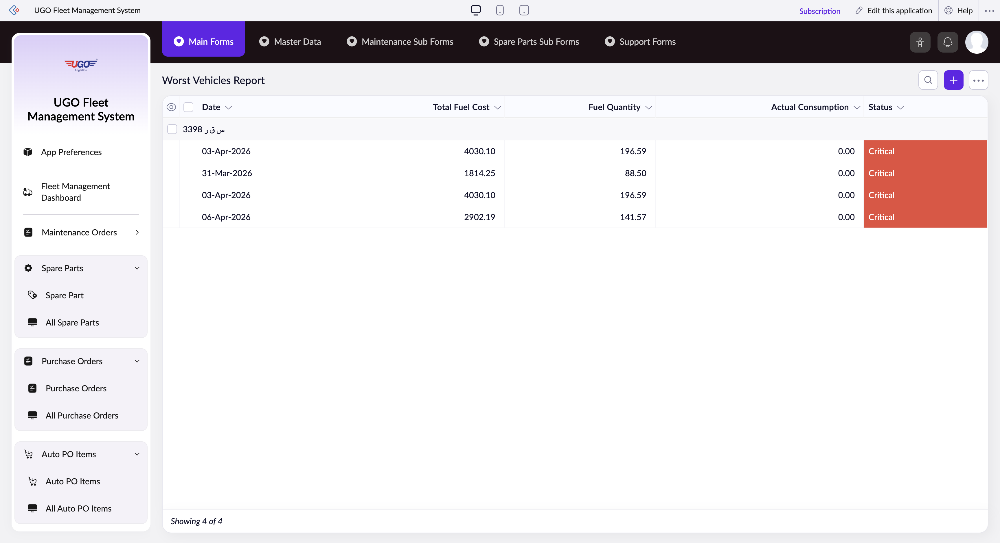

# Worst Vehicles Report

The Worst Vehicles Report shows which vehicles in your fleet consume the most fuel and have the highest fuel costs. Operations managers use this page to identify problem vehicles that may need maintenance, driver retraining, or replacement. Check this report regularly to control fuel expenses and improve fleet efficiency.

**URL:** `https://creatorapp.zoho.com/m.fahmy_ugologistics/u-go-garage-maintenance#Report:Worst_Vehicles_Report`

## How to Use

1. Open the Worst Vehicles Report from the Fuel Management section.
2. Select a date range using the 'From' and 'To' fields to analyze fuel consumption over a specific period.
3. Use the Vehicle dropdown to filter results for specific vehicles, or leave it empty to see all vehicles.
4. Review the table to see which vehicles have the highest Total Fuel Cost and Actual Consumption rates.
5. Click the checkbox next to any vehicle row to select it for further action.
6. Export the report using the Export button to share with your maintenance or driver management team.
7. Use the Print button to create a hard copy for your records or team meetings.

## Page Sections

- Worst Vehicles Report

## Form Fields

| Field | Description | Type | Required |
|-------|-------------|------|----------|
| lang-select-dropdown | Change the language used in this report if your system supports multiple languages. | dropdown | No |
| Checkbox |  | checkbox | No |
| groupid0_ZC_R8NJRI |  | checkbox | No |
| 4780709000000797002_checkbox |  | checkbox | No |
| 4780709000000797004_checkbox |  | checkbox | No |
| 4780709000000805030_checkbox |  | checkbox | No |
| 4780709000000805034_checkbox |  | checkbox | No |
| Checkbox |  | checkbox | No |
| wrapColsInputEl |  | checkbox | No |
| show-hide-col-all |  | checkbox | No |
| viewdel |  | checkbox | No |
| viewdel |  | checkbox | No |
| viewdel |  | checkbox | No |
| viewdel |  | checkbox | No |
| viewdel |  | checkbox | No |
| viewdel |  | checkbox | No |
| volume |  | range | No |
| checkbox-Vehicle-ZC_R8NJRI |  | checkbox | No |
| s2id_autogen112 |  | text | No |
| s2id_autogen112_search |  | text | No |
| zc_searchSelect |  | dropdown | No |
| checkbox-Date_field1-ZC_R8NJRI |  | checkbox | No |
| s2id_autogen114 |  | text | No |
| s2id_autogen114_search |  | text | No |
| zc_searchSelect |  | dropdown | No |
| viewSearchEl_Date_field1 |  | text | No |
| From |  | text | No |
| To |  | text | No |
| checkbox-Total_Fuel_Cost-ZC_R8NJRI |  | checkbox | No |
| s2id_autogen116 |  | text | No |
| s2id_autogen116_search |  | text | No |
| zc_searchSelect |  | dropdown | No |
| From |  | text | No |
| To |  | text | No |
| checkbox-Fuel_Quantity-ZC_R8NJRI |  | checkbox | No |
| s2id_autogen118 |  | text | No |
| s2id_autogen118_search |  | text | No |
| zc_searchSelect |  | dropdown | No |
| From |  | text | No |
| To |  | text | No |
| checkbox-Actual_Consumption-ZC_R8NJRI |  | checkbox | No |
| s2id_autogen120 |  | text | No |
| s2id_autogen120_search |  | text | No |
| zc_searchSelect |  | dropdown | No |
| From |  | text | No |
| To |  | text | No |
| checkbox-Status-ZC_R8NJRI |  | checkbox | No |
| s2id_autogen122 |  | text | No |
| s2id_autogen122_search |  | text | No |
| zc_searchSelect |  | dropdown | No |
| checkbox-Driver-ZC_R8NJRI |  | checkbox | No |
| s2id_autogen124 |  | text | No |
| s2id_autogen124_search |  | text | No |
| zc_searchSelect |  | dropdown | No |
| checkbox-Odometer_Reading-ZC_R8NJRI |  | checkbox | No |
| s2id_autogen126 |  | text | No |
| s2id_autogen126_search |  | text | No |
| zc_searchSelect |  | dropdown | No |
| From |  | text | No |
| To |  | text | No |
| checkbox-Fuel_Price_Per_Liter-ZC_R8NJRI |  | checkbox | No |
| s2id_autogen128 |  | text | No |
| s2id_autogen128_search |  | text | No |
| zc_searchSelect |  | dropdown | No |
| From |  | text | No |
| To |  | text | No |
| checkbox-Distance_Since_Last_Fuel-ZC_R8NJRI |  | checkbox | No |
| s2id_autogen130 |  | text | No |
| s2id_autogen130_search |  | text | No |
| zc_searchSelect |  | dropdown | No |
| From |  | text | No |
| To |  | text | No |
| checkbox-Consumption_Deviation-ZC_R8NJRI |  | checkbox | No |
| s2id_autogen132 |  | text | No |
| s2id_autogen132_search |  | text | No |
| zc_searchSelect |  | dropdown | No |
| From |  | text | No |
| To |  | text | No |
| allowlocation |  | button | No |
| useIconSwitch |  | checkbox | No |
| toggleIconSwitch |  | checkbox | No |
| saveIcons |  | button | No |
| resetIcons |  | button | No |
| Search... |  | text | No |
| I have read the above conditions. |  | checkbox | No |
| reqEmailId |  | text | No |
| s2id_autogen2 |  | text | No |
| s2id_autogen2_search |  | text | No |
| supportType |  | dropdown | No |
| Please enable edit permission to help with troubleshooting |  | checkbox | No |
| reachusChatDescription |  | textarea | No |
| reachUsStartChat |  | button | No |

## Table Columns

- Date
- Total Fuel Cost
- Fuel Quantity
- Actual Consumption
- Status

## Actions

- **Done**
- **Main Forms**
- **Master Data**
- **Maintenance Sub Forms**
- **Spare Parts Sub Forms**
- **Support Forms**
- **Remove Changes**
- **Show as**
- **Print**
- **Import**
- **Export**
- **Bulk Edit**
- **Duplicate**
- **Delete**
- **AddAdd (Option + Shift + N)**
- **Submit Request**

## Tips

- High Actual Consumption values often signal maintenance issues like poor tire pressure, engine problems, or transmission wear. Flag these vehicles for immediate maintenance inspection.
- Always compare fuel costs alongside consumption rates—a vehicle may use more fuel simply because it travels more miles. Focus on vehicles with high consumption per mile.

## Related Pages

- [Fuel Control](fuel-control.md)
- [All Fuel Controls](all-fuel-controls.md)
- [Fuel Entries](fuel-entries.md)
- [All Fuel Entries](all-fuel-entries.md)
- [Fuel – Vehicle Performance Summary](fuel-vehicle-performance-summary.md)
- [Cost Per KM](cost-per-km.md)

## Common Workflows

_Add step-by-step workflows specific to your organisation here._
