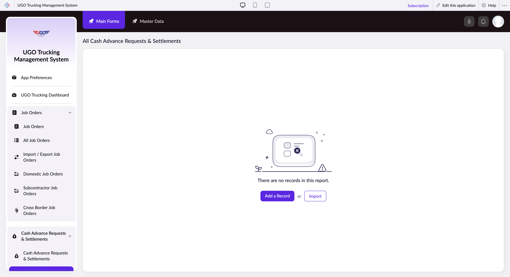

# All Cash Advance Requests & Settlements

This page displays all cash advance requests and their settlement records for your company's drivers and staff. Finance and operations teams use this page to track advance disbursements, monitor settlement status, and audit expense claims before final payment approval.

**URL:** `https://creatorapp.zoho.com/m.fahmy_ugologistics/u-go-trucking-management-system#Report:All_Cash_Advances_Requests_Settleme`

## How to Use

1. Select your preferred language using the Language dropdown at the top if needed
2. Use the checkboxes next to each filter field to enable the search criteria you want to use
3. Enter or select your filter values (for example, check the Job Order box and search for a specific job number)
4. Use the Volume range slider to narrow results by advance amount if needed
5. Click the Submit Request button to apply your filters and view matching records
6. Review the filtered results and use the action buttons (Done, Add a Record, Import, etc.) to manage your records

## Page Sections

- All Cash Advance Requests & Settlements

## Form Fields

| Field | Description | Type | Required |
|-------|-------------|------|----------|
| lang-select-dropdown |  | dropdown | No |
| volume |  | range | No |
| checkbox-Job_Order-ZC_OVULYW |  | checkbox | No |
| s2id_autogen236 |  | text | No |
| s2id_autogen236_search |  | text | No |
| zc_searchSelect |  | dropdown | No |
| checkbox-Cash_Advance_ID-ZC_OVULYW |  | checkbox | No |
| s2id_autogen238 |  | text | No |
| s2id_autogen238_search |  | text | No |
| zc_searchSelect |  | dropdown | No |
| checkbox-Route-ZC_OVULYW |  | checkbox | No |
| s2id_autogen240 |  | text | No |
| s2id_autogen240_search |  | text | No |
| zc_searchSelect |  | dropdown | No |
| checkbox-Port_Representative2-ZC_OVULYW |  | checkbox | No |
| s2id_autogen242 |  | text | No |
| s2id_autogen242_search |  | text | No |
| zc_searchSelect |  | dropdown | No |
| checkbox-Cash_Advance_Settlement_Expenses.Expense_Type-ZC_OVULYW |  | checkbox | No |
| s2id_autogen244 |  | text | No |
| s2id_autogen244_search |  | text | No |
| zc_searchSelect |  | dropdown | No |
| checkbox-Settlement_Balance_Status-ZC_OVULYW |  | checkbox | No |
| s2id_autogen246 |  | text | No |
| s2id_autogen246_search |  | text | No |
| zc_searchSelect |  | dropdown | No |
| checkbox-Finance_Audit_Status-ZC_OVULYW |  | checkbox | No |
| s2id_autogen248 |  | text | No |
| s2id_autogen248_search |  | text | No |
| zc_searchSelect |  | dropdown | No |
| checkbox-Requested_Date-ZC_OVULYW |  | checkbox | No |
| s2id_autogen250 |  | text | No |
| s2id_autogen250_search |  | text | No |
| zc_searchSelect |  | dropdown | No |
| viewSearchEl_Requested_Date |  | text | No |
| From |  | text | No |
| To |  | text | No |
| checkbox-Purpose_Notes-ZC_OVULYW |  | checkbox | No |
| s2id_autogen252 |  | text | No |
| s2id_autogen252_search |  | text | No |
| zc_searchSelect |  | dropdown | No |
| checkbox-Currency-ZC_OVULYW |  | checkbox | No |
| s2id_autogen254 |  | text | No |
| s2id_autogen254_search |  | text | No |
| zc_searchSelect |  | dropdown | No |
| checkbox-Payment_Method-ZC_OVULYW |  | checkbox | No |
| s2id_autogen256 |  | text | No |
| s2id_autogen256_search |  | text | No |
| zc_searchSelect |  | dropdown | No |
| checkbox-Requested_By-ZC_OVULYW |  | checkbox | No |
| s2id_autogen258 |  | text | No |
| s2id_autogen258_search |  | text | No |
| zc_searchSelect |  | dropdown | No |
| checkbox-Status-ZC_OVULYW |  | checkbox | No |
| s2id_autogen260 |  | text | No |
| s2id_autogen260_search |  | text | No |
| zc_searchSelect |  | dropdown | No |
| checkbox-Approved_Amount-ZC_OVULYW |  | checkbox | No |
| s2id_autogen262 |  | text | No |
| s2id_autogen262_search |  | text | No |
| zc_searchSelect |  | dropdown | No |
| From |  | text | No |
| To |  | text | No |
| checkbox-Payment_Date-ZC_OVULYW |  | checkbox | No |
| s2id_autogen264 |  | text | No |
| s2id_autogen264_search |  | text | No |
| zc_searchSelect |  | dropdown | No |
| viewSearchEl_Payment_Date |  | text | No |
| From |  | text | No |
| To |  | text | No |
| checkbox-Approved_By-ZC_OVULYW |  | checkbox | No |
| s2id_autogen266 |  | text | No |
| s2id_autogen266_search |  | text | No |
| zc_searchSelect |  | dropdown | No |
| checkbox-Advance_Amount-ZC_OVULYW |  | checkbox | No |
| s2id_autogen268 |  | text | No |
| s2id_autogen268_search |  | text | No |
| zc_searchSelect |  | dropdown | No |
| From |  | text | No |
| To |  | text | No |
| checkbox-Total_Expenses-ZC_OVULYW |  | checkbox | No |
| s2id_autogen270 |  | text | No |
| s2id_autogen270_search |  | text | No |
| zc_searchSelect |  | dropdown | No |
| From |  | text | No |
| To |  | text | No |
| checkbox-Balance-ZC_OVULYW |  | checkbox | No |
| s2id_autogen272 |  | text | No |
| s2id_autogen272_search |  | text | No |
| zc_searchSelect |  | dropdown | No |
| From |  | text | No |
| To |  | text | No |
| checkbox-Finance_Reviewed_By-ZC_OVULYW |  | checkbox | No |
| s2id_autogen274 |  | text | No |
| s2id_autogen274_search |  | text | No |
| zc_searchSelect |  | dropdown | No |
| checkbox-Finance_Review_Date-ZC_OVULYW |  | checkbox | No |
| s2id_autogen276 |  | text | No |
| s2id_autogen276_search |  | text | No |
| zc_searchSelect |  | dropdown | No |
| viewSearchEl_Finance_Review_Date |  | text | No |
| From |  | text | No |
| To |  | text | No |
| checkbox-Finance_Notes-ZC_OVULYW |  | checkbox | No |
| s2id_autogen278 |  | text | No |
| s2id_autogen278_search |  | text | No |
| zc_searchSelect |  | dropdown | No |
| checkbox-New_Settlement-ZC_OVULYW |  | checkbox | No |
| s2id_autogen280 |  | text | No |
| s2id_autogen280_search |  | text | No |
| zc_searchSelect |  | dropdown | No |
| checkbox-Client_Name-ZC_OVULYW |  | checkbox | No |
| s2id_autogen282 |  | text | No |
| s2id_autogen282_search |  | text | No |
| zc_searchSelect |  | dropdown | No |
| checkbox-Selling_Price-ZC_OVULYW |  | checkbox | No |
| s2id_autogen284 |  | text | No |
| s2id_autogen284_search |  | text | No |
| zc_searchSelect |  | dropdown | No |
| checkbox-MBL_No-ZC_OVULYW |  | checkbox | No |
| s2id_autogen286 |  | text | No |
| s2id_autogen286_search |  | text | No |
| zc_searchSelect |  | dropdown | No |
| checkbox-Shipping_Order_No-ZC_OVULYW |  | checkbox | No |
| s2id_autogen288 |  | text | No |
| s2id_autogen288_search |  | text | No |
| zc_searchSelect |  | dropdown | No |
| checkbox-Number_of_Containers-ZC_OVULYW |  | checkbox | No |
| s2id_autogen290 |  | text | No |
| s2id_autogen290_search |  | text | No |
| zc_searchSelect |  | dropdown | No |
| checkbox-Size_of_Containers-ZC_OVULYW |  | checkbox | No |
| s2id_autogen292 |  | text | No |
| s2id_autogen292_search |  | text | No |
| zc_searchSelect |  | dropdown | No |
| checkbox-Port_Representative-ZC_OVULYW |  | checkbox | No |
| s2id_autogen294 |  | text | No |
| s2id_autogen294_search |  | text | No |
| zc_searchSelect |  | dropdown | No |
| checkbox-Work_Type-ZC_OVULYW |  | checkbox | No |
| s2id_autogen296 |  | text | No |
| s2id_autogen296_search |  | text | No |
| zc_searchSelect |  | dropdown | No |
| allowlocation |  | button | No |
| useIconSwitch |  | checkbox | No |
| toggleIconSwitch |  | checkbox | No |
| saveIcons |  | button | No |
| resetIcons |  | button | No |
| Search... |  | text | No |
| I have read the above conditions. |  | checkbox | No |
| reqEmailId |  | text | No |
| s2id_autogen2 |  | text | No |
| s2id_autogen2_search |  | text | No |
| supportType |  | dropdown | No |
| Please enable edit permission to help with troubleshooting |  | checkbox | No |
| reachusChatDescription |  | textarea | No |
| reachUsStartChat |  | button | No |

## Actions

- **Done**
- **Main Forms**
- **Master Data**
- **Remove Changes**
- **Add a Record**
- **Import**
- **Submit Request**

## Tips

- Always check the Finance Audit Status field to ensure all advances have been reviewed before processing final payments—unapproved advances may indicate missing documentation
- Use the Settlement Balance Status filter monthly to identify overdue settlements and follow up with drivers who have not submitted expense receipts

## Related Pages

- [Cash Advance Requests & Settlements](cash-advance-requests-settlements.md)
- [Open Cash Advances](open-cash-advances.md)
- [Unsettled Cash Advances](unsettled-cash-advances.md)
- [Driver Expenses & Wages Form](driver-expenses-wages-form.md)
- [Driver Expenses & Wages Form Report](driver-expenses-wages-form-report.md)
- [Driver Unpaid Summary](driver-unpaid-summary.md)

## Common Workflows

_Add step-by-step workflows specific to your organisation here._
