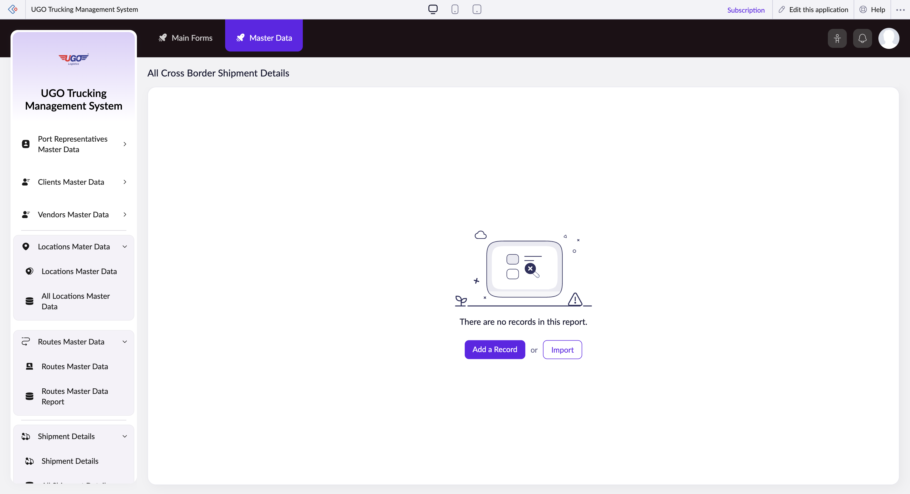

# All Cross Border Shipment Details

This page lets you view and manage detailed information about cross-border shipments in the U-Go system. Operations staff use it to track trailer types, goods descriptions, vehicle assignments, and driver information for shipments crossing international borders. You'll use this when setting up new cross-border routes or updating existing shipment details.

**URL:** `https://creatorapp.zoho.com/m.fahmy_ugologistics/u-go-trucking-management-system#Report:All_Cross_Border_Shipment_Details`

## How to Use

1. Select your preferred language from the lang-select-dropdown at the top of the page.
2. Check the checkbox next to each shipment detail category you want to filter or edit (Trailer Type, Goods Description, Truck Source, etc.).
3. Use the search fields that appear after checking a box to find specific values—type directly in the text field or use the dropdown to select from available options.
4. Set the volume range if you need to filter shipments by cargo size.
5. Review all assigned details (Vehicle, Trailer, Driver, and Sub-Contracted Vehicle information) to ensure accuracy.
6. Click Add a Record if you need to enter a new cross-border shipment, or click Submit Request when your changes are complete.
7. Use Remove Changes if you need to discard edits, or Done to save and exit the page.

## Page Sections

- All Cross Border Shipment Details

## Form Fields

| Field | Description | Type | Required |
|-------|-------------|------|----------|
| lang-select-dropdown | Choose the language for the form display. Select your preferred language to view all labels and instructions. | dropdown | No |
| volume | Set a range to filter shipments by cargo volume. Use this to find shipments within a specific size range. | range | No |
| checkbox-Cross_Border_Trailer_Type-ZC_ICAQSD |  | checkbox | No |
| checkbox-Cross_Border_Goods_Description-ZC_ICAQSD |  | checkbox | No |
| checkbox-Cross_Border_Truck_Source-ZC_ICAQSD |  | checkbox | No |
| checkbox-Cross_Border_Assigned_Vehicle-ZC_ICAQSD |  | checkbox | No |
| checkbox-Cross_Border_Assigned_Trailer-ZC_ICAQSD |  | checkbox | No |
| checkbox-Cross_Border_Assigned_Driver-ZC_ICAQSD |  | checkbox | No |
| checkbox-Cross_Border_Sub_Contracted_Vehicle-ZC_ICAQSD |  | checkbox | No |
| checkbox-Cross_Border_Subcontracted_Driver-ZC_ICAQSD |  | checkbox | No |
| checkbox-Cross_Border_Driver_Cash_Advance-ZC_ICAQSD |  | checkbox | No |
| From |  | text | No |
| To |  | text | No |
| checkbox-Cross_Border_Cash_Advance_Currency-ZC_ICAQSD |  | checkbox | No |
| checkbox-Cross_Border_Cash_Advance_Paid_by-ZC_ICAQSD |  | checkbox | No |
| checkbox-Cross_Border_Shipment_Notes-ZC_ICAQSD |  | checkbox | No |
| checkbox-Job_Order-ZC_ICAQSD |  | checkbox | No |
| checkbox-Destination_Type-ZC_ICAQSD |  | checkbox | No |
| checkbox-Buy_Rate_of_Subcontracted_Vehicle-ZC_ICAQSD |  | checkbox | No |
| From |  | text | No |
| To |  | text | No |

## Actions

- **Done**
- **Main Forms**
- **Master Data**
- **Remove Changes**
- **Add a Record**
- **Import**
- **Submit Request**

## Tips

- Always verify that all four assignment fields (Vehicle, Trailer, Driver, and Sub-Contracted Vehicle) are filled correctly before submitting—incomplete assignments will cause delays at the border.
- Use the search fields to quickly locate existing records instead of manually scrolling; typing even partial information will filter results and save time.

## Related Pages

- [Shipment Details](shipment-details.md)
- [All Shipment Details](all-shipment-details.md)
- [Domestic Shipment Details](domestic-shipment-details.md)
- [All Domestic Shipment Details](all-domestic-shipment-details.md)
- [Subcontractor Shipment Details](subcontractor-shipment-details.md)
- [All Subcontractor Shipment Details](all-subcontractor-shipment-details.md)
- [Cross Border Shipment Details](cross-border-shipment-details.md)

## Common Workflows

_Add step-by-step workflows specific to your organisation here._
