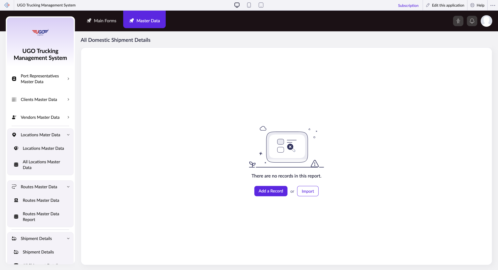

# All Domestic Shipment Details

This page lets you view, filter, and manage details for all domestic shipments in the U-Go system. Operations staff use it to search for specific shipments, update shipment information, and organize shipment records by various criteria like weight, vehicle assignment, and driver assignment.

**URL:** `https://creatorapp.zoho.com/m.fahmy_ugologistics/u-go-trucking-management-system#Report:All_Domestic_Shipment_Details`

## How to Use

1. Select your preferred language from the Language dropdown at the top if needed.
2. Use the checkboxes next to each field (Shipment Type, Goods Description, Total Weight, Truck Source, Assigned Vehicle, Assigned Trailer, Assigned Driver) to enable filtering or editing for those fields.
3. For any checked field, enter search terms in the text box or use the dropdown to select from available options.
4. Use the Volume range slider to narrow results by shipment size if needed.
5. Click Submit Request to apply your filters and search for matching shipments.
6. Review the results, then click Done to close the page or use Add a Record to create a new shipment entry.

## Page Sections

- All Domestic Shipment Details

## Form Fields

| Field | Description | Type | Required |
|-------|-------------|------|----------|
| lang-select-dropdown |  | dropdown | No |
| checkbox-Domestic_Shipment_Type-ZC_Q398B7 |  | checkbox | No |
| checkbox-Domestic_Goods_Description-ZC_Q398B7 |  | checkbox | No |
| checkbox-Domestic_Total_Weight-ZC_Q398B7 |  | checkbox | No |
| checkbox-Domestic_Truck_Source-ZC_Q398B7 |  | checkbox | No |
| checkbox-Domestic_Assigned_Vehicle-ZC_Q398B7 |  | checkbox | No |
| checkbox-Domestic_Assigned_Trailer-ZC_Q398B7 |  | checkbox | No |
| checkbox-Domestic_Assigned_Driver-ZC_Q398B7 |  | checkbox | No |
| checkbox-Domestic_Subcontracted_Vehicle-ZC_Q398B7 |  | checkbox | No |
| checkbox-Domestic_Subcontracted_Driver-ZC_Q398B7 |  | checkbox | No |
| checkbox-Domestic_Driver_Advance_Amount-ZC_Q398B7 |  | checkbox | No |
| checkbox-Job_Order-ZC_Q398B7 |  | checkbox | No |
| checkbox-Destination_Type-ZC_Q398B7 |  | checkbox | No |
| checkbox-Buy_Rate_of_Subcontracted_Vehicle-ZC_Q398B7 |  | checkbox | No |

## Actions

- **Done**
- **Main Forms**
- **Master Data**
- **Remove Changes**
- **Add a Record**
- **Import**
- **Submit Request**

## Tips

- You can filter by multiple fields at once—just check the boxes for the fields you want to use. This helps narrow down results quickly when searching through many shipments.
- Always click Submit Request after making your selections; simply checking boxes or entering text does not filter results until you submit.

## Related Pages

- [Shipment Details](shipment-details.md)
- [All Shipment Details](all-shipment-details.md)
- [Domestic Shipment Details](domestic-shipment-details.md)
- [Subcontractor Shipment Details](subcontractor-shipment-details.md)
- [All Subcontractor Shipment Details](all-subcontractor-shipment-details.md)
- [Cross Border Shipment Details](cross-border-shipment-details.md)
- [All Cross Border Shipment Details](all-cross-border-shipment-details.md)

## Common Workflows

_Add step-by-step workflows specific to your organisation here._
