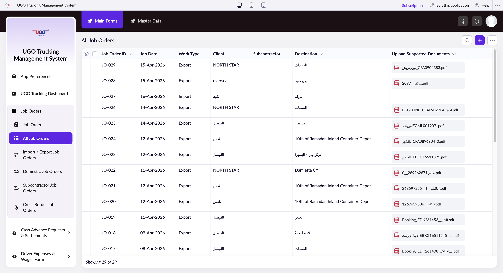

# All Job Orders

The All Job Orders page displays a list of all active and completed job orders in your U-Go Trucking system. Operations staff use this page to view, manage, and take action on trucking jobs assigned to your fleet. You'll access this page daily to monitor job status, assign work, and handle bulk updates across multiple orders.

**URL:** `https://creatorapp.zoho.com/m.fahmy_ugologistics/u-go-trucking-management-system#Report:All_Job_Orders`

## How to Use

1. Open the All Job Orders page from the main menu to see your complete job list with Job Order ID, Job Date, Work Type, Client, Subcontractor, Destination, and document status.
2. Use the Language dropdown at the top if you need to view the page in a different language.
3. Select individual job orders by checking the checkboxes next to each row, or check the main checkbox at the top to select all visible jobs.
4. Click Bulk Edit to make changes to multiple selected orders at once (for example, reassigning a subcontractor or updating job status).
5. Click the specific Job Order ID to open that order's full details for viewing or editing individual job information.
6. Use Print, Export, or Import buttons to generate reports, share data with other systems, or bring in new job data from external sources.
7. Click Delete to remove selected orders or Submit Request to process pending job requests through your workflow.

## Page Sections

- All Job Orders

## Form Fields

| Field | Description | Type | Required |
|-------|-------------|------|----------|
| lang-select-dropdown | Select your preferred language for viewing this page and its contents. Changes apply immediately. | dropdown | No |
| Checkbox |  | checkbox | No |
| Checkbox |  | checkbox | No |
| wrapColsInputEl |  | checkbox | No |
| show-hide-col-all |  | checkbox | No |
| s2id_autogen22 |  | text | No |
| s2id_autogen22_search |  | text | No |
| s2id_autogen24 |  | text | No |
| s2id_autogen24_search |  | text | No |
| From |  | text | No |
| To |  | text | No |
| s2id_autogen26 |  | text | No |
| s2id_autogen26_search |  | text | No |
| s2id_autogen28 |  | text | No |
| s2id_autogen28_search |  | text | No |
| s2id_autogen30 |  | text | No |
| s2id_autogen30_search |  | text | No |
| s2id_autogen32 |  | text | No |
| s2id_autogen32_search |  | text | No |
| s2id_autogen34 |  | text | No |
| s2id_autogen34_search |  | text | No |
| From |  | text | No |
| To |  | text | No |
| From |  | text | No |
| To |  | text | No |
| From |  | text | No |
| To |  | text | No |
| From |  | text | No |
| To |  | text | No |
| From |  | text | No |
| To |  | text | No |
| From |  | text | No |
| To |  | text | No |
| Search... |  | text | No |

## Table Columns

- Job Order ID
- Job Date
- Work Type
- Client
- Subcontractor
- Destination
- Upload Supported Documents

## Actions

- **Done**
- **Main Forms**
- **Master Data**
- **Remove Changes**
- **Show as**
- **Print**
- **Import**
- **Export**
- **Bulk Edit**
- **Duplicate**
- **Delete**
- **AddAdd (Option + Shift + N)**
- **Submit Request**

## Tips

- The numbered checkboxes correspond to individual job orders. Use these to select specific jobs for bulk actions rather than selecting all orders on the page.
- Always verify the Subcontractor field is populated before submitting a job request—unassigned jobs cannot enter the active workflow. Use Bulk Edit to assign multiple jobs to the same subcontractor quickly.

## Related Pages

- [Job Orders](job-orders.md)
- [Import / Export Job Orders](import-export-job-orders.md)
- [Domestic Job Orders](domestic-job-orders.md)
- [Subcontractor Job Orders](subcontractor-job-orders.md)
- [Cross Border Job Orders](cross-border-job-orders.md)

## Common Workflows

_Add step-by-step workflows specific to your organisation here._
