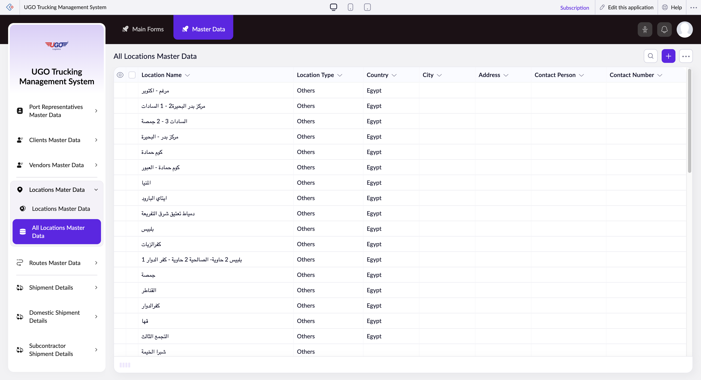

# All Locations Master Data

The All Locations Master Data page lets you view, manage, and organize all your company's warehouse, depot, and distribution locations in one place. Operations staff use this page to set up new locations, update existing facility information, and control which locations are active for shipments and operations. You'll use this when onboarding new facilities, updating contact details, or managing location access permissions.

**URL:** `https://creatorapp.zoho.com/m.fahmy_ugologistics/u-go-trucking-management-system#Report:All_Locations_Master_Data`

## How to Use

1. Open the All Locations Master Data page from the Master Data menu
2. Review the table to find the location you need to work with, or use filters to narrow results by location type or country
3. To add a new location, click the Add button (Option + Shift + N) and fill in the location name, type, country, city, address, and contact details
4. To edit an existing location, click the location row to open its details and update any necessary information
5. Select the appropriate permission checkboxes if you need to restrict location access or control which teams can use this facility
6. Click Done to save your changes, or use Submit Request if your company requires approval for location changes
7. Use Export to download your locations list, or Import to add multiple locations at once from a file

## Page Sections

- All Locations Master Data

## Form Fields

| Field | Description | Type | Required |
|-------|-------------|------|----------|
| lang-select-dropdown | Choose your preferred language for viewing and working with this location's data. This applies only to your current session. | dropdown | No |
| Checkbox |  | checkbox | No |
| 4780709000000801143_checkbox |  | checkbox | No |
| 4780709000000768183_checkbox |  | checkbox | No |
| 4780709000000768021_checkbox |  | checkbox | No |
| 4780709000000768009_checkbox |  | checkbox | No |
| 4780709000000732031_checkbox |  | checkbox | No |
| 4780709000000732027_checkbox |  | checkbox | No |
| 4780709000000720077_checkbox |  | checkbox | No |
| 4780709000000720073_checkbox |  | checkbox | No |
| 4780709000000703189_checkbox |  | checkbox | No |
| 4780709000000640103_checkbox |  | checkbox | No |
| 4780709000000640099_checkbox |  | checkbox | No |
| 4780709000000620045_checkbox |  | checkbox | No |
| 4780709000000620027_checkbox |  | checkbox | No |
| 4780709000000608189_checkbox |  | checkbox | No |
| 4780709000000608185_checkbox |  | checkbox | No |
| 4780709000000608181_checkbox |  | checkbox | No |
| 4780709000000608177_checkbox |  | checkbox | No |
| 4780709000000549003_checkbox |  | checkbox | No |
| 4780709000000547003_checkbox |  | checkbox | No |
| 4780709000000532144_checkbox |  | checkbox | No |
| 4780709000000528061_checkbox |  | checkbox | No |
| 4780709000000528053_checkbox |  | checkbox | No |
| 4780709000000507103_checkbox |  | checkbox | No |
| 4780709000000494003_checkbox |  | checkbox | No |
| 4780709000000475161_checkbox |  | checkbox | No |
| 4780709000000456127_checkbox |  | checkbox | No |
| 4780709000000456123_checkbox |  | checkbox | No |
| 4780709000000456119_checkbox |  | checkbox | No |
| 4780709000000456115_checkbox |  | checkbox | No |
| 4780709000000456111_checkbox |  | checkbox | No |
| 4780709000000456107_checkbox |  | checkbox | No |
| 4780709000000456103_checkbox |  | checkbox | No |
| 4780709000000456099_checkbox |  | checkbox | No |
| 4780709000000456095_checkbox |  | checkbox | No |
| 4780709000000456091_checkbox |  | checkbox | No |
| 4780709000000456087_checkbox |  | checkbox | No |
| 4780709000000456083_checkbox |  | checkbox | No |
| 4780709000000456079_checkbox |  | checkbox | No |
| 4780709000000456075_checkbox |  | checkbox | No |
| 4780709000000456071_checkbox |  | checkbox | No |
| 4780709000000456067_checkbox |  | checkbox | No |
| 4780709000000456063_checkbox |  | checkbox | No |
| 4780709000000456059_checkbox |  | checkbox | No |
| 4780709000000456055_checkbox |  | checkbox | No |
| 4780709000000456025_checkbox |  | checkbox | No |
| 4780709000000456015_checkbox |  | checkbox | No |
| 4780709000000456011_checkbox |  | checkbox | No |
| 4780709000000439043_checkbox |  | checkbox | No |
| 4780709000000439039_checkbox |  | checkbox | No |
| 4780709000000439035_checkbox |  | checkbox | No |
| Checkbox |  | checkbox | No |
| wrapColsInputEl |  | checkbox | No |
| show-hide-col-all |  | checkbox | No |
| viewdel |  | checkbox | No |
| viewdel |  | checkbox | No |
| viewdel |  | checkbox | No |
| viewdel |  | checkbox | No |
| viewdel |  | checkbox | No |
| viewdel |  | checkbox | No |
| viewdel |  | checkbox | No |
| volume |  | range | No |
| checkbox-Location_Name-ZC_BBQ5WT |  | checkbox | No |
| s2id_autogen4 |  | text | No |
| s2id_autogen4_search |  | text | No |
| zc_searchSelect |  | dropdown | No |
| checkbox-Location_Type-ZC_BBQ5WT |  | checkbox | No |
| s2id_autogen6 |  | text | No |
| s2id_autogen6_search |  | text | No |
| zc_searchSelect |  | dropdown | No |
| checkbox-Country-ZC_BBQ5WT |  | checkbox | No |
| s2id_autogen8 |  | text | No |
| s2id_autogen8_search |  | text | No |
| zc_searchSelect |  | dropdown | No |
| checkbox-City-ZC_BBQ5WT |  | checkbox | No |
| s2id_autogen10 |  | text | No |
| s2id_autogen10_search |  | text | No |
| zc_searchSelect |  | dropdown | No |
| checkbox-Address-ZC_BBQ5WT |  | checkbox | No |
| s2id_autogen12 |  | text | No |
| s2id_autogen12_search |  | text | No |
| zc_searchSelect |  | dropdown | No |
| checkbox-Contact_Person-ZC_BBQ5WT |  | checkbox | No |
| s2id_autogen14 |  | text | No |
| s2id_autogen14_search |  | text | No |
| zc_searchSelect |  | dropdown | No |
| checkbox-Contact_Number-ZC_BBQ5WT |  | checkbox | No |
| s2id_autogen16 |  | text | No |
| s2id_autogen16_search |  | text | No |
| zc_searchSelect |  | dropdown | No |
| checkbox-Notes-ZC_BBQ5WT |  | checkbox | No |
| s2id_autogen18 |  | text | No |
| s2id_autogen18_search |  | text | No |
| zc_searchSelect |  | dropdown | No |
| allowlocation |  | button | No |
| useIconSwitch |  | checkbox | No |
| toggleIconSwitch |  | checkbox | No |
| saveIcons |  | button | No |
| resetIcons |  | button | No |
| Search... |  | text | No |
| I have read the above conditions. |  | checkbox | No |
| reqEmailId |  | text | No |
| s2id_autogen2 |  | text | No |
| s2id_autogen2_search |  | text | No |
| supportType |  | dropdown | No |
| Please enable edit permission to help with troubleshooting |  | checkbox | No |
| reachusChatDescription |  | textarea | No |
| reachUsStartChat |  | button | No |
| zc-reachus-editaccess-enable-button |  | button | No |
| zc-reachus-editaccess-revoke-button |  | button | No |
| zc-reachus-screenrecord-button |  | button | No |

## Table Columns

- Location Name
- Location Type
- Country
- City
- Address
- Contact Person
- Contact Number

## Actions

- **Done**
- **Main Forms**
- **Master Data**
- **Remove Changes**
- **Show as**
- **Print**
- **Import**
- **Export**
- **Bulk Edit**
- **Duplicate**
- **Delete**
- **AddAdd (Option + Shift + N)**
- **Submit Request**

## Tips

- The numbered checkboxes control which teams or departments can access and use each location—check with your supervisor about which boxes to enable for new facilities to avoid restricting shipments by mistake.
- Before deleting a location, make sure no active shipments or standing orders are assigned to it. Use the Bulk Edit feature to reassign multiple shipments at once if you need to deactivate a facility.

## Related Pages

- [Port Representatives Master Data Report](port-representatives-master-data-report.md)
- [Clients Master Data Report](clients-master-data-report.md)
- [Vendors Master Data Report](vendors-master-data-report.md)
- [Routes Master Data](routes-master-data.md)
- [Routes Master Data Report](routes-master-data-report.md)
- [Driver Trip Allowances Master Data](driver-trip-allowances-master-data.md)
- [Driver Trip Allowances Master Data Report](driver-trip-allowances-master-data-report.md)

## Common Workflows

_Add step-by-step workflows specific to your organisation here._
