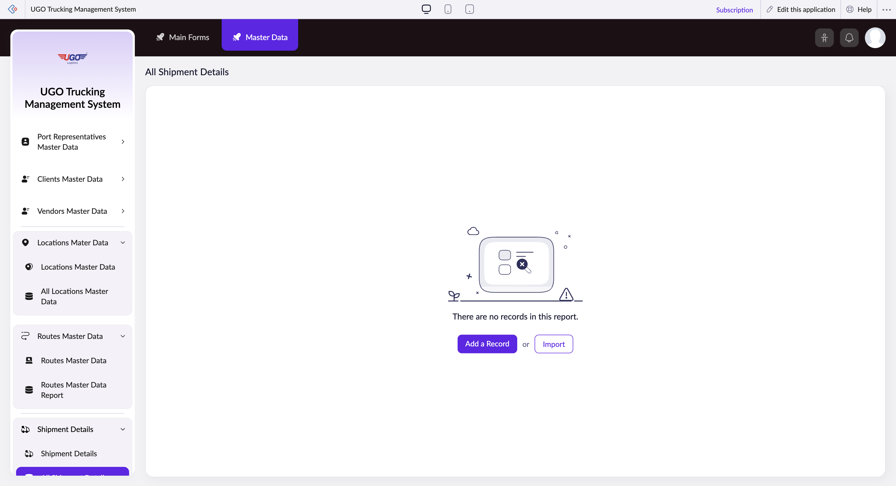

# All Shipment Details

The All Shipment Details page lets you search, filter, and manage shipment records in the U-Go Trucking system. Operations staff use this page to locate specific shipments, update shipment information, and organize shipments by job order, container, goods type, vehicle, or driver assignment. Access this page when you need to find a shipment to modify, check assignment status, or prepare shipments for dispatch.

**URL:** `https://creatorapp.zoho.com/m.fahmy_ugologistics/u-go-trucking-management-system#Report:All_Shipment_Details`

## How to Use

1. Open the All Shipment Details page from the Shipments section.
2. Use the Language Selector dropdown at the top if you need to change the interface language.
3. Enter a Volume range (optional) if you want to filter shipments by cargo size.
4. Check the checkbox next to any shipment field (Job Order, Container No, Goods Description, Truck Source, Assigned Vehicle, Assigned Driver, or Container Assigned) to enable filtering by that field.
5. Type or search for the value you want to filter by in the text and search boxes that appear after checking a checkbox.
6. Click Submit Request to apply your filters and display matching shipments.
7. Click Done to save your work or Main Forms to return to the main menu.

## Page Sections

- All Shipment Details

## Form Fields

| Field | Description | Type | Required |
|-------|-------------|------|----------|
| lang-select-dropdown | Choose your preferred language for the system interface. This is optional and only affects display language, not the data you enter. | dropdown | No |
| volume | Set a minimum and maximum cargo volume range to find shipments within a specific size. Leave blank if you do not want to filter by volume. | range | No |
| checkbox-Job_Order-ZC_ALCCSB | Check this box to filter shipments by Job Order number. Use this when you want to see all shipments linked to a specific job. | checkbox | No |
| s2id_autogen94 |  | text | No |
| s2id_autogen94_search |  | text | No |
| zc_searchSelect |  | dropdown | No |
| checkbox-Container_No-ZC_ALCCSB | Check this box to filter shipments by Container Number. Use this to locate all shipments in a particular container. | checkbox | No |
| s2id_autogen96 |  | text | No |
| s2id_autogen96_search |  | text | No |
| zc_searchSelect |  | dropdown | No |
| checkbox-Goods_Description-ZC_ALCCSB | Check this box to filter shipments by the type or description of cargo. Use this to find all shipments carrying specific goods. | checkbox | No |
| s2id_autogen98 |  | text | No |
| s2id_autogen98_search |  | text | No |
| zc_searchSelect |  | dropdown | No |
| checkbox-Truck_Source-ZC_ALCCSB | Check this box to filter shipments by Truck Source (the origin or supplier of the truck). Use this to organize shipments by their source. | checkbox | No |
| s2id_autogen100 |  | text | No |
| s2id_autogen100_search |  | text | No |
| zc_searchSelect |  | dropdown | No |
| checkbox-Assigned_Vehicle-ZC_ALCCSB | Check this box to filter shipments by the vehicle assigned to haul them. Use this to see all loads assigned to a specific truck. | checkbox | No |
| s2id_autogen102 |  | text | No |
| s2id_autogen102_search |  | text | No |
| zc_searchSelect |  | dropdown | No |
| checkbox-Assigned_Driver-ZC_ALCCSB | Check this box to filter shipments by the driver assigned. Use this to find all shipments under a particular driver's responsibility. | checkbox | No |
| s2id_autogen104 |  | text | No |
| s2id_autogen104_search |  | text | No |
| zc_searchSelect |  | dropdown | No |
| checkbox-Container_Assigned-ZC_ALCCSB | Check this box to filter shipments by assigned container. Use this to verify which shipments are in a container and manage container utilization. | checkbox | No |
| s2id_autogen106 |  | text | No |
| s2id_autogen106_search |  | text | No |
| zc_searchSelect |  | dropdown | No |
| checkbox-Container_Type_Size-ZC_ALCCSB |  | checkbox | No |
| s2id_autogen108 |  | text | No |
| s2id_autogen108_search |  | text | No |
| zc_searchSelect |  | dropdown | No |
| checkbox-Seal_No-ZC_ALCCSB |  | checkbox | No |
| s2id_autogen110 |  | text | No |
| s2id_autogen110_search |  | text | No |
| zc_searchSelect |  | dropdown | No |
| checkbox-Shipment_Type-ZC_ALCCSB |  | checkbox | No |
| s2id_autogen112 |  | text | No |
| s2id_autogen112_search |  | text | No |
| zc_searchSelect |  | dropdown | No |
| checkbox-Weight_tons-ZC_ALCCSB |  | checkbox | No |
| s2id_autogen114 |  | text | No |
| s2id_autogen114_search |  | text | No |
| zc_searchSelect |  | dropdown | No |
| From |  | text | No |
| To |  | text | No |
| checkbox-Subcontractor_Vehicle_Number-ZC_ALCCSB |  | checkbox | No |
| s2id_autogen116 |  | text | No |
| s2id_autogen116_search |  | text | No |
| zc_searchSelect |  | dropdown | No |
| checkbox-Subcontractor_Driver_Name_Contact-ZC_ALCCSB |  | checkbox | No |
| s2id_autogen118 |  | text | No |
| s2id_autogen118_search |  | text | No |
| zc_searchSelect |  | dropdown | No |
| checkbox-Driver_Cash_In_Advance-ZC_ALCCSB |  | checkbox | No |
| s2id_autogen120 |  | text | No |
| s2id_autogen120_search |  | text | No |
| zc_searchSelect |  | dropdown | No |
| From |  | text | No |
| To |  | text | No |
| checkbox-Currency-ZC_ALCCSB |  | checkbox | No |
| s2id_autogen122 |  | text | No |
| s2id_autogen122_search |  | text | No |
| zc_searchSelect |  | dropdown | No |
| checkbox-Paid_By-ZC_ALCCSB |  | checkbox | No |
| s2id_autogen124 |  | text | No |
| s2id_autogen124_search |  | text | No |
| zc_searchSelect |  | dropdown | No |
| checkbox-Assigned_Trailer-ZC_ALCCSB |  | checkbox | No |
| s2id_autogen126 |  | text | No |
| s2id_autogen126_search |  | text | No |
| zc_searchSelect |  | dropdown | No |
| checkbox-Buy_Rate_of_Subcontracted_Vehicle-ZC_ALCCSB |  | checkbox | No |
| s2id_autogen128 |  | text | No |
| s2id_autogen128_search |  | text | No |
| zc_searchSelect |  | dropdown | No |
| From |  | text | No |
| To |  | text | No |
| allowlocation |  | button | No |
| useIconSwitch |  | checkbox | No |
| toggleIconSwitch |  | checkbox | No |
| saveIcons |  | button | No |
| resetIcons |  | button | No |
| Search... |  | text | No |
| I have read the above conditions. |  | checkbox | No |
| reqEmailId |  | text | No |
| s2id_autogen2 |  | text | No |
| s2id_autogen2_search |  | text | No |
| supportType |  | dropdown | No |
| Please enable edit permission to help with troubleshooting |  | checkbox | No |
| reachusChatDescription |  | textarea | No |
| reachUsStartChat |  | button | No |
| zc-reachus-editaccess-enable-button |  | button | No |
| zc-reachus-editaccess-revoke-button |  | button | No |
| zc-reachus-screenrecord-button |  | button | No |

## Actions

- **Done**
- **Main Forms**
- **Master Data**
- **Remove Changes**
- **Add a Record**
- **Import**
- **Submit Request**

## Tips

- You can check multiple filter checkboxes at once to narrow your search. For example, filter by both Assigned Vehicle and Assigned Driver to find all loads for a specific truck-driver pair.
- After checking a checkbox, both a text field and a dropdown will appear. Use the text field to type or search if you know the exact value, or click the dropdown to browse available options. This reduces errors from typos.

## Related Pages

- [Shipment Details](shipment-details.md)
- [Domestic Shipment Details](domestic-shipment-details.md)
- [All Domestic Shipment Details](all-domestic-shipment-details.md)
- [Subcontractor Shipment Details](subcontractor-shipment-details.md)
- [All Subcontractor Shipment Details](all-subcontractor-shipment-details.md)
- [Cross Border Shipment Details](cross-border-shipment-details.md)
- [All Cross Border Shipment Details](all-cross-border-shipment-details.md)

## Common Workflows

_Add step-by-step workflows specific to your organisation here._
