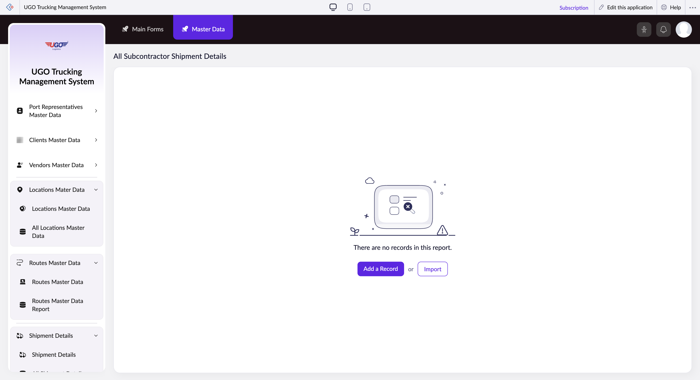

# All Subcontractor Shipment Details

**URL:** `https://creatorapp.zoho.com/m.fahmy_ugologistics/u-go-trucking-management-system#Report:All_Subcontractor_Shipment_Details`

## Page Sections

- All Subcontractor Shipment Details

## Form Fields

| Field | Type | Required |
|-------|------|----------|
| lang-select-dropdown | dropdown | No |
| volume | range | No |
| checkbox-Subcontractor_Shipment_Type-ZC_EWATT0 | checkbox | No |
| s2id_autogen182 | text | No |
| s2id_autogen182_search | text | No |
| zc_searchSelect | dropdown | No |
| checkbox-Subcontractor_Goods_Description-ZC_EWATT0 | checkbox | No |
| s2id_autogen184 | text | No |
| s2id_autogen184_search | text | No |
| zc_searchSelect | dropdown | No |
| checkbox-Subcontractor_Total_Weight-ZC_EWATT0 | checkbox | No |
| s2id_autogen186 | text | No |
| s2id_autogen186_search | text | No |
| zc_searchSelect | dropdown | No |
| checkbox-Subcontractor_Assigned_Vehicle-ZC_EWATT0 | checkbox | No |
| s2id_autogen188 | text | No |
| s2id_autogen188_search | text | No |
| zc_searchSelect | dropdown | No |
| checkbox-Subcontractor_Assigned_Trailer-ZC_EWATT0 | checkbox | No |
| s2id_autogen190 | text | No |
| s2id_autogen190_search | text | No |
| zc_searchSelect | dropdown | No |
| checkbox-Subcontractor_Assigned_Driver-ZC_EWATT0 | checkbox | No |
| s2id_autogen192 | text | No |
| s2id_autogen192_search | text | No |
| zc_searchSelect | dropdown | No |
| checkbox-Subcontractor_Driver_Cash_Advance-ZC_EWATT0 | checkbox | No |
| s2id_autogen194 | text | No |
| s2id_autogen194_search | text | No |
| zc_searchSelect | dropdown | No |
| From | text | No |
| To | text | No |
| checkbox-Subcontractor_Cash_Advance_Paid_by-ZC_EWATT0 | checkbox | No |
| s2id_autogen196 | text | No |
| s2id_autogen196_search | text | No |
| zc_searchSelect | dropdown | No |
| checkbox-Subcontractor_Shipment_Notes-ZC_EWATT0 | checkbox | No |
| s2id_autogen198 | text | No |
| s2id_autogen198_search | text | No |
| zc_searchSelect | dropdown | No |
| checkbox-Job_Order-ZC_EWATT0 | checkbox | No |
| s2id_autogen200 | text | No |
| s2id_autogen200_search | text | No |
| zc_searchSelect | dropdown | No |
| checkbox-Destination_Type-ZC_EWATT0 | checkbox | No |
| s2id_autogen202 | text | No |
| s2id_autogen202_search | text | No |
| zc_searchSelect | dropdown | No |
| allowlocation | button | No |
| useIconSwitch | checkbox | No |
| toggleIconSwitch | checkbox | No |
| saveIcons | button | No |
| resetIcons | button | No |
| Search... | text | No |
| I have read the above conditions. | checkbox | No |
| reqEmailId | text | No |
| s2id_autogen2 | text | No |
| s2id_autogen2_search | text | No |
| supportType | dropdown | No |
| Please enable edit permission to help with troubleshooting | checkbox | No |
| reachusChatDescription | textarea | No |
| reachUsStartChat | button | No |
| zc-reachus-editaccess-enable-button | button | No |
| zc-reachus-editaccess-revoke-button | button | No |
| zc-reachus-screenrecord-button | button | No |

## Actions

- **Done**
- **Main Forms**
- **Master Data**
- **Remove Changes**
- **Add a Record**
- **Import**
- **Submit Request**

## Common Workflows

_Document step-by-step workflows for this page here._
