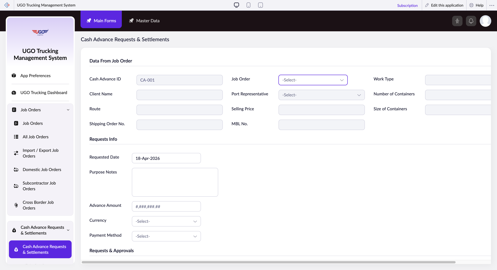

# Cash Advance Requests & Settlements

**URL:** `https://creatorapp.zoho.com/m.fahmy_ugologistics/u-go-trucking-management-system#Form:Cash_Advance_Requests_Settlements`

## Page Sections

- Data From Job Order
- Requests Info
- Requests & Approvals
- Summary
- Finance Audit

## Form Fields

| Field | Type | Required |
|-------|------|----------|
| lang-select-dropdown | dropdown | No |
| Cash Advance ID | text | No |
| Client Name | text | No |
| Route | text | No |
| Shipping Order No. | text | No |
| Port Representative | text | No |
| zc-sel2-foc-Job_Order | text | No |
| zc-sel2-inp-Job_Order | text | No |
| Job_Order | text | No |
| zc-sel2-foc-Port_Representative | text | No |
| zc-sel2-inp-Port_Representative | text | No |
| Port_Representative | text | No |
| Selling Price | text | No |
| MBL No. | text | No |
| Work Type | text | No |
| Number of Containers | text | No |
| Size of Containers | text | No |
| Requested_Date | text | No |
| Purpose Notes | textarea | No |
| Advance Amount | text | No |
| zc-sel2-foc-Currency | text | No |
| zc-sel2-inp-Currency | text | No |
| Currency | text | No |
| zc-sel2-foc-Payment_Method | text | No |
| zc-sel2-inp-Payment_Method | text | No |
| Payment_Method | text | No |
| Requested By | text | No |
| zc-sel2-foc-Approved_By | text | No |
| zc-sel2-inp-Approved_By | text | No |
| Approved_By | text | No |
| Payment_Date | text | No |
| zc-sel2-foc-Status | text | No |
| zc-sel2-inp-Status | text | No |
| Status | text | No |
| Approved Amount | text | No |
| Total Expenses | text | No |
| Balance | text | No |
| zc-sel2-foc-Settlement_Balance_Status | text | No |
| zc-sel2-inp-Settlement_Balance_Status | text | No |
| Settlement_Balance_Status | text | No |
| zc-sel2-foc-New_Settlement | text | No |
| zc-sel2-inp-New_Settlement | text | No |
| New_Settlement | text | No |
| zc-sel2-foc-Finance_Reviewed_By | text | No |
| zc-sel2-inp-Finance_Reviewed_By | text | No |
| Finance_Reviewed_By | text | No |
| zc-sel2-foc-Finance_Audit_Status | text | No |
| zc-sel2-inp-Finance_Audit_Status | text | No |
| Finance_Audit_Status | text | No |
| Finance_Review_Date | text | No |
| Finance Notes | textarea | No |
| submit | submit | No |
| reset | reset | No |
| searchmap | text | No |
| useIconSwitch | checkbox | No |
| toggleIconSwitch | checkbox | No |
| saveIcons | button | No |
| resetIcons | button | No |
| Search... | text | No |
| I have read the above conditions. | checkbox | No |
| reqEmailId | text | No |
| s2id_autogen2 | text | No |
| s2id_autogen2_search | text | No |
| supportType | dropdown | No |
| Please enable edit permission to help with troubleshooting | checkbox | No |
| reachusChatDescription | textarea | No |
| reachUsStartChat | button | No |
| zc-reachus-editaccess-enable-button | button | No |
| zc-reachus-editaccess-revoke-button | button | No |
| zc-reachus-screenrecord-button | button | No |

## Actions

- **Done**
- **Main Forms**
- **Master Data**
- **Expand**
- **Add New**
- **Submit**
- **Submit Request**

## Common Workflows

_Document step-by-step workflows for this page here._
