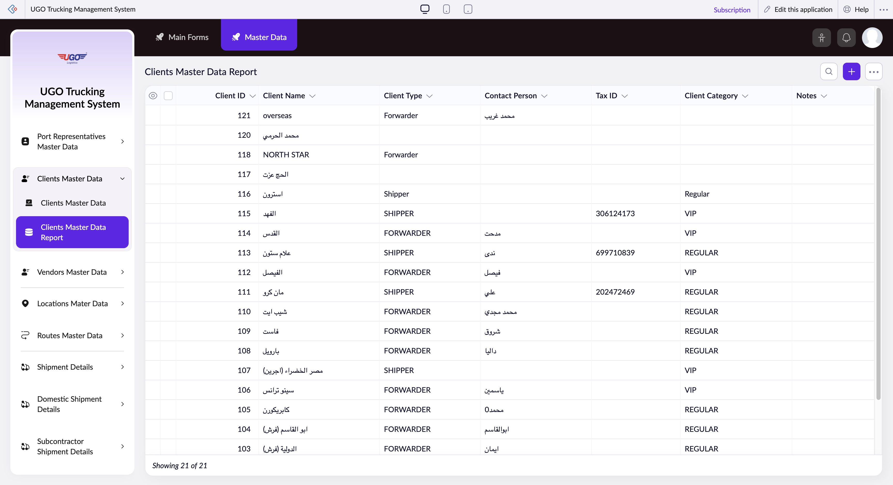

# Clients Master Data Report

The Clients Master Data Report displays all your company's client accounts with key information like contact details, tax IDs, and classification. Use this page to view, update, or manage client records during daily operations and when onboarding new customers.

**URL:** `https://creatorapp.zoho.com/m.fahmy_ugologistics/u-go-trucking-management-system#Report:Clients_Master_Data_Report`

## How to Use

1. Open the Clients Master Data Report from the Master Data menu.
2. Use the Language dropdown if you need to view the report in a different language.
3. Review the table to find the client you need. Use sorting or filtering if the list is long.
4. Click on a client row to open their full record for viewing or editing details.
5. To make changes to multiple clients at once, check the boxes next to their names and select Bulk Edit.
6. When finished making updates, click Submit Request to save all changes to the system.
7. Use Export to download the client list for external reports or Import to add new clients in bulk.

## Page Sections

- Clients Master Data Report

## Form Fields

| Field | Description | Type | Required |
|-------|-------------|------|----------|
| lang-select-dropdown | Choose the language for viewing all labels and text on this report. Select your preferred language from the list. | dropdown | No |
| Checkbox |  | checkbox | No |
| Checkbox |  | checkbox | No |
| wrapColsInputEl |  | checkbox | No |
| show-hide-col-all |  | checkbox | No |
| s2id_autogen4_search |  | text | No |
| From |  | text | No |
| To |  | text | No |
| s2id_autogen6_search |  | text | No |
| s2id_autogen8_search |  | text | No |
| s2id_autogen10_search |  | text | No |
| s2id_autogen12_search |  | text | No |
| s2id_autogen14_search |  | text | No |
| s2id_autogen16_search |  | text | No |
| s2id_autogen18_search |  | text | No |
| s2id_autogen20_search |  | text | No |
| s2id_autogen22_search |  | text | No |
| s2id_autogen24_search |  | text | No |
| s2id_autogen26_search |  | text | No |
| s2id_autogen28_search |  | text | No |
| s2id_autogen30_search |  | text | No |
| s2id_autogen32_search |  | text | No |
| s2id_autogen34_search |  | text | No |
| s2id_autogen36_search |  | text | No |
| s2id_autogen38_search |  | text | No |
| allowlocation |  | button | No |
| useIconSwitch |  | checkbox | No |
| Search... |  | text | No |
| I have read the above conditions. |  | checkbox | No |
| reqEmailId |  | text | No |
| s2id_autogen2_search |  | text | No |
| supportType |  | dropdown | No |

## Table Columns

- Client ID
- Client Name
- Client Type
- Contact Person
- Tax ID
- Client Category
- Notes

## Actions

- **Done**
- **Main Forms**
- **Master Data**
- **Remove Changes**
- **Show as**
- **Print**
- **Import**
- **Export**
- **Bulk Edit**
- **Duplicate**
- **Delete**
- **AddAdd (Option + Shift + N)**
- **Submit Request**

## Tips

- Before deleting a client record, check that they have no active shipments or pending invoices. Use the Delete button only after confirming all transactions are closed.
- Use the Show as button to switch between list view and other display formats if the standard table view is difficult to read or navigate.

## Related Pages

- [Port Representatives Master Data Report](port-representatives-master-data-report.md)
- [Vendors Master Data Report](vendors-master-data-report.md)
- [All Locations Master Data](all-locations-master-data.md)
- [Routes Master Data](routes-master-data.md)
- [Routes Master Data Report](routes-master-data-report.md)
- [Driver Trip Allowances Master Data](driver-trip-allowances-master-data.md)
- [Driver Trip Allowances Master Data Report](driver-trip-allowances-master-data-report.md)

## Common Workflows

_Add step-by-step workflows specific to your organisation here._
