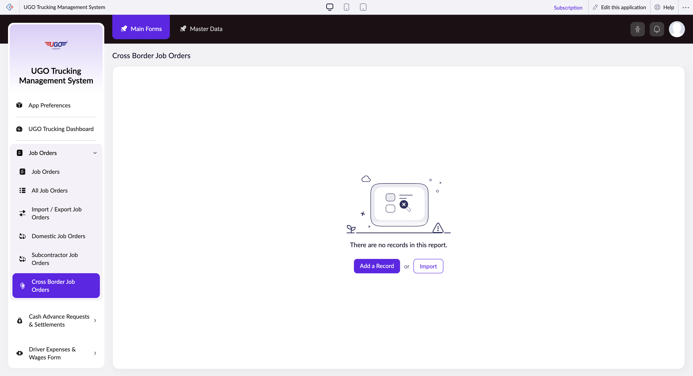

# Cross Border Job Orders

The Cross Border Job Orders page lets you create and manage trucking jobs that involve international shipments. Operations staff use this page to set up cross-border orders with specific cargo details, trailer types, and driver information. You'll typically use this when a new job requires customs clearance or involves movement across national borders.

**URL:** `https://creatorapp.zoho.com/m.fahmy_ugologistics/u-go-trucking-management-system#Report:Cross_Border_Job_Orders`

## How to Use

1. Click 'Add a Record' to start creating a new cross-border job order.
2. Select your language preference using the language dropdown if needed.
3. Fill in the job details: enter the job date range using the 'From' and 'To' date fields, and select the work type from the dropdown.
4. Enter cargo information by searching for and selecting the goods description and specifying the cargo volume in the range field.
5. Select the trailer type required for this shipment from the dropdown.
6. If the driver needs a cash advance, check that box and enter the amount, then select the advance type from the dropdown.
7. Click 'Submit Request' to save and send the job order for processing.

## Page Sections

- Cross Border Job Orders

## Form Fields

| Field | Description | Type | Required |
|-------|-------------|------|----------|
| lang-select-dropdown | Choose the language for this job order. Select your preferred language from the list. | dropdown | No |
| volume | Enter the cargo volume amount. Use the range slider to specify the quantity of goods being shipped. | range | No |
| checkbox-Job_Order-ZC_CWHAHJ |  | checkbox | No |
| s2id_autogen182 |  | text | No |
| s2id_autogen182_search |  | text | No |
| zc_searchSelect |  | dropdown | No |
| checkbox-Job_Order.Job_Date-ZC_CWHAHJ |  | checkbox | No |
| s2id_autogen184 |  | text | No |
| s2id_autogen184_search |  | text | No |
| zc_searchSelect |  | dropdown | No |
| viewSearchEl_Job_Order.Job_Date |  | text | No |
| From |  | text | No |
| To |  | text | No |
| checkbox-Job_Order.Work_Type-ZC_CWHAHJ |  | checkbox | No |
| s2id_autogen186 |  | text | No |
| s2id_autogen186_search |  | text | No |
| zc_searchSelect |  | dropdown | No |
| checkbox-Cross_Border_Goods_Description-ZC_CWHAHJ |  | checkbox | No |
| s2id_autogen188 |  | text | No |
| s2id_autogen188_search |  | text | No |
| zc_searchSelect |  | dropdown | No |
| checkbox-Cross_Border_Trailer_Type-ZC_CWHAHJ |  | checkbox | No |
| s2id_autogen190 |  | text | No |
| s2id_autogen190_search |  | text | No |
| zc_searchSelect |  | dropdown | No |
| checkbox-Cross_Border_Driver_Cash_Advance-ZC_CWHAHJ |  | checkbox | No |
| s2id_autogen192 |  | text | No |
| s2id_autogen192_search |  | text | No |
| zc_searchSelect |  | dropdown | No |
| From |  | text | No |
| To |  | text | No |
| checkbox-Cross_Border_Cash_Advance_Currency-ZC_CWHAHJ |  | checkbox | No |
| s2id_autogen194 |  | text | No |
| s2id_autogen194_search |  | text | No |
| zc_searchSelect |  | dropdown | No |
| checkbox-Cross_Border_Truck_Source-ZC_CWHAHJ |  | checkbox | No |
| s2id_autogen196 |  | text | No |
| s2id_autogen196_search |  | text | No |
| zc_searchSelect |  | dropdown | No |
| checkbox-Cross_Border_Assigned_Vehicle-ZC_CWHAHJ |  | checkbox | No |
| s2id_autogen198 |  | text | No |
| s2id_autogen198_search |  | text | No |
| zc_searchSelect |  | dropdown | No |
| checkbox-Cross_Border_Assigned_Trailer-ZC_CWHAHJ |  | checkbox | No |
| s2id_autogen200 |  | text | No |
| s2id_autogen200_search |  | text | No |
| zc_searchSelect |  | dropdown | No |
| checkbox-Cross_Border_Assigned_Driver-ZC_CWHAHJ |  | checkbox | No |
| s2id_autogen202 |  | text | No |
| s2id_autogen202_search |  | text | No |
| zc_searchSelect |  | dropdown | No |
| checkbox-Cross_Border_Sub_Contracted_Vehicle-ZC_CWHAHJ |  | checkbox | No |
| s2id_autogen204 |  | text | No |
| s2id_autogen204_search |  | text | No |
| zc_searchSelect |  | dropdown | No |
| checkbox-Cross_Border_Subcontracted_Driver-ZC_CWHAHJ |  | checkbox | No |
| s2id_autogen206 |  | text | No |
| s2id_autogen206_search |  | text | No |
| zc_searchSelect |  | dropdown | No |
| checkbox-Destination_Type-ZC_CWHAHJ |  | checkbox | No |
| s2id_autogen208 |  | text | No |
| s2id_autogen208_search |  | text | No |
| zc_searchSelect |  | dropdown | No |
| checkbox-Buy_Rate_of_Subcontracted_Vehicle-ZC_CWHAHJ |  | checkbox | No |
| s2id_autogen210 |  | text | No |
| s2id_autogen210_search |  | text | No |
| zc_searchSelect |  | dropdown | No |
| From |  | text | No |
| To |  | text | No |
| checkbox-Cross_Border_Cash_Advance_Paid_by-ZC_CWHAHJ |  | checkbox | No |
| s2id_autogen212 |  | text | No |
| s2id_autogen212_search |  | text | No |
| zc_searchSelect |  | dropdown | No |
| checkbox-Cross_Border_Shipment_Notes-ZC_CWHAHJ |  | checkbox | No |
| s2id_autogen214 |  | text | No |
| s2id_autogen214_search |  | text | No |
| zc_searchSelect |  | dropdown | No |
| allowlocation |  | button | No |
| useIconSwitch |  | checkbox | No |
| toggleIconSwitch |  | checkbox | No |
| saveIcons |  | button | No |
| resetIcons |  | button | No |
| Search... |  | text | No |
| I have read the above conditions. |  | checkbox | No |
| reqEmailId |  | text | No |
| s2id_autogen2 |  | text | No |
| s2id_autogen2_search |  | text | No |
| supportType |  | dropdown | No |
| Please enable edit permission to help with troubleshooting |  | checkbox | No |
| reachusChatDescription |  | textarea | No |
| reachUsStartChat |  | button | No |
| zc-reachus-editaccess-enable-button |  | button | No |
| zc-reachus-editaccess-revoke-button |  | button | No |
| zc-reachus-screenrecord-button |  | button | No |

## Actions

- **Done**
- **Main Forms**
- **Master Data**
- **Remove Changes**
- **Add a Record**
- **Import**
- **Submit Request**

## Tips

- Always check the checkbox next to a field if you want to filter or apply specific conditions to that data—unchecked fields will be ignored in your search or submission.
- The 'From' and 'To' date fields at the bottom are for setting date ranges; make sure your job deadline in the 'To' field allows enough time for border clearance and customs processing.

## Related Pages

- [Job Orders](job-orders.md)
- [All Job Orders](all-job-orders.md)
- [Import / Export Job Orders](import-export-job-orders.md)
- [Domestic Job Orders](domestic-job-orders.md)
- [Subcontractor Job Orders](subcontractor-job-orders.md)

## Common Workflows

_Add step-by-step workflows specific to your organisation here._
