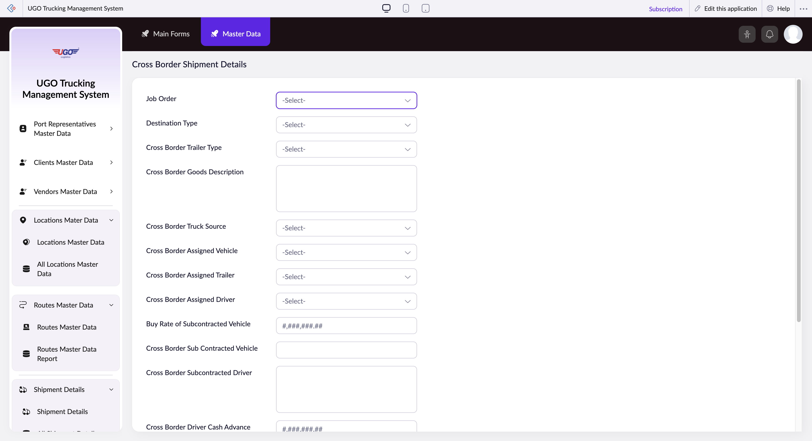

# Cross Border Shipment Details

This page captures all details for a shipment that crosses international borders. Dispatchers and operations staff use this form to record the job, vehicle assignments, driver details, and subcontracting information before the truck departs. Complete this form when you need to track cross-border freight and manage costs for international routes.

**URL:** `https://creatorapp.zoho.com/m.fahmy_ugologistics/u-go-trucking-management-system#Form:Cross_Border_Shipment_Details`

## How to Use

1. Select your language preference at the top of the page if needed.
2. Enter or select the Job Order number to link this shipment to the correct work order.
3. Specify the Destination Type (for example: port, warehouse, customer facility) to clarify where the load is going.
4. Choose the Cross Border Trailer Type that matches your cargo (flatbed, enclosed, tanker, etc.).
5. Enter a description of the goods being shipped in the Goods Description field for customs and reference purposes.
6. Assign the vehicle, trailer, and driver by selecting from the dropdown menus, or enter subcontractor details if you're using an outside carrier.
7. If using a subcontracted vehicle, enter the buy rate and driver cash advance amount, then click Submit.

## Form Fields

| Field | Description | Type | Required |
|-------|-------------|------|----------|
| Job_Order | Unique identifier for this shipment job. Select an existing order or enter a new one to link all cross-border details to the correct shipment. | text | No |
| Destination_Type | Category describing where the load ends (for example: port, distribution center, customer warehouse). Helps with route planning and documentation. | text | No |
| Cross_Border_Trailer_Type | The type of trailer required for this shipment (for example: dry van, refrigerated, flatbed, tanker). Must match your cargo requirements and cross-border regulations. | text | No |
| Cross Border Goods Description | Detailed description of what is being transported. Include item names, quantities, and any special handling notes needed for customs clearance. | textarea | No |
| Cross_Border_Truck_Source | Indicates whether the vehicle is company-owned or subcontracted. This determines which cost fields to complete. | text | No |
| Cross_Border_Assigned_Vehicle | The truck or tractor unit assigned to this shipment. Select from your fleet or leave blank if using a subcontractor. | text | No |
| Cross_Border_Assigned_Trailer | The specific trailer unit assigned to haul the load. Ensure it is the correct type for the goods. | text | No |
| Cross_Border_Assigned_Driver | The driver assigned to operate the vehicle. Must have valid cross-border credentials and documentation. | text | No |
| Buy Rate of Subcontracted Vehicle | The agreed cost per mile or per job paid to the subcontractor. Enter only if using external carrier. | text | No |
| Cross Border Sub Contracted Vehicle | License plate or vehicle ID of the subcontracted truck. Required if the vehicle is not company-owned. | text | No |
| Cross Border Subcontracted Driver | Name and license information of the hired driver. Include contact details and any special certifications needed. | textarea | No |
| Cross Border Driver Cash Advance | Cash amount given to the driver before departure for tolls, fuel, meals, or other cross-border expenses. | text | No |

## Actions

- **Done**
- **Main Forms**
- **Master Data**
- **Submit**
- **Submit Request**

## Tips

- Always fill in driver and vehicle information before submitting, even if you are not sure which driver will operate the truck—this prevents delays at the border.
- For subcontracted shipments, verify the buy rate and driver cash advance are correct before submission, as these costs lock in the freight billing and cannot be easily changed later.

## Related Pages

- [Shipment Details](shipment-details.md)
- [All Shipment Details](all-shipment-details.md)
- [Domestic Shipment Details](domestic-shipment-details.md)
- [All Domestic Shipment Details](all-domestic-shipment-details.md)
- [Subcontractor Shipment Details](subcontractor-shipment-details.md)
- [All Subcontractor Shipment Details](all-subcontractor-shipment-details.md)
- [All Cross Border Shipment Details](all-cross-border-shipment-details.md)

## Common Workflows

_Add step-by-step workflows specific to your organisation here._
