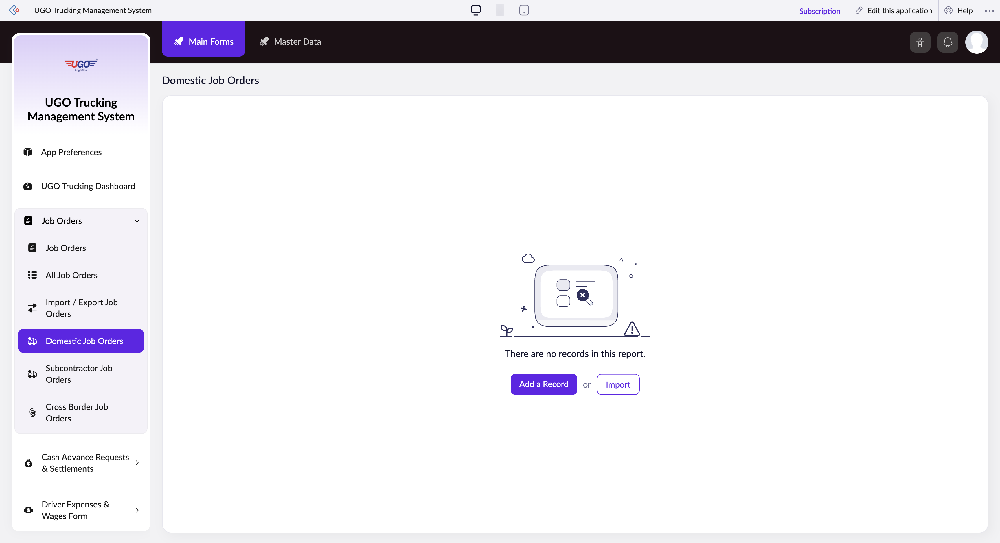

# Domestic Job Orders

The Domestic Job Orders page lets you search, filter, and manage truck shipments within your country. Operations staff use this page to find specific job orders, view their details, and organize orders by shipment date, cargo type, weight, and driver advances. Access this page daily to track domestic deliveries and coordinate with drivers.

**URL:** `https://creatorapp.zoho.com/m.fahmy_ugologistics/u-go-trucking-management-system#Report:Domestic_Job_Orders`

## How to Use

1. Select your preferred language from the Language dropdown at the top of the page if needed.
2. Use the Volume range field to filter jobs by cargo size—drag the slider or enter minimum and maximum values.
3. Enter or select a Job Order ID in the first search field to locate a specific shipment.
4. Set a date range using the From and To fields under Job Date to view orders within a specific timeframe.
5. Filter by Work Type (such as 'Full Load' or 'Partial Load') using the corresponding search field.
6. Review results and click on a job order row to open its details, or click Add a Record to create a new domestic job order.
7. Click Submit Request when you've made changes, or click Done to exit without saving.

## Page Sections

- Domestic Job Orders

## Form Fields

| Field | Description | Type | Required |
|-------|-------------|------|----------|
| lang-select-dropdown |  | dropdown | No |
| volume | Enter the minimum and maximum cargo volume in cubic feet or meters to narrow your search to shipments of a specific size. | range | No |
| checkbox-Job_Order-ZC_XUUSMY |  | checkbox | No |
| s2id_autogen122 |  | text | No |
| s2id_autogen122_search |  | text | No |
| zc_searchSelect |  | dropdown | No |
| checkbox-Job_Order.Job_Date-ZC_XUUSMY |  | checkbox | No |
| s2id_autogen124 |  | text | No |
| s2id_autogen124_search |  | text | No |
| zc_searchSelect |  | dropdown | No |
| viewSearchEl_Job_Order.Job_Date |  | text | No |
| From |  | text | No |
| To |  | text | No |
| checkbox-Job_Order.Work_Type-ZC_XUUSMY |  | checkbox | No |
| s2id_autogen126 |  | text | No |
| s2id_autogen126_search |  | text | No |
| zc_searchSelect |  | dropdown | No |
| checkbox-Domestic_Goods_Description-ZC_XUUSMY |  | checkbox | No |
| s2id_autogen128 |  | text | No |
| s2id_autogen128_search |  | text | No |
| zc_searchSelect |  | dropdown | No |
| checkbox-Domestic_Total_Weight-ZC_XUUSMY |  | checkbox | No |
| s2id_autogen130 |  | text | No |
| s2id_autogen130_search |  | text | No |
| zc_searchSelect |  | dropdown | No |
| checkbox-Domestic_Driver_Advance_Amount-ZC_XUUSMY |  | checkbox | No |
| s2id_autogen132 |  | text | No |
| s2id_autogen132_search |  | text | No |
| zc_searchSelect |  | dropdown | No |
| From |  | text | No |
| To |  | text | No |
| checkbox-Domestic_Truck_Source-ZC_XUUSMY |  | checkbox | No |
| s2id_autogen134 |  | text | No |
| s2id_autogen134_search |  | text | No |
| zc_searchSelect |  | dropdown | No |
| checkbox-Domestic_Assigned_Vehicle-ZC_XUUSMY |  | checkbox | No |
| s2id_autogen136 |  | text | No |
| s2id_autogen136_search |  | text | No |
| zc_searchSelect |  | dropdown | No |
| checkbox-Domestic_Assigned_Trailer-ZC_XUUSMY |  | checkbox | No |
| s2id_autogen138 |  | text | No |
| s2id_autogen138_search |  | text | No |
| zc_searchSelect |  | dropdown | No |
| checkbox-Domestic_Assigned_Driver-ZC_XUUSMY |  | checkbox | No |
| s2id_autogen140 |  | text | No |
| s2id_autogen140_search |  | text | No |
| zc_searchSelect |  | dropdown | No |
| checkbox-Buy_Rate_of_Subcontracted_Vehicle-ZC_XUUSMY |  | checkbox | No |
| s2id_autogen142 |  | text | No |
| s2id_autogen142_search |  | text | No |
| zc_searchSelect |  | dropdown | No |
| From |  | text | No |
| To |  | text | No |
| checkbox-Domestic_Subcontracted_Vehicle-ZC_XUUSMY |  | checkbox | No |
| s2id_autogen144 |  | text | No |
| s2id_autogen144_search |  | text | No |
| zc_searchSelect |  | dropdown | No |
| checkbox-Domestic_Subcontracted_Driver-ZC_XUUSMY |  | checkbox | No |
| s2id_autogen146 |  | text | No |
| s2id_autogen146_search |  | text | No |
| zc_searchSelect |  | dropdown | No |
| checkbox-Destination_Type-ZC_XUUSMY |  | checkbox | No |
| s2id_autogen148 |  | text | No |
| s2id_autogen148_search |  | text | No |
| zc_searchSelect |  | dropdown | No |
| checkbox-Domestic_Shipment_Type-ZC_XUUSMY |  | checkbox | No |
| s2id_autogen150 |  | text | No |
| s2id_autogen150_search |  | text | No |
| zc_searchSelect |  | dropdown | No |
| allowlocation |  | button | No |
| useIconSwitch |  | checkbox | No |
| toggleIconSwitch |  | checkbox | No |
| saveIcons |  | button | No |
| resetIcons |  | button | No |
| Search... |  | text | No |
| I have read the above conditions. |  | checkbox | No |
| reqEmailId |  | text | No |
| s2id_autogen2 |  | text | No |
| s2id_autogen2_search |  | text | No |
| supportType |  | dropdown | No |
| Please enable edit permission to help with troubleshooting |  | checkbox | No |
| reachusChatDescription |  | textarea | No |
| reachUsStartChat |  | button | No |
| zc-reachus-editaccess-enable-button |  | button | No |
| zc-reachus-editaccess-revoke-button |  | button | No |
| zc-reachus-screenrecord-button |  | button | No |

## Actions

- **Done**
- **Main Forms**
- **Master Data**
- **Remove Changes**
- **Add a Record**
- **Import**
- **Submit Request**

## Tips

- Use checkboxes next to field names to enable or disable filters for that field—uncheck a box if you want to ignore that filter and see all results.
- Click Remove Changes to undo any filters or selections before you submit, and click Main Forms or Master Data to navigate to related record types.

## Related Pages

- [Job Orders](job-orders.md)
- [All Job Orders](all-job-orders.md)
- [Import / Export Job Orders](import-export-job-orders.md)
- [Subcontractor Job Orders](subcontractor-job-orders.md)
- [Cross Border Job Orders](cross-border-job-orders.md)

## Common Workflows

_Add step-by-step workflows specific to your organisation here._
