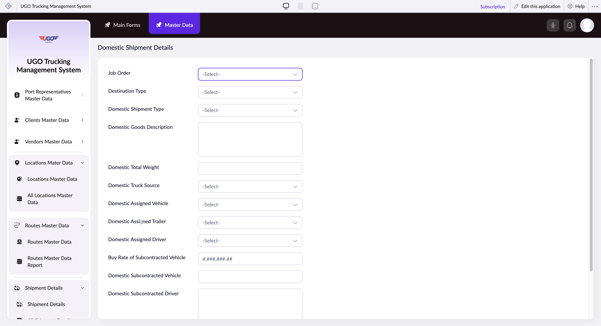

# Domestic Shipment Details

**URL:** `https://creatorapp.zoho.com/m.fahmy_ugologistics/u-go-trucking-management-system#Form:Domestic_Shipment_Details`

## Page Sections

- Upgrade to Creator 5
- Update your subscription plan
- UGO Trucking Management System
- Section
- Introducing the New zoho Creator ui
- Introducing the New zoho Creator ui
- Introducing the New zoho Creator ui
- Introducing the New zoho Creator ui

## Form Fields

| Field | Type | Required |
|-------|------|----------|
| lang-select-dropdown | dropdown | No |
| zc-sel2-foc-Job_Order | text | No |
| zc-sel2-inp-Job_Order | text | No |
| Job_Order | text | No |
| zc-sel2-foc-Destination_Type | text | No |
| zc-sel2-inp-Destination_Type | text | No |
| Destination_Type | text | No |
| zc-sel2-foc-Domestic_Shipment_Type | text | No |
| zc-sel2-inp-Domestic_Shipment_Type | text | No |
| Domestic_Shipment_Type | text | No |
| Domestic Goods Description | textarea | No |
| Domestic Total Weight | text | No |
| zc-sel2-foc-Domestic_Truck_Source | text | No |
| zc-sel2-inp-Domestic_Truck_Source | text | No |
| Domestic_Truck_Source | text | No |
| zc-sel2-foc-Domestic_Assigned_Vehicle | text | No |
| zc-sel2-inp-Domestic_Assigned_Vehicle | text | No |
| Domestic_Assigned_Vehicle | text | No |
| zc-sel2-foc-Domestic_Assigned_Trailer | text | No |
| zc-sel2-inp-Domestic_Assigned_Trailer | text | No |
| Domestic_Assigned_Trailer | text | No |
| zc-sel2-foc-Domestic_Assigned_Driver | text | No |
| zc-sel2-inp-Domestic_Assigned_Driver | text | No |
| Domestic_Assigned_Driver | text | No |
| Buy Rate of Subcontracted Vehicle | text | No |
| Domestic Subcontracted Vehicle | text | No |
| Domestic Subcontracted Driver | textarea | No |
| Domestic Driver Advance Amount | text | No |
| submit | submit | No |
| searchmap | text | No |
| useIconSwitch | checkbox | No |
| toggleIconSwitch | checkbox | No |
| saveIcons | button | No |
| resetIcons | button | No |
| Search... | text | No |
| I have read the above conditions. | checkbox | No |
| reqEmailId | text | No |
| s2id_autogen2 | text | No |
| s2id_autogen2_search | text | No |
| supportType | dropdown | No |
| Please enable edit permission to help with troubleshooting | checkbox | No |
| reachusChatDescription | textarea | No |
| reachUsStartChat | button | No |
| zc-reachus-editaccess-enable-button | button | No |
| zc-reachus-editaccess-revoke-button | button | No |
| zc-reachus-screenrecord-button | button | No |

## Actions

- **Done**
- **Main Forms**
- **Master Data**
- **Submit**
- **Submit Request**

## Common Workflows

_Document step-by-step workflows for this page here._
