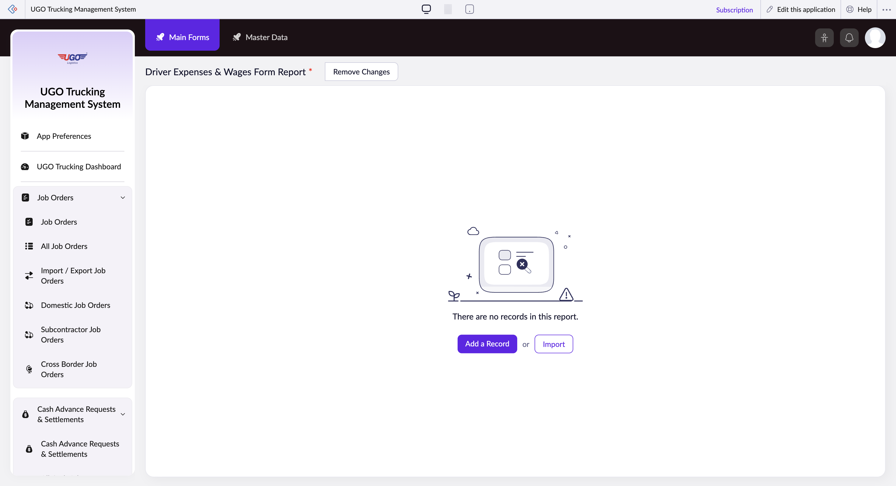

# Driver Expenses & Wages Form Report

The Driver Expenses & Wages Form Report lets you view, filter, and manage driver expense and wage records in the U-Go system. Operations staff use this page to track driver costs, verify expense claims, and generate reports for specific time periods or job orders.

**URL:** `https://creatorapp.zoho.com/m.fahmy_ugologistics/u-go-trucking-management-system#Report:Driver_Expenses_Wages_Form_Report`

## How to Use

1. Select your preferred language from the Language dropdown at the top if needed.
2. Use the date range fields (From and To) to specify the time period you want to report on.
3. Check the boxes next to any filter criteria you want to apply—such as Job Order, Driver Name, Route Name, or Work Type—to narrow down the records shown.
4. In the search fields that appear after checking a box, type or select the specific value you're looking for (for example, a driver's name or job order number).
5. Click the Save button to store your filter settings, or click Submit Request to generate the report with your current filters.
6. Review the results in the table, then use Done to close the form or Main Forms to return to the menu.

## Page Sections

- Driver Expenses & Wages Form Report
*
- Save Changes

## Actions

- **Done**
- **Main Forms**
- **Master Data**
- **Remove Changes**
- **Add a Record**
- **Import**
- **Save**
- **Cancel**
- **Submit Request**

## Tips

- Always set a date range before generating a large report—this keeps the system responsive and makes it easier to find the records you need.
- Use the filter checkboxes to combine multiple criteria (for example, filter by both Driver Name and Date Range) to quickly locate specific expense claims or wage disputes.

## Related Pages

- [Cash Advance Requests & Settlements](cash-advance-requests-settlements.md)
- [All Cash Advance Requests & Settlements](all-cash-advance-requests-settlements.md)
- [Open Cash Advances](open-cash-advances.md)
- [Unsettled Cash Advances](unsettled-cash-advances.md)
- [Driver Expenses & Wages Form](driver-expenses-wages-form.md)
- [Driver Unpaid Summary](driver-unpaid-summary.md)

## Common Workflows

_Add step-by-step workflows specific to your organisation here._
